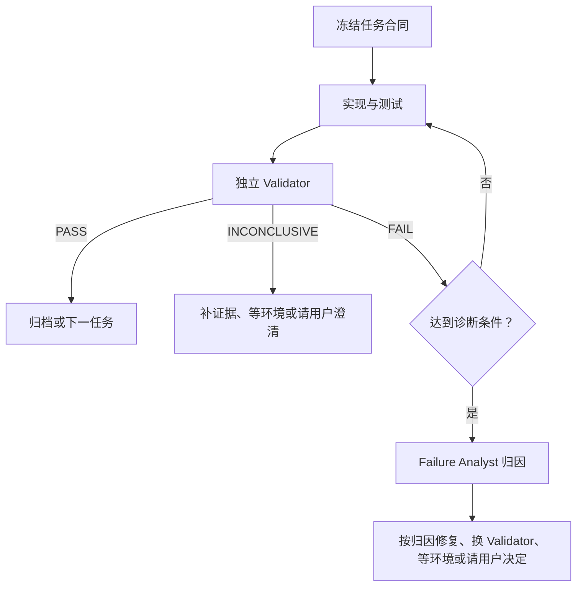

# TrainLab

TrainLab 根开发 Harness 适配 [agentForge main](https://github.com/wyizhou/agentForge/tree/9964970d38df95bbd8fab53166c27c2e5648b82e)
提交 `9964970d38df95bbd8fab53166c27c2e5648b82e`（v0.4.4 之后的治理更新，不是新正式版本）；产品工程唯一位于
`source/`。根目录只维护开发规则、Roadmap、执行计划、技能和 CI，不再保留第二份
产品源码或产品运行 Harness。

## 目录边界

```text
TrainLab/
├── AGENTS.md rules.md memory.md PLANS.md
├── docs/ references/ skills/ .github/
├── data-backup/          # 本机忽略的旧数据归档
└── source/
    ├── AGENTS.md         # 无状态运行 Harness
    ├── skills/           # 本地 Skills、脚本与合同测试
    ├── templates/        # fixed/open-report 邮件外壳
    ├── config.json       # 非秘密运行参数
    ├── goal.module.md    # 可跟踪的脱敏目标模板
    ├── goal.md           # 私有用户目标，忽略
    ├── state/            # 私有 SQLite、raw 与运行状态，忽略
    └── requirements.txt
```

`data-backup/` 仅保存旧实例的可回滚归档，不是当前运行目录；它完全被 Git 忽略。
真实配置、数据库、raw、FIT、token、日志和 state 不会进入 Git，也不会被测试或发布
产物展示。

## 无状态运行

从仓库根目录执行 `codex exec -C source`。运行时先读取 `source/AGENTS.md`、`config.json`、
私有 `goal.md`、需要的 Skill 和 `state/trainlab.db`，再运行对应脚本；结果、状态、批准和
外部动作都追加写入 SQLite。当前只保留无状态 `auto.txt` Prompt，不安装或启用 cron。

## 安装依赖与检查

项目不要求仓库内 `.venv`，可使用用户选择的 Python 3.12 环境：

```sh
python3.12 -m pip install -r source/requirements.txt
cd source
python3.12 -m pytest tests/code -q
python3.12 -m ruff --config skills/_shared/ruff.toml check skills tests/code
python3.12 -m ruff format --check skills tests/code
python3.12 -m mypy --config-file skills/_shared/mypy.ini skills tests/code
```

CI 的所有产品步骤都以 `source/` 为工作目录；Ruff 和 mypy 配置位于
`source/skills/_shared/`。产品不再声明 wheel、bundle 或 console script 发布。

## 运行时边界

TrainLab 运行 Harness 位于 `source/AGENTS.md` 和 `source/skills/`，只接受有来源和 lineage
的有界输入。脚本负责读取 raw 并写入 SQLite，AI 负责受约束的解释和决策；Garmin、Gmail
和 Sites 的外部写入必须由各自明确授权的边界完成。产品不再包含历史自动 Orchestration、
Supervisor 或后台服务入口。

## 数据重建说明

旧实例已在本机归档到 `data-backup/<timestamp>/`。新 raw-first 数据库只从
Garmin raw/FIT 离线重建，不迁移旧 AI 报告、邮件、用户事实、交付或后台运行历史；
数据库完成完整性、外键、哈希和权限验证后已切换为 `source/state/`；旧 state 仍保留在
本机 `data-backup/` 的切换归档中。

## 开发规则

开始仓库工作先阅读 [AGENTS.md](AGENTS.md) 并通过 Git 检查，再按角色加载适用规则和必要上下文。
主协调 Agent 恢复项目状态；Worker 只接收获批目标与实现范围；Validator 不加载 memory 或计划历史。
详细规则统一在 [执行协议](docs/exec-plans/README.md)，[计划模板](docs/exec-plans/template.md) 只提供填写结构。TrainLab 禁止使用
`orchestrate-parallel-work`，不得恢复 `.orchestration`、Graph/Dashboard 或旧
hash-bound 审批控制面。

## 开发、验证与失败诊断

| 工作 | 适用流程 |
| --- | --- |
| 单次只读分析、纯拼写或排版 | 依据和适用检查即可，不强制完整计划或独立验证 |
| 跨会话只读分析 | 保存简短目标、证据、检查点和下一动作 |
| 代码、配置、功能或治理含义变更 | 正式计划、冻结验收、测试与独立验证 |
| 实际并行开发 | 正式流程加独立 worktree、任务级与集成级验证 |

轻量不等于改动少：命令、链接目标、配置值或约束含义变化均属于正式任务。
正式合同以 `AC-*` 和适用 `GATE-*` 为核心，按实际风险加入 `INV-*`、`TM-*`、`EX-*`，
不为填表虚构要求；AI 实施方法和未确认假设不自动成为验收要求。全新只读 Validator
只接收冻结合同、适用规则和当前结果，可以创造检查方法，但不能增加验收要求。

验证绑定实际受审文件快照，不以 HEAD 或历史 PASS 代替未提交内容检查；语义变更后重新验证。
仅追加真实结果、同步状态和归档链接不重新启动验证循环。能力不足时直接选择充分档位，
不要求固定逐档升级，不降低已选维度；合同争议和环境故障不靠升级模型解决。

- `PASS`：当前结果满足全部适用标准；
- `FAIL`：有可复核证据证明当前结果违反已绑定的冻结标准；
- `INCONCLUSIVE`：证据不足、环境不可用、合同含糊或报告未绑定标准，不能可靠判断。

同一失败用两种不同办法仍未解决、连续三轮没有收敛，或直接发现合同冲突时，任务进入
`DIAGNOSIS_PENDING`。独立 Failure Analyst 可以读取失败历史，判断属于实现、规划合同、验证、
环境或暂时无法确定；它不能修改文件、改变合同或代替 Validator 宣布通过。


