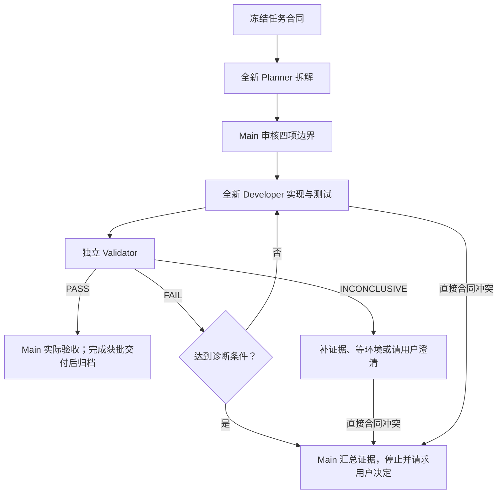

# TrainLab

TrainLab 根开发 Harness 适配 [agentForge main](https://github.com/wyizhou/agentForge/tree/9964970d38df95bbd8fab53166c27c2e5648b82e)
提交 `9964970d38df95bbd8fab53166c27c2e5648b82e`（v0.4.4 之后的治理更新，不是新正式版本）；产品工程唯一位于
`source/`。根目录只维护开发规则、Roadmap、执行计划、技能和 CI，不再保留第二份
产品源码或产品运行 Harness。

## 目录边界

```text
TrainLab/
├── AGENTS.md rules.md memory.md PLANS.md
├── docs/ references/ skills/ .github/
├── data-backup/          # 忽略的旧代码、数据和失败证据归档
└── source/
    ├── AGENTS.md         # M12 产品边界与迁移状态
    ├── skills/           # 当前 FIT-only 模块及独立维护工具
    ├── tests/            # 当前活动产品的代码/AI 验收
    ├── goal.module.md    # 可跟踪的脱敏目标模板
    ├── goal.md           # 私有用户目标，忽略
    ├── state/            # 旧正式实例，最终切换前保持不变
    ├── private/          # 可选的新独立实例根，忽略
    └── requirements.txt
```

`data-backup/` 保存可回滚历史，不是当前运行、模型输入或 CI 的依赖；它完全被 Git 忽略。
真实配置、数据库、raw、FIT、token、日志和 state 不会进入 Git，也不会被测试或发布
产物展示。

## M12 迁移状态

旧 `codex exec -C source` 自动路线已经停用，auto.txt 只返回退役通知。新 Python FIT-only
运行层尚未交付；请勿使用旧历史批次发送邮件或修改 Garmin。当前分支
`work/m12-running-only-planning` 的目标是香港时间每日 22:00 同步运动、星期日 15:00
执行两阶段周任务，以简单邮件/PDF 和 Garmin 课程发布；另一开发路线不因本分支修改而改变。

已完成新库、FIT 导入/同步、解析、受限细读和模型适配基础。当前有效目标见
[RUN-VC-001 冻结合同](docs/exec-plans/active/M12-fit-weekly-0001-rebuild.md#当前完整冻结合同-run-vc-001)；
[退役映射](source/docs/legacy-retirement.md) 记录保留能力、取消业务和安全接替。
新增两阶段、周报业务、PDF、发布与完整调度仍未交付；本次治理文档不把现有单阶段基础
描述为已替换，也不提供尚不存在的运行命令。旧正式 state/私人配置保持不变，没有启用真实调用。

| 周任务阶段 | 当前分支已批准目标，尚未实现 |
| --- | --- |
| 先独立跑步规划 `plan` | 独立无状态 AI 上下文；只读取本期跑步、最多四份历史中可验证的跑步分析/计划、用户目标/限制/可训练时间及跑步细读。排课不读非跑步活动或混合总结全文，无独立跑步字段的历史不整篇传入。 |
| 后全运动总结 `summary` | 另一个独立无状态 AI 上下文；读取本期全部运动、最多四份完整成功 M12 周报、目标与本次已验证固定计划，不修改或替代计划，不按其他运动负荷调整跑课。 |

两阶段各最多一次模型调用，失败或 unknown 不自动重试；合计共享每周最多 20 次细读、
每次最多 20 分钟，同请求缓存，重启/版本/搬迁不重置。规划失败不启动总结；总结失败保留
已成功计划但不发布，成功阶段不重跑。最终合并为一份周报和唯一固定七日跑步计划。

## 安装依赖与检查

项目不要求仓库内 `.venv`，可使用用户选择的 Python 3.12 环境：

```sh
python3.12 -m pip install -r source/requirements.txt
cd source
python3.12 -m pytest tests/code -q
python3.12 -m ruff --config skills/_shared/ruff.toml check skills tests/code
python3.12 -m ruff format --check skills tests/code
python3.12 -m mypy --config-file skills/_shared/mypy.ini skills tests/code
```

CI 的所有产品步骤都以 `source/` 为工作目录；Ruff 和 mypy 配置位于
`source/skills/_shared/`。产品不再声明 wheel、bundle 或 console script 发布。

## 运行时边界

根 agentForge 继续管理开发，不承担产品调度。M12 由 Python 管理来源、SQLite、定时和
动作状态，AI 只负责每周受约束的解释/课程决策。有来源的运动 GPS、路线、地点与活动名称
可交给选定 AI，但不公开或进入 Git；原始 FIT 字节、凭据及任意文件/SQL能力不交给模型。
Gmail 仅官方 REST，Garmin 写入需通过既定前置门与精确授权，Sites 不在新方向内。
不恢复旧 Orchestration、Supervisor、cron 或开机自动服务。

按 A-023，批准的新方案必须在同批次退出被替代的实现、入口和验收，更新配置/Schema/Prompt/CI
与文档。旧失败保留原文；必要安全测试按能力迁移，不以保留全部旧业务作为新系统完成条件。

## 历史数据说明

M12 之前的实例已在本机归档到 `data-backup/<timestamp>/`。当时的 raw-first 数据库只从
Garmin raw/FIT 离线重建，不迁移旧 AI 报告、邮件、用户事实、交付或后台运行历史；
数据库完成完整性、外键、哈希和权限验证后切换为 `source/state/`。M12 将另外建立新库，
目前尚未切换；本机旧数据和新的恢复归档均保留，不把归档作为新运行依赖。

## 开发规则

开始仓库工作先阅读 [AGENTS.md](AGENTS.md) 并通过 Git 检查，再按角色加载适用规则和必要上下文。
Main 恢复项目状态；子角色只有 Planner、Developer、Validator，每次派发、修复和复验均
全新且不继承旧聊天，只接收当前任务包，不加载 memory 或计划协调历史。
详细规则统一在 [执行协议](docs/exec-plans/README.md)，[计划模板](docs/exec-plans/template.md) 只提供填写结构。TrainLab 禁止使用
`orchestrate-parallel-work`，不得恢复 `.orchestration`、Graph/Dashboard 或旧
hash-bound 审批控制面。

## 开发、验证与失败诊断

| 工作 | 适用流程 |
| --- | --- |
| 单次只读分析、纯拼写或排版 | 依据和适用检查即可，不强制完整计划或独立验证 |
| 跨会话只读分析 | 保存简短目标、证据、检查点和下一动作 |
| 代码、配置、功能或治理含义变更 | 正式计划、冻结验收、三角色协作、独立验证及 Main 实际验收 |
| 实际并行开发 | 正式流程加独立 worktree、任务级与集成级验证 |

轻量不等于改动少：命令、链接目标、配置值或约束含义变化均属于正式任务。
正式合同以 `AC-*` 和适用 `GATE-*` 为核心，按实际风险加入 `INV-*`、`TM-*`、`EX-*`，
不为填表虚构要求；AI 实施方法和未确认假设不自动成为验收要求。全新只读 Validator
只接收冻结合同、适用规则和当前结果，可以在隔离位置自建测试，但不能改交付或正确答案、
增加验收要求，也不读取旧裁决或实施者辩护。[通用启动 Prompt](docs/exec-plans/roles/start-prompt.md)
与三份角色模板可直接复用，不修改全局配置。

Planner 拆解下级预期，Main 仅审核遗漏、矛盾、额外需求与接口衔接，再由 Developer 实施及测试。
独立 PASS 后，Main 仍须实际验收完整功能与适用质量门；lint 不能替代功能测试或实际验收。
本分支每模块满足这些门后才精确提交并正常推送 `origin/work/m12-running-only-planning`，
核对远端及 CI 后进入依赖模块；不推 `main`、不强推、不夹带私人/无关/未验收资料。
这里描述获批交付流程，不代表这些 Git 动作已经发生。

验证绑定实际受审文件快照，不以 HEAD 或历史 PASS 代替未提交内容检查；语义变更后重新验证。
仅追加真实结果、同步状态和归档链接不重新启动验证循环。能力不足时直接选择充分档位，
不要求固定逐档升级，不降低已选维度；合同争议和环境故障不靠升级模型解决。

- `PASS`：当前结果满足全部适用标准；
- `FAIL`：有可复核证据证明当前结果违反已绑定的冻结标准；
- `INCONCLUSIVE`：证据不足、环境不可用、合同含糊或报告未绑定标准，不能可靠判断。

同一失败用两种不同办法仍未解决、连续三轮没有收敛，或直接发现合同冲突时，任务进入
`DIAGNOSIS_PENDING` 并停止普通修复/复验。Main 保存累计次数、汇总当前证据与未知项请求用户；
不派第四角色，不靠换 Agent/模型清零，也不保留诊断后自动一次修复的旧授权。


