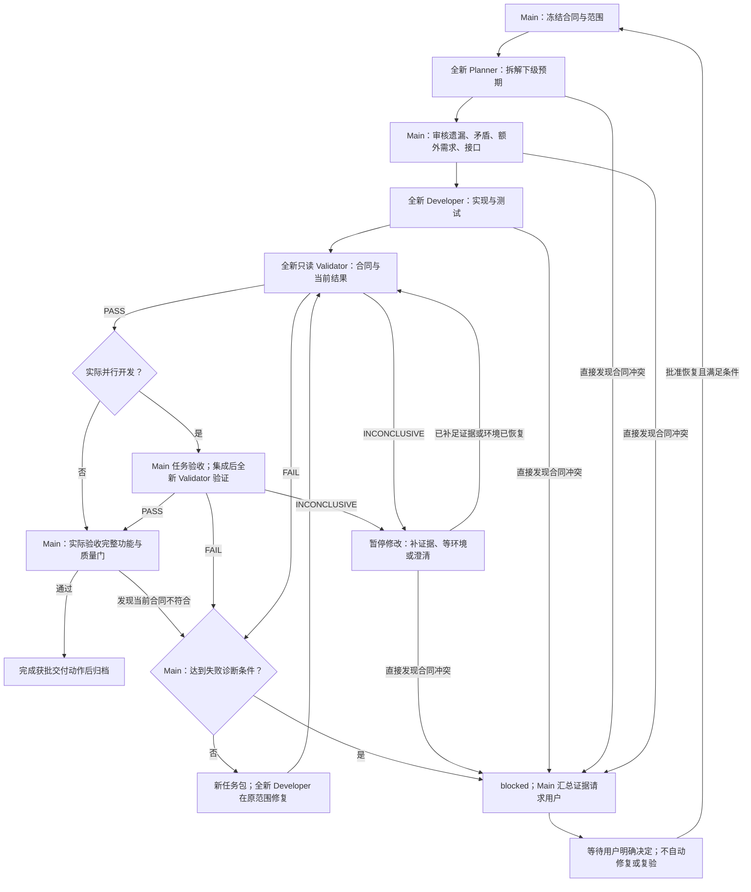

# 执行协议与计划

本文件由 [AGENTS.md](../../AGENTS.md) 授权，集中定义详细执行协议；核心权限和工程边界仍以 AGENTS 为准。[模板](template.md) 提供必填核心和按需章节，不重复定义协议。计划是对应任务状态的唯一事实源，不另建合同目录。

## 流程选择与计划创建

- 单次只读分析、纯拼写/排版可以只在交付报告记录依据和适用检查，不强制完整计划或独立 Validator。改变命令、链接目标、配置值、功能、规则或合同含义不在豁免内；不确定时走正式流程。
- 跨会话只读任务保存简短计划：目标、范围、证据、检查点、下一动作和迭代记录即可。维护这些只读记录不使其变成必须自我验证的实施任务。
- 代码、配置、功能行为或治理语义变更使用正式计划，修改前冻结合同，完成前独立验证。已豁免任务途中产生语义修改需求时，必须先取得所需范围授权并转正式流程。
- Main（当前主协调 Agent）是计划、memory、Roadmap、失败记录和集成状态的唯一写入者；只有 Planner、Developer、Validator 三种子角色，其他角色不再派发。子角色只返回当前任务产物与事实，不自动创建协调计划。
- 同一计划最多一个步骤为 `in_progress`，步骤状态为 `pending / in_progress / blocked / done`。并行任务各有独立计划，不受另一个计划的步骤状态限制。

## Roadmap 与命名

[PLANS.md](../../PLANS.md) 记录“将来准备做什么”。主 Agent 可以提出候选阶段、任务、优先级、依赖和批次，但阶段目标、范围、任务增删、排序及并行拓扑必须经人工批准。远期阶段只记目标、依赖和成果；当前阶段准备启动时才展开叶子任务。

阶段 ID 使用稳定的 `P1`、`M1`、`Q1` 等标识；任务编号在阶段内全局递增（如 `P1-0001`），只表示排序和优先级，依赖须在 Roadmap 与计划中显式声明。

- 进入 ready batch、准备修改仓库时创建详细计划，不在阶段获批时为未就绪任务批量建文件。同一 ready batch 可以同时创建多份计划。
- Roadmap 计划：`<stage>-<initiative-slug>-<sequence>-<feature-slug>.md`。
- 非 Roadmap：`ADHOC-<sequence>-<slug>.md`；创建前检查现有编号。
- 返工：保留原 completed 计划，新建 `-r01`、`-r02` 等文件并链接原计划，Roadmap 改为 `rework`，重新走适用验证。历史名称无需机械改写。

## 生命周期与归档

计划和 Roadmap 使用 `planned / ready / active / blocked / validating / validated / integrating / completed / rework / cancelled`。非终态文件放在 `active/`，终态放在 `completed/`，取消也保留历史。

| 执行方式 | 完成条件 |
| --- | --- |
| 轻量任务 | 适用检查完成并报告证据；有只读检查点计划时可从 active 归档，不要求 Validator。 |
| 串行正式任务 | active → validating → 独立 PASS → validated → Main 实际验收 → 完成获批交付动作 → completed。 |
| 实际并行任务 | 各任务 active → validating → 任务级 PASS → validated → Main 任务验收；集成后 integrating → 集成级 PASS → Main 整体验收 → 完成获批交付动作 → completed。 |

`validated` 不是完成。有效 FAIL 不得勾选；INCONCLUSIVE 或 Validator 不可用保持 `validating`，达到诊断条件则转 `blocked`。独立 PASS 不能替代 Main 对完整功能与适用质量门的实际验收；lint 通过也不能替代功能测试或实际功能验收。纯治理模块验收治理结果及适用文档检查，不虚构产品运行证据。PASS 和 Main 验收均不替代提交、推送、发布等所需授权或实际执行。

完成后主 Agent 归档计划、将对应 Roadmap 叶子任务标为 `[x] completed`、重算父级状态并清除 memory 活动指针。父级只有批准范围内全部非取消叶子任务完成才能勾选；ADHOC 不新增虚构 Roadmap。尚有外部交付待完成时如实记录，不预写成功。

关键步骤、阻塞、交接或上下文结束前更新检查点；每个上下文只追加一条简短日志。恢复时用 Git 和实际文件核对计划，仓库事实优先，并记录偏差。

## 冻结验证合同

正式计划必须包含版本、状态、批准来源、可验证的 `AC-*` 与适用 `GATE-*`、批准范围和非目标；适用时再添加 `INV-*`、`TM-*` 和 `EX-*`，不为填表虚构威胁或大量“不适用”。不能以省略章节隐藏已批准的不变量、风险或排除项。

- 合同状态：`draft / frozen / superseded`。每个标准注明用户请求、已批准计划或生效规则来源；必要时引用 `RULE-*`。
- 用户明确任务或批准计划可同时冻结由这些要求直接得到的 `VC-001`，无需重复确认。AI 提出的实施方法不是新验收要求。
- 影响范围、行为或验收的未知事项列为待确认，并暂停受影响实施；不能把假设当作授权后标为 frozen。范围内不改变要求的实施细节由 AI 自行选择，不额外索取无必要批准。
- 修改仓库前适用合同须 frozen。冻结后只有人工明确批准才能升为 `VC-002` 等；保留旧合同原文和修订记录，说明变更、理由、受影响标准、批准依据。新合同生效后旧验证失效。
- 同合同重验证逐字沿用冻结内容，不提供旧 Validator 的推理、结论或新增假设；合同争议不能借升级模型解决。

### 裁决标准

| 结论 | 必要条件 | 主 Agent 处理 |
| --- | --- | --- |
| PASS | 全部适用标准和门禁通过，没有有效阻塞发现 | 进入 Main 实际验收及适用交付；不能直接宣称完成。 |
| FAIL | 至少一个阻塞发现绑定 AC、INV、TM、RULE 或 GATE 的具体 ID，标准明确且当前证据可复核 | 记录失败特征；仅明确的范围内实施错误可进入修复，达到诊断条件先归因。 |
| INCONCLUSIVE | 标准缺失、含糊、冲突，证据不足，检查无法运行，或报告协议无效 | 不据此改代码、正确测试或合同；补证据、等环境或人工澄清，直接冲突立即诊断。 |

Validator 可以设计新测试、输入和方法，但只能验证已有要求。阻塞项必须给出标准 ID、复现方式、实际结果和证据；未预列具体用例不妨碍它证明已有标准被违反。

命中 `EX-*`、超出范围或新增质量要求只能进入 `ADVISORY` 或 `SCOPE_CHANGE_CANDIDATE`，不得改变总体判定、触发实现修改或重验循环。有效建议可以与 PASS 共存。不能自行采用更严格的合同解释。

无标准 ID 的阻塞报告无效，主 Agent 按 INCONCLUSIVE 记录，不自行改判 PASS，也不据此修代码、测试、规则或合同。INCONCLUSIVE 是“无法可靠判断”，不是较轻的 FAIL；普通一次不计入实施失败的两种修法或三轮无收敛。

## 并行与隔离

ready batch 必须满足：范围已批准、依赖已满足、写入互不重叠、共享接口已冻结、不同时修改同一迁移/配置入口/集成文件、Agent 容量足够。

每个并行开发任务使用 `work/<task-id>-<feature-slug>` 本地分支和 `../<repo-name>-worktrees/<task-id>/` 独立 worktree，阶段使用 `integration/<stage-id>`。阶段批准只授权明确列出的本地分支、worktree、任务提交和集成操作，不覆盖推送、主分支合并、发布或部署。

Developer 只写获批实现和测试范围；Main 统一维护协调文件。发现依赖、接口或写入冲突时停止受影响工作并降为串行；减少并发不需新增批准，但新增范围、任务或外部影响必须重新批准。容量不足也减少并发，不削弱合同或验证。

任务级 PASS 后仅 validated；Main 实际验收后集成同批结果，再由另一个全新 Validator 运行整体 lint、完整测试和跨任务回归，最后由 Main 实际验收完整功能。集成检查依据获批批次的冻结合同及共享接口要求，不临时增加集成验收目标。串行实施加独立只读审查不属于并行开发，不凭空创建集成分支或第二层验证。

TrainLab 不使用 `orchestrate-parallel-work`、`.orchestration`、Graph/Dashboard 或 hash-bound handoff；项目布局和业务外部授权以根 AGENTS 与已批准规则为准。

## 三角色与任务包

每个正式模块遵循：全新 Planner → Main 审核任务包 → 全新 Developer → 全新 Validator → Main 实际验收。通用模板为 [Planner](roles/planner.md)、[Developer](roles/developer.md)、[Validator](roles/validator.md) 及 [启动 Prompt](roles/start-prompt.md)；模板不绑定产品、本机路径或厂商，也不改变全局 Agent 配置。

| 角色 | 职责与边界 |
| --- | --- |
| Main | 保存批准目标、任务、累计失败和证据；仅从遗漏、矛盾、未经批准的额外需求、模块接口衔接四方面审核 Planner 拆解，不借审核重写需求；执行最终实际验收及获批交付。 |
| Planner | 只读地把当前批准目标拆解为可检查的下级预期、输入输出、正常/错误/边界行为、接口和任务边界；不增加需求，不实施，不自行批准范围。 |
| Developer | 仅实施审核后的任务与适用测试；先固定批准行为的正确预期，再交付代码和测试；不改需求、正确答案或验收标准。 |
| Validator | 独立判断当前结果是否满足有效合同；可自建隔离测试，不修改交付、正确预期或合同，不替代 Main 最终验收。 |

每次派发、修复和复验均创建全新 Agent，并关闭旧聊天继承；不得复用旧 Agent 续修或复验。Main 从当前有效要求重新组装最小任务包，不转发历史对话、实施者辩护或旧裁决。任务包必须包含：

- 当前角色模板、任务 ID、逐字有效冻结合同及本任务适用标准；不能要求从历史多版本拼接。
- 已批准目标、明确输入/输出及正确预期、正常/错误/边界行为；Planner 待拆解项保持为待拆解，不把未确认假设冻结。
- 必要接口代码/签名与只读定位、允许/禁止写入范围、已知依赖；不要求加载无关仓库历史。
- 适用检查材料、真实环境限制、交付格式与停止条件；失败修复包仅提供必要的当前可复核不符合事实，不附旧裁决或修法辩护。

Main 的审核结果、任务包版本及批准依据留在计划；子角色不自动读取 memory、PLANS、计划协调段或旧失败记录。发现缺失输入或合同冲突先报告，不能通过扩大读取或推测要求继续。只有用户可以批准实质变更。

## Agent 派发与选档

模型能力与推理强度各用 `low / medium / high` 跨平台相对档位，运行时适配，不在仓库绑定具体厂商、模型名或平台参数。

| 任务类型 | 模型 | 推理 |
| --- | --- | --- |
| 检索、提取、格式转换、机械检查 | low | low |
| 单模块 Developer、常规测试、一般文档 | medium | medium |
| 跨模块 Planner、复杂调试、迁移、并发、安全 | high | high |
| 任务 Validator | 不低于对应 Developer | 至少 medium |
| 集成 Validator | 不低于批次最高 Developer | 至少 medium |
| 高风险 Validator | high | high |

每次派发记录角色/任务 ID、目标与验收、合同版本、风险复杂度、模型与推理档位、理由、平台支持、允许/禁止写入范围、lint/test 门及返回产物。信息可引用合同和范围，不重复复制。

选择最低充分档位。只有证据指向能力不足时才使用全新 Agent 升级；按实际困难直接选择足够档位，不要求逐一经过固定路线，也不得降低任一已选维度。记录不足证据及升级结果。合同歧义、范围争议、未绑定标准的阻塞、超范围假设和环境故障不通过升级解决。

达到 high/high 仍因能力不足无法完成时停止自动重试，标为 blocked，由 Main 汇总证据请求人工决定；失败诊断条件更早触发时先停止，不得用升级重置计数或接受部分结果释放依赖。

平台不能控制某维度时使用并记录 `platform-default`，不得猜测实际档位；通过缩小任务、明确验收、完整检查和独立验证补偿。不能提供独立 Validator 时保持 validating，不自我认证。

## 独立验证

Validator 每次必须全新、只读、未参与实施。正式任务均需独立验证，Main 不能用自身检查代替独立验证；独立验证也不能代替 Main 实际验收。实际并行使用上述两层验证。

- 中性输入只有逐字冻结合同、适用 AGENTS/本协议条款、已批准规则及当前受审结果。不自动加载 memory、PLANS 状态、计划其他章节或历史上下文；调度时关闭对实施会话的历史继承。
- 不传实施者推理、辩护、预期结论、声称的测试通过、旧 Validator 输出或缺陷导向提示。受审文件和基准位置是客观定位信息，可以提供。
- 历史记录本身若属于当前交付，允许检查其差异、格式和风险，但不能将其中的 verdict 或推理当作本次通过/失败的证据。本次修改的 memory 或计划协调段也仅作差异审计，不作为偏好指令或验收事实；此例外不允许加载完整 memory 或读取无关计划历史。
- 独立核对 Git 实际变更（含未跟踪文件）、各可执行技术栈的适用 linter 配置和真实运行结果、功能测试目录与文件、测试是否忠于合同及是否被删改/弱化/跳过、定向和完整适用测试、其他验收与生效规则。
- 只读意味着不修改交付文件、交付测试、合同、正确预期或协调状态；可在隔离临时位置自建测试并运行必要检查，不使用修复/重写选项，不为得到通过改答案。仓库指令不等于操作系统只读权限；平台有沙箱时采用可用隔离，不能声称未实际提供的权限保障。
- 每轮返回以下固定字段。证据记录在计划，由主 Agent 维护；Validator 不写文件。

```text
contract_version
overall_verdict
criterion_results
blocking_findings
advisories
scope_change_candidates
unknowns
commands_and_evidence
```

每项 criterion_results 指向标准 ID 和实测结果；commands_and_evidence 给出受审快照、实际命令/检查、退出结果、关键输出及限制，不以“检查过了”替代证据。结果或协议不可靠时遵循裁决表，不把主 Agent 自检当作替代。

Main 在独立 PASS 后针对同一受审快照实际检查完整功能和适用质量门，记录输入、命令或操作、实际输出、对应标准与限制。功能未运行、材料不足或结果不符时不宣布验收通过；治理模块按其批准治理目标验收。发现问题仍按冻结合同处理，不临时增加需求，不以重复 lint 代替功能证明。

## 受审快照与回写

验证证据必须绑定：

- 冻结合同版本及其原文内容摘要；
- Git 基准提交；
- 相对基准的完整变更清单，包括 tracked、untracked 和删除项，每个当前文件的 SHA-256 内容摘要；删除标为 deleted，重命名记录前后路径；
- 必要的模式/符号链接变化和影响检查的仓库配置；涉及仓库外检查时说明环境和限制；
- 实际命令、退出结果、关键证据及记录日期。

未变更内容由基准提交确定；文件清单与摘要共同标识受审结果，不能只用 HEAD 代表含未提交改动的工作区。主 Agent 派发前记录，Validator 自行核对。为了避免计划包含自身摘要的循环，计划文件仅将冻结合同段纳入内容摘要，其他协调段逐项检查差异；不能借此隐藏交付要求。

验证后改动合同、实现、正确测试、配置、命令或治理含义，相关 PASS 失效，对新快照进行全新独立验证；合同本身变化还须人工批准与版本升级。提交前复核实际差异，不能将未验证内容混入提交。

仅追加真实检查结果、同步状态/活动指针、记录已验证的稳定事实及归档路径属于协调回写，可沿用原验证，不重启循环；主 Agent 仍检查差异、摘要对应关系和 Markdown 链接。若回写包含新规则、新要求或改变交付含义，则不享有豁免。

## 失败诊断门

主 Agent 根据计划失败记录判断触发条件；Validator 只裁决当前合同与当前结果，不凭失败次数认定规划错误。

失败特征由任务 ID、合同版本、关联标准 ID 和可观察的不符合结果构成，不使用易变日志全文。尝试按“任务 + 合同版本 + 失败特征”累计，仅在该特征消除或人工批准新合同时重置。

满足任一条件立即停止普通修复、复验和自动重试，任务设为 blocked，blocker_type 为 `DIAGNOSIS_PENDING`，由 Main 汇总证据请求用户决定：

1. 同一失败特征采用两种实质不同修法仍存在；不同须体现不同根因假设或行为路径，改名、格式整理、重复补丁不另计。
2. 同一失败特征连续三轮“修改 → Validator”未消除且有效阻塞项没有持续减少，或在同一组标准之间反复往返。
3. 任意时刻发现两个或多个冻结目标、标准、依赖或批准边界无法同时满足。

不派第四角色或 Failure Analyst。Main 保留并汇总当前目标、合同、失败特征、不同修法、累计轮次、可复核证据和未知项；不得通过换 Agent、换模型、拆成同义任务或把阻塞降为技术债清零。供用户决策的记录至少包含：

```text
failure_id
failure_class
criterion_ids
failure_signature
trigger
attempts_compared
evidence
minimal_conflict_set
contract_change_required
recommended_actions
confidence
```

这些字段是 Main 的证据摘要，不是独立 PASS，也不新增自动修复授权。不能可靠区分原因时写明未知，不把推测当定论。后续新 Validator 仍只接收当前合同、适用规则和当前结果，不接收这份历史摘要。

### 用户决策与恢复条件

| failure_class | 含义 | 处理及恢复条件 |
| --- | --- | --- |
| IMPLEMENTATION_DEFECT | 实现、配置或交付测试未正确满足合同 | 保持 blocked，请用户决定是否继续以及修复边界；批准后才按当前合同组装任务包，派全新 Developer 及全新 Validator，不存在诊断后自动一次修复。 |
| PLAN_CONTRACT_CONFLICT | 目标、标准、不变量、依赖或范围无法同时满足 | 保持 blocked，列出标准 ID、最小冲突集合、证据、互斥方案及影响；人工明确批准修改后升级合同、使旧验证失效，再按新范围恢复。批准前不得改实现迁就冲突。 |
| VALIDATION_DEFECT | Validator 报告、临时检查方法或执行错误/越界 | 不改实现、正确测试或合同；达到本门后仍请求用户决定，不自动循环换 Validator。仓库内交付测试不符合同属于实施缺陷，不能借本类别改正确预期。 |
| ENVIRONMENT_FAILURE | 仓库外网络、权限、服务、工具等状态阻止实施或验证 | 保存证据并等待相关外部状态变化；达到本门后须用户确认恢复范围，不得无变化重复尝试或声称检查通过。 |
| UNDETERMINED | 证据不足以可靠区分原因 | 保持 blocked，列出未知项请求用户决定，不猜测或降低标准；超范围建议同样等待批准。 |

Main 记录完整证据、blocker_type、诊断状态（`not_triggered / pending / awaiting_user / resolved`）与用户决定。只有取得明确恢复授权、补足所需证据并满足批准条件才解除阻塞；未解决部分继续保留。用户仅批准继续而未改变合同或消除失败特征时，不清零累计记录，后续动作必须遵守批准的范围与次数。不得靠提高模型档位代替人工判断。

### 决策图

下图仅展示正式任务；每次进入子角色均使用全新且无旧聊天的上下文。达到失败门后只有用户决定可以授权恢复，不保留自动修复通道。



## 技术债与交付

主 Agent 可将有仓库证据、暂不阻塞正确性、安全或当前交付的问题记入[技术债表](tech-debt-tracker.md)，不得自动安排实施。记录 ID、来源任务、证据、影响、范围、建议行动、人工决定和关联计划。

状态为 `candidate / accepted / deferred / rejected / promoted / resolved`；只有人工可以接受、拒绝、排序或提升。提升为长期目标关联 Roadmap ID，批准立即处理则创建独立计划。阻塞交付的问题必须在当前计划解决或停止交付，不能降级为债务。

交付报告说明实际结果、重要文件、检查及证据、独立验证状态、未运行项和风险。只有获批才提交/推送/发布，并在操作后核对实际状态；记录回写不得声称未来动作已经成功。
