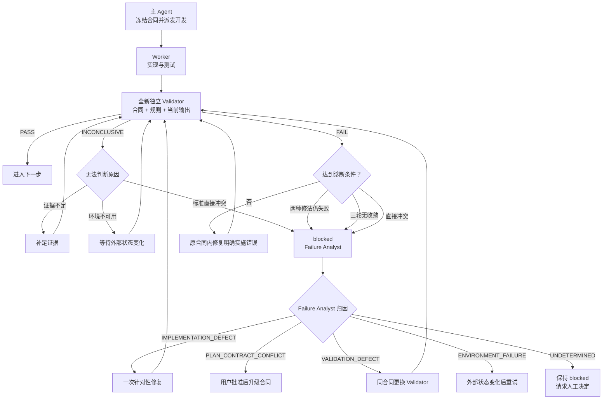

# 执行计划

执行计划回答“当前任务如何完成”，并外置需求、步骤、检查点、Agent 派发和验证证据。产品与工程方向保存在根目录 `PLANS.md`。

## 创建时机与命名

- Git 门禁通过后，除纯概念问答和简单状态查询外，每个仓库任务都创建或恢复计划。
- Roadmap 任务只有进入 ready batch、即将修改仓库时才创建详细计划；阶段获批时不得提前批量创建未来计划。
- Roadmap 计划使用 `<stage>-<initiative-slug>-<sequence>-<feature-slug>.md`。
- 已完成任务的真正返工使用原文件名加 `-r01`、`-r02`，并链接原 completed 计划。
- 普通诊断、命令重试和同一任务内修复只更新当前计划。
- 非 Roadmap 工作使用 `ADHOC-<sequence>-<slug>.md`；历史计划无需机械改名。

## 生命周期

- 非终态计划保存在 `active/`；终态 `completed` 或 `cancelled` 计划移至 `completed/`。
- 状态使用 `planned`、`ready`、`active`、`blocked`、`validating`、`validated`、`integrating`、`completed`、`rework` 和 `cancelled`。
- 主协调 Agent 是计划、Roadmap 和协调状态的唯一写入者；Worker、Validator 和 Failure Analyst 只返回结构化事实。
- `memory.md` 只链接活动计划；步骤和检查点只保存在计划中，完成后删除 memory 指针。

```text
planned → ready → active → validating → validated → integrating → completed
                    ↕           │                         │
                  blocked       └── FAIL → 记录与诊断门   └── FAIL → 记录与诊断门

completed → rework → active
active|blocked|validating|validated|integrating → cancelled
```

任务级 Validator `PASS` 只进入 `validated`。并行结果集成后，集成级 Validator `PASS` 才能完成、归档并勾选 `PLANS.md`；单一串行任务在任务级 `PASS` 后可直接完成。

## 冻结验证合同

全局纪律由 `AGENTS.md` 定义；每个任务具体的验收范围保存在自身 exec plan 的“冻结验证合同”中，不建立独立合同文件。

- 用户明确提出任务或批准计划时，同时冻结初始版本 `VC-001`，Worker 开始修改前合同必须为 `frozen`。
- 合同使用 `AC-*`、`INV-*`、`TM-*`、`EX-*` 和 `GATE-*` 标记验收标准、行为不变量、威胁模型、明确排除项和检查门禁，并记录冻结依据与修订历史。
- Validator 可以用新方法验证已有标准，但不得增加验收要求。阻塞发现必须绑定 `AC-*`、`INV-*`、`TM-*`、`RULE-*` 或 `GATE-*`。
- `EX-*` 或超范围发现只进入 `ADVISORY`/`SCOPE_CHANGE_CANDIDATE`；合同含糊或阻塞发现未绑定标准时返回 `INCONCLUSIVE` 并保持 `validating`。
- 冻结后只有人工明确批准才能升级合同版本。新版本必须记录变更和批准依据，旧版本验证随即失效。
- 重验证逐字沿用同一合同版本，且不接收历史 Validator 输出。合同争议不触发模型升级或自动修改实现。

## 失败诊断门

有效失败不能无条件进入下一轮修复。计划按“任务 + 合同版本 + 失败特征”记录每次修法和验证结果；失败特征由关联标准和可观察的不符合结果组成。

| Validator 结论 | 判断条件 | 主协调 Agent 处理 |
| --- | --- | --- |
| `PASS` | 全部适用标准和门禁通过，且没有有效阻塞发现 | 进入集成、归档或下一任务。 |
| `FAIL` | 当前输出明确违反至少一项已有标准，且发现已绑定标准并有可复核证据 | 记录失败特征；未达到诊断条件时修复明确实施错误，达到条件时先启动 Failure Analyst。 |
| `INCONCLUSIVE` | 证据不足、检查无法运行、合同含糊或冲突，或报告协议无效 | 禁止直接修改实现；补证据、等待环境变化或请求人工澄清。 |



出现以下任一情况时，任务设为 `blocked`、`blocker_type=DIAGNOSIS_PENDING`：

- 同一失败特征采用两种实质不同修法仍失败；
- 连续三轮修改和验证没有消除该特征、没有持续减少有效阻塞项，或在同一组标准间往返；
- 直接发现冻结目标、标准、依赖或范围无法同时满足。

全新、只读、未参与实施的 `high/high` Failure Analyst 可以读取相关失败历史，固定归因为 `IMPLEMENTATION_DEFECT`、`PLAN_CONTRACT_CONFLICT`、`VALIDATION_DEFECT`、`ENVIRONMENT_FAILURE` 或 `UNDETERMINED`。它只负责找原因，不得修改文件、改变合同、替代 Validator 或裁决 `PASS`。

- 可安全修复的实施缺陷只允许一次诊断后修复；相同特征继续失败则停止并请求人工决定。
- 规划或合同冲突必须给出最小冲突集合和处理选项，只有人工批准才能升级合同。
- 验证缺陷使用同一合同交给全新 Validator，不修改实现。
- 环境故障只有确认外部状态变化后才允许一次重试。
- 无法确定时保持 `blocked`，不得猜测或降低标准。

Failure Analyst 与 Validator 严格隔离：前者为了归因可以接收尝试历史；后者仍只能接收冻结合同、适用规则和当前结果。仓库内已有历史 Validator 记录可以作为当前文件的格式和风险检查对象，但其 verdict 不得成为新 Validator 的裁决证据。

## 并行与写入隔离

- 计划记录 Roadmap ID、Batch ID、显式依赖、分支、worktree、集成分支、写入范围和禁止范围。
- 同一 batch 的活动任务不得拥有重叠写入范围。
- Worker 只修改任务合同批准的代码和测试；协调文档由主协调 Agent 统一维护。
- 依赖、接口或写入冲突时停止相关并行工作，并将任务改为 `blocked` 或串行执行。
- TrainLab 不使用 `orchestrate-parallel-work`、`.orchestration`、Graph/Dashboard 或 hash-bound handoff 管理这些状态。

## Agent 派发与升级

- 每个 subagent 派发记录抽象模型和推理档位：`low`、`medium`、`high`，不记录具体模型名称。
- 记录选档依据、平台支持、输入、权限、预期产物和 lint/test 门。
- 平台不能控制某维度时记录 `platform-default`。
- 只有能力不足时才使用全新 Agent 按规定阶梯升级；合同缺失、含糊、范围争议或超范围发现交由合同裁决和人工决定。
- `high/high` 仍无法满足合同后停止自动重试并标记 `blocked`。
- Failure Analyst 固定使用 `high/high`；它不参与能力升级链。

## 检查点与回写

- 同一计划最多一个步骤为 `in_progress`。
- 检查点记录 `blocker_type` 和诊断状态；诊断状态使用 `not_triggered`、`pending`、`in_progress` 或 `completed`。
- 完成关键步骤、出现阻塞、准备交接和上下文结束前更新检查点。
- 每个上下文追加一条简短迭代日志，不保存完整对话。
- 恢复时以 Git 和文件系统事实核对检查点，仓库事实优先并记录偏差。
- 验证通过后按顺序归档计划、更新适用 Roadmap 状态并删除 memory 指针。

## 验证证据

- Validator 必须是全新、只读且未参与实施的 Agent，只接收逐字冻结合同、适用规则和当前结果。
- Validator 固定返回 `contract_version`、`overall_verdict`、`criterion_results`、`blocking_findings`、`advisories`、`scope_change_candidates`、`unknowns` 和 `commands_and_evidence`。
- 计划保存 Validator 档位、合同版本、逐项结果、命令、证据、结论和剩余风险。
- 未绑定冻结标准的阻塞发现使报告无效并按 `INCONCLUSIVE` 处理，不得触发代码、测试、规则或合同修改。
- Validator 不可用或结论为 `INCONCLUSIVE` 时不得完成计划。
