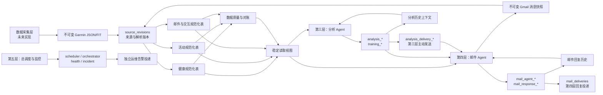

# 第一层：数据基础层开发契约

状态：已冻结

契约版本：2.4

冻结日期：2026-07-23

实现状态：尚未开始

样本证据：[../fit-storage-sample.md](../fit-storage-sample.md)

v2 变更：将 Garmin Connect 生理资源覆盖和 Gmail 会话数据提升为第一层正式契约，
补充通用生理记录、资源覆盖状态、邮件线程、会话事件及用户事实模型。

v2.1 变更：补充活动在 Garmin 端的 active、疑似缺失和已删除状态，并扩展
活动 summary、FIT、splits、sets、zones、天气和装备等来源角色；其余主体模型不变。

v2.2 变更：将 AI 日总结、周总结、训练建议、周计划和交互式回答提升为正式的
派生数据域，补充分析运行、输入快照、产物 revision、训练计划及邮件投递血缘。

v2.3 变更：正式拆分第三层分析 Agent 与第四层邮件 Agent 的数据写入所有权。
第三层的 `analysis_*` 只保存日/周分析和正式重生成；邮件 AI 回复、会话事件、
用户事实、邮件运行与投递血缘改由第四层独立表写入和修订。

v2.4 变更：第三层在 accepted 分析产物落库后自行使用受限 Gmail MCP 投递；
新增第三层专属 `analysis_deliveries` 和 `analysis_delivery_artifacts`。第四层
收敛为收件、会话处理和邮件回复，`mail_delivery_*` 只记录第四层回复投递；同时
补充第五层调度、健康检查、incident 和独立运维告警的运行表。

## 1. 目标

数据基础层是项目开始阶段的一次性环境初始化，不是项目运行期间持续工作的服务。
它的交付物是已经准备好的目录、文件、SQLite schema、稳定视图和版本标记；成功
交付这些环境后，第一层生命周期立即结束，后续由第二至第五层使用这些交付物。

数据基础层为四个一等数据域提供统一、可迁移、可重建的 SQLite 数据基础：

1. Garmin Connect 生理健康数据。
2. Garmin Connect 活动、FIT 和传感器数据。
3. Gmail 邮件、回复及由其形成的会话与用户事实。
4. 第三层生成的日/周总结、训练建议和训练计划，以及第四层生成的邮件 AI 回复。

前三类包含来源事实与用户事实；第四类是有明确输入血缘和版本的派生数据，不得
反向伪装成健康事实或用户陈述。服务运行和监控数据可以复用同一数据库，但不属于
四类业务数据；其第五层运行表仍由本层 initializer 创建和迁移。
本层负责定义：

- 数据库和原始文件的权威位置。
- 表、字段、单位、时间、身份和版本语义。
- Garmin JSON/FIT 和 Gmail 消息到规范化数据的承载方式。
- 第三层分析产物和第四层邮件回复各自的输入血缘、版本和历史上下文承载方式。
- 手表、外接传感器和开发者字段的来源规则。
- 幂等、修订、冲突、质量问题和重建规则。
- 下游服务可以稳定读取的边界。

数据基础层没有常驻进程，不访问 Garmin、Google 或其他网络服务，不负责定时、
重试、补漏、分析、发信和运维告警。

## 2. 非目标

以下内容由后续分层文档定义：

- Garmin Connect API 调用、认证、日期区间和限流重试。
- 全量/增量同步、最近日期重拉、历史缺口扫描和任务调度。
- 每日总结、周总结、训练计划、邮件 AI 回答及其具体模型调用流程。
- Gmail MCP 发送、回复监控和 TrainLab 标签处理流程。
- 服务拉起、进程守护、日志轮转和告警策略。

本层必须定义邮件、交互及 AI 派生数据的存储契约，但不提前规定第三层如何调用
模型，也不规定第四层如何轮询、发送或处理标签。

### 2.1 生命周期与初始化边界

数据基础层的正常生命周期固定为：

```text
未初始化/可恢复的初始化中 → 执行或恢复 init → 环境 ready → 第一层生命周期结束
```

它不是长期运行的业务层。第二至第四层不在每次启动时调用它；第五层 Supervisor
启动时允许调用一次 `foundation init` 作为项目 bootstrap：

1. 当 ready 标记不存在，且现场可判定为未初始化或可安全恢复的初始化中状态时，
   init 创建或继续创建目录、`data.db`、`raw/` 子目录、安全权限、DDL、稳定视图
   和 schema version；不得通过清空现场重新开始。
2. 所有创建和初始 migration 成功后，原子写入“数据基础已就绪”标记并立即退出。
3. 环境已经 ready 且 schema 为当前支持版本时，不需要再次执行第一层；即使用户
   显式重复调用 init，也只返回 `already_initialized`，不得重建、扫描或改写数据。
4. 环境已经 ready 时，第五层的 bootstrap 调用必须只返回
   `already_initialized`，不扫描、补建、迁移或改写数据；第二至第四层只验证
   ready 标记和兼容 schema version。
5. 第一层不启动 daemon、scheduler、worker、timer、后台线程或网络监听，也不承担
   采集、补漏、分析、发信、备份轮询和服务监控。
6. 未来 schema 升级、影子重建和恢复必须使用独立、显式的 maintenance/migrate
   操作，由发布或恢复流程触发；这是维护能力复用，不表示第一层重新进入常驻生命
   周期，也不能在普通业务启动时静默执行。

初始化必须可以安全重复执行：已存在的目录、原始文件、表和用户数据不得被覆盖或
清空。仅在确认“尚未初始化”或“上次 init 可安全恢复”时才允许创建缺失目录；
无法证明现场可恢复时必须停止。已经 ready 后出现目录缺失、数据库版本异常、
migration 失败或权限不安全时也必须停止并给出明确错误，不能借重复 init 静默
补建、迁移或重置。

### 2.2 公共接口

目标 CLI：

```text
trainlab foundation init
trainlab foundation status
trainlab foundation verify
trainlab foundation migrate --target-version VERSION
```

规则：

- 所有命令都是一次性进程，执行后退出。
- `init` 是唯一正常初始化入口；空环境创建完整基础，ready 环境严格 no-op。
- `status` 只读 ready、schema version 和路径权限摘要。
- `verify` 只做受控完整性与兼容性检查，不补建或迁移。
- `migrate` 是显式维护入口，只接受代码支持的目标版本；第五层普通启动不得调用。
- 数据根目录来自 owner-only 配置，不允许通过邮件、模型输出或任意 CLI 路径覆盖。
- stdout 只输出 `FoundationReceipt` JSON，不输出数据内容、凭据或完整错误堆栈。

稳定 Python API：

```python
FoundationTool.execute(request: FoundationRequest) -> FoundationReceipt
```

`FoundationRequest` 固定包含：

- `mode`：`init`、`status`、`verify`、`migrate`。
- `invocation_id`。
- `target_schema_version`，仅 migrate 使用。
- `requested_at_utc`。

`FoundationReceipt` 固定包含：

- `schema_version`：receipt 自身版本。
- `invocation_id`。
- `mode`。
- `status`：`initialized`、`already_initialized`、`ready`、`incompatible`、
  `lock_busy`、`failed`。
- `foundation_schema_version`。
- `ready`。
- 创建、已存在和验证的目录/对象计数。
- migration 起止版本与已应用 migration ID。
- `next_action`：`none`、`explicit_migrate`、`operator_review`。
- 脱敏 warnings/errors。
- `started_at_utc`、`completed_at_utc`。

CLI 和 Python API 必须调用同一个 application service。第五层只能根据 receipt
判断 bootstrap 是否成功，不能通过目录是否“看起来存在”自行猜测。

CLI 退出码：

| 退出码 | receipt 状态 | 含义 |
|---:|---|---|
| 0 | `initialized` / `already_initialized` / `ready` | 初始化或只读检查完成 |
| 10 | `incompatible` | 需要显式 migrate 或升级工具版本 |
| 11 | `lock_busy` | 另一 init/maintenance 调用持有锁 |
| 20 | `failed` | 配置、权限、磁盘、SQLite 或不可恢复错误 |

目标配置至少包含：

```yaml
foundation:
  data_root: .
  database_path: data.db
  raw_root: raw
  state_root: state
  ready_marker: state/foundation-ready.json
  lock_path: state/locks/foundation.lock
```

所有路径在加载后必须解析到允许的数据根目录内；环境变量和 CLI 不能把单个子路径
重定向到未授权位置。配置不包含任何 Garmin/Gmail 凭据。

## 3. 已冻结的核心决策

1. 使用一个 SQLite 文件作为结构化数据权威来源。
2. 本层以一次性幂等 initializer 和独立显式维护工具的形式存在；首次 init 进入
   ready 后生命周期结束，没有常驻进程或周期任务。第五层 Supervisor 启动时可以
   调用一次 init 作 bootstrap，但 ready 环境必须严格 no-op。
3. 生理健康、活动、邮件交互和 AI 派生结果是四个平级的一等数据域；采集、分析
   和邮件层只拥有流程，不另建彼此割裂的业务数据库。
4. 原始 Garmin JSON/FIT 和 Gmail 消息快照不作为 BLOB 存入 SQLite，而是不可变地
   保存在文件系统。
5. 数据库保存原始文件路径、SHA-256、来源、抓取时间和解析器版本。
6. Garmin 是目标架构的主要健康与活动来源；现有 `Health.xlsx` 和旧 FIT 导入仅作为
   迁移兼容来源。
7. “完整覆盖”指保存当前 `python-garminconnect` 可读取的数据，并能无损接住未来
   新增或账户特有的 JSON 字段；不声称覆盖 Garmin 未公开、库未实现的内部数据。
8. 原始数据、来源修订和解析投影分离；任何投影都可以重建。
9. 同一 Garmin 或 Gmail 对象发生变化时新增 revision，不覆盖或删除旧原始版本。
10. 生理数据采用常用专项表、通用记录/指标表和原始 JSON 三层结构，避免把库的
   当前字段清单固化成数据库上限。
11. 每种资源和日期都记录 `fetched`、`partial`、`empty`、`not_enabled`、
    `not_available`、`forbidden` 或 `error` 等覆盖状态；“没有记录”不能自动
    解释为真实零值。
12. 活动使用通用概要、通用分段、时间序列和少量专项投影，不为每种运动建立
   一套彼此不兼容的完整表。
13. 高频活动数据每个时间点一行，常用字段为明确列，其他已识别字段进入
   `extras_json`；不使用“每个指标一行”的活动 EAV 结构。
14. 未识别 FIT message 的完整值留在原始 FIT，SQLite 保存 message/field
   签名、数量和解析状态。
15. 传感器来源按字段和有效时间范围记录，不能给整行 sample 绑定单一设备。
16. 无直接证据时来源标为未知，不根据字段名猜测来自手表或第三方设备。
17. 邮件原始内容、规范化消息、会话事件和用户事实分层保存；模型推断不能伪装
    成用户明确陈述。
18. 所有规范化数值使用固定公制单位，同时保留原始值、原始单位和来源。
19. UTC 是存储时间，`Asia/Singapore` 是本地日期与调度日历。
20. 第三层只写 daily、weekly、plan revision、regeneration 的 `analysis_*`、
    `training_*` 和 `analysis_delivery_*`；第四层只写 Gmail、会话、用户事实、
    邮件 Agent 运行、邮件回复和 `mail_delivery_*`。
21. 分析总结、训练计划和邮件 AI 回复必须在发送前保存；Gmail 是交付渠道，
    不是任何一类历史产物的唯一权威副本。
22. 第三层重生成与第四层邮件回复重生成各自新增 revision，不覆盖旧产物；
    两层分别记录分析主动投递和邮件回复投递，不共同写任何业务表。
23. 每个 AI 产物必须能追溯到确切的结构化输入快照、来源 revision、历史产物和
    对应的 Shared/专项 Harness 与 Schema 版本。
24. 历史分析产物和历史邮件回复只能以 `prior_model_output` 身份进入后续上下文；
    Garmin 事实和用户明确陈述的证据优先级始终更高。
25. 只保存通过 Schema 与安全校验的结构化结果和用户可见解释，不保存隐藏推理、
    chain-of-thought、原始模型协议响应或完整内部提示词。
26. 第五层只写 `scheduler_*`、`orchestrator_*`、`service_health_checks`、
    `operational_incidents` 和 `operational_alert_deliveries`；运维告警不占用
    第三层分析投递或第四层回复投递表。

## 4. 总体数据流



数据基础层只定义图中的存储和契约；Garmin 箭头由第二层实现，Gmail 箭头由
第四层实现。第三层实现分析产物、训练计划及其主动投递；第四层实现会话解释、
用户事实、邮件 Agent 回复及回复投递。两层可以读取对方已经 accepted 的稳定
视图，但不写入或重复发送对方拥有的产物。

## 5. 权威文件布局

目标布局：

```text
data.db
raw/
  garmin/
    fit/YYYY/MM/<sha256>.fit
    json/YYYY/MM/<sha256>.json
  gmail/
    json/YYYY/MM/<sha256>.json
    attachments/YYYY/MM/<sha256>
  legacy/
    health_xlsx/<sha256>.xlsx
    fit/YYYY/MM/<sha256>.fit
```

规则：

- `data.db` 保持为项目结构化数据入口。
- 原始文件以内容哈希命名；显示名称、远端对象 ID 和原始文件名保存在数据库。
- 同一内容只保存一次；不同内容即使属于同一活动也分别保存。
- 需要持久化的原始文件先写目标目录临时文件，完成校验后原子重命名。
- 原始文件不因云端删除、解析失败、revision 替换或数据库重建而删除。
- Garmin `ORIGINAL` 活动下载的 ZIP 只作为临时传输容器；安全提取并通过 CRC
  和活动身份校验的 FIT 才作为原始对象长期保存，临时 ZIP 随后删除。
- Gmail 原始对象优先保存 MCP/API 返回的完整 JSON；附件单独按内容哈希保存，
  SQLite 只保留元数据和关联，不保存附件 BLOB。
- accepted AI 产物、输入快照和训练计划直接以有界结构化数据保存在 SQLite；
  不为模型厂商的原始请求、响应或隐藏推理建立 raw 文件归档。
- 当前生产的 `source/Health.xlsx`、`source/HealthFit/*.fit` 在迁移完成前保持不变。
  切换数据源必须与 Harness、配置、迁移和回滚一起发布。

## 6. 通用类型和单位

| 数据 | 规范 |
|---|---|
| 精确时间 | UTC ISO-8601 文本，带 `Z` 或明确 `+00:00`，保留可用的毫秒 |
| 本地日期 | `YYYY-MM-DD`，按 `Asia/Singapore` 派生 |
| 时长 | 秒，`REAL` |
| 距离/海拔 | 米 |
| 速度 | 米/秒 |
| 体重 | 千克 |
| 温度 | 摄氏度 |
| 功率 | 瓦 |
| 心率 | bpm |
| 血氧/比例 | 0–1；展示层可以转百分比 |
| JSON | UTF-8、稳定键顺序、必须通过 `json_valid` |

规范化列只保存规范单位；`raw_value`、`raw_unit`、FIT field number、
scale/offset 和来源保存在修订、定义或 `extras_json` 中。

## 7. 表目录与所有权

本节冻结表的职责、粒度和关键约束；完整 DDL 在后续实现任务中生成，但不得改变
这里的语义。

运行时写入所有权（第一层 init 只创建 schema，并不拥有后续业务写入）：

| 表族 | 唯一运行时写入者 |
|---|---|
| `schema_migrations`、`foundation_state` | 显式 maintenance/migrate；普通业务层均不写 |
| Garmin raw/revision/coverage、健康、活动、FIT 与相关质量投影 | 第二层 |
| Gmail raw/revision/coverage、`mail_*`、`conversation_events`、`user_facts`、`mail_delivery_*` | 第四层 |
| `analysis_*`、`training_*`、`analysis_delivery_*` | 第三层 |
| `scheduler_*`、`orchestrator_*`、`service_health_checks`、`operational_*` | 第五层 |
| 运行/质量/对账表 | 产生该运行或检查的唯一对应层；不得跨层代写 |

第三至第五层可读取明确开放的稳定视图，但不存在共同可写表。

### 7.1 迁移、原始数据和修订

#### `schema_migrations`

- 粒度：每个数据库迁移版本一行。
- 关键字段：`version`、`description`、`applied_at_utc`、`code_revision`。
- 约束：版本单调递增；不允许通过修改旧迁移改变已发布数据库。

#### `data_subjects`

- 粒度：一个被记录和分析的人一行；首版只允许一个 active subject。
- 关键字段：`subject_key`、`timezone`、`is_active`、`created_at_utc`。
- 规则：所有健康、活动、邮件、用户事实、AI 产物和训练计划最终关联同一个
  `subject_id`，不能仅靠“当前登录账号”隐式连接。

#### `subject_identities`

- 粒度：一个 subject 在一个 provider 中的一种账号身份。
- 关键字段：`subject_id`、`provider`、`identity_kind`、`identity_hmac`、
  `is_verified`、`first_seen_at_utc`、`last_seen_at_utc`。
- 唯一键：`(provider, identity_kind, identity_hmac)`。
- 安全：Garmin user ID、Gmail 地址等身份使用项目密钥生成稳定 HMAC，不在
  规范化表保存明文账号。

#### `raw_objects`

- 粒度：每个不同 SHA-256 的原始文件一行。
- 关键字段：`sha256`、`relative_path`、`media_type`、`size_bytes`、
  `provider`、`resource_kind`、`original_name`、`fetched_at_utc`。
- 约束：`sha256` 唯一；路径必须位于允许的 `raw/` 根目录。
- 内容：只记录元数据，不存原始 BLOB。

#### `source_revisions`

- 粒度：某个 provider 对象的一次不可变内容修订。
- 关键字段：`provider`、`resource_kind`、`provider_object_id`、
  `revision_no`、`raw_object_id`、`payload_hash`、`parser_name`、
  `parser_version`、`profile_version`、`is_current`、`parsed_at_utc`。
- 唯一键：`(provider, resource_kind, provider_object_id, revision_no)`。
- 规则：同一内容哈希重复导入为 no-op；内容变化新增 revision，并切换
  `is_current`。

#### `resource_coverage`

- 粒度：某 subject、provider、resource kind 和一个查询窗口的一次覆盖结论。
- 关键字段：`subject_id`、`provider`、`resource_kind`、`window_start_utc`、
  `window_end_utc`、`local_date`、`availability_state`、`record_count`、
  `source_revision_id`、`observed_at_utc`。
- `availability_state`：`fetched`、`partial`、`empty`、`not_enabled`、
  `not_available`、`forbidden`、`not_supported`、`error`。
- 规则：`empty` 表示请求成功且源端明确没有数据；`not_available` 表示账号、
  设备或地区没有该指标；`not_enabled` 表示功能存在但用户没有启用；
  `error` 不得伪装成这些状态。
- 说明：同步任务、重试次数和错误堆栈属于第二或第四层；本表只保存可供质量门禁
  使用的最终数据覆盖事实。

### 7.2 设备和传感器来源

#### `devices`

- 粒度：一个可区分的记录设备或传感器一行。
- 关键字段：`device_uid_hash`、`manufacturer`、`product`、`device_type`、
  `hardware_version`、`first_seen_at_utc`、`last_seen_at_utc`。
- 安全：数据库不保存明文设备序列号；使用项目密钥生成稳定 HMAC。

#### `activity_devices`

- 粒度：活动与设备的一次关联。
- 关键字段：`activity_id`、`device_id`、`device_role`、`source_revision_id`。
- 角色示例：`main_device`、`heart_rate_sensor`、`power_sensor`、
  `developer_app`、`unknown`.

#### `activity_metric_sources`

- 粒度：某活动的某指标在一个有效时间范围内的一种来源。
- 关键字段：`activity_id`、`metric_key`、`valid_from_utc`、`valid_to_utc`、
  `source_kind`、`device_id`、`developer_data_index`、`attribution_method`、
  `confidence`。
- `attribution_method`：`explicit_device`、`explicit_developer`、
  `provider_metadata`、`inferred`、`unknown`。
- 规则：一行 `activity_samples` 可包含多个来源的字段，所以 sample 表没有
  单一 `device_id`。
- 规则：没有直接证据时使用 `unknown`；推断值不能伪装成明确来源。

### 7.3 健康和生理数据

#### 当前 Garmin Connect 覆盖基线

本契约以 2026-07-23 检查的
[`python-garminconnect` 0.3.6 源码](https://github.com/cyberjunky/python-garminconnect/blob/2ae0eb5d6e56a13bc0194e229992c3a7d855253c/garminconnect/__init__.py)
为基线。以下是需要承载的数据族，不是第二层必须逐次调用的 endpoint 清单：

| 数据族 | 当前库方法示例 | 规范化落点 |
|---|---|---|
| 日常活动与能量 | `get_stats`、`get_user_summary`、`get_steps_data`、`get_floors`、`get_intensity_minutes_data`、`get_hydration_data` | `daily_health`、`health_samples` |
| 心肺与自主神经 | `get_heart_rates`、`get_rhr_day`、`get_hrv_data`、`get_respiration_data`、`get_spo2_data`、`get_blood_pressure` | `daily_health`、`health_samples`、`physiology_records` |
| 压力、恢复与精力 | `get_all_day_stress`、`get_stress_data`、`get_body_battery`、`get_body_battery_events`、`get_training_readiness` | `health_samples`、`physiology_records`、`physiology_metrics` |
| 睡眠 | `get_sleep_data` | `sleep_sessions`、`sleep_stages`、`health_samples` |
| 身体组成 | `get_body_composition`、`get_weigh_ins`、`get_daily_weigh_ins` | `body_measurements` |
| 训练生理与能力 | `get_max_metrics`、`get_lactate_threshold`、`get_training_status`、`get_running_tolerance`、`get_endurance_score`、`get_hill_score`、`get_race_predictions`、`get_fitnessage_data` | `physiology_records`、`physiology_metrics` |
| 生活、营养与生殖健康 | `get_lifestyle_logging_data`、`get_all_day_events`、`get_nutrition_daily_*`、`get_menstrual_*`、`get_pregnancy_summary` | `physiology_records`、`physiology_metrics` |
| 用户基线与设置 | `get_user_profile`、`get_userprofile_settings`、设备资料 | `physiology_records`、`devices` |

同一指标可能出现在多个 endpoint。第二层必须保存每个原始响应和 revision，再由
canonical 来源规则选值，而不能将接口响应直接互相覆盖。某项数据是否实际存在取决于
账号、设备、地区、固件和用户是否启用功能；因此“所有”必须通过
`resource_coverage` 证明，不能用一张固定字段表宣称完成。

#### `daily_health`

- 粒度：每个用户、本地日期、current revision 一行。
- 常用列：步数、距离、总/活动热量、静息心率、平均/最低/最高心率、压力、
  Body Battery、血氧、呼吸率、中高强度分钟、楼层、补水。
- 其他字段：`extras_json`、`source_map_json`、`source_revision_id`。
- 约束：同一用户和日期只有一个 current canonical 行。
- 说明：这里只放每日分析稳定使用的汇总字段，不作为所有生理字段的唯一容器。

#### `health_samples`

- 粒度：一个时间点的一个健康指标观察值。
- 关键字段：`observed_at_utc`、`local_date`、`metric_key`、`value_number`、
  `value_text`、`raw_value_json`、`raw_unit`、`canonical_unit`、
  `device_id`、`source_revision_id`。
- 说明：全天健康指标采样频率不同且天然稀疏，本表允许使用长表模型；
  它与高密度、多字段同时采样的 `activity_samples` 不同。

#### `physiology_records`

- 粒度：一个低频生理事件、评分、状态、预测、基线或一个有起止范围的记录。
- 关键字段：`subject_id`、`domain`、`record_type`、`provider_record_id`、
  `effective_at_utc`、`period_start_utc`、`period_end_utc`、`local_date`、
  `value_origin`、`status_key`、`status_text`、`extras_json`、
  `source_revision_id`。
- `value_origin`：`sensor_observed`、`user_entered`、`provider_derived`、
  `provider_predicted`、`profile_setting`、`unknown`。
- `domain` 示例：`cardiovascular`、`recovery`、`sleep`、`training`、
  `body_composition`、`nutrition`、`reproductive_health`、`profile`。
- `record_type` 示例：`training_readiness`、`training_status`、`vo2_max`、
  `fitness_age`、`lactate_threshold`、`race_prediction`、`blood_pressure`、
  `body_battery_event`、`menstrual_day`、`pregnancy_snapshot`。
- 规则：时间序列采样仍进入 `health_samples`；睡眠和身体测量优先进入专项表；
  本表承载其余异构、低频数据，并允许未来 resource kind 无需新增整张表。

#### `physiology_metrics`

- 粒度：一个 `physiology_records` 记录中的一个已识别指标。
- 关键字段：`physiology_record_id`、`metric_key`、`value_number`、
  `value_text`、`value_boolean`、`value_json`、`raw_unit`、
  `canonical_unit`、`value_origin`、`source_path`。
- 约束：四种 value 列最多一个非空；`metric_key` 使用版本化词典。
- 说明：低频生理数据的结构差异很大，长表可以避免为每个 Garmin 评分建立独立
  宽表；高频活动数据仍不使用这种结构。
- 说明：VO₂ Max、训练准备度、体能年龄和比赛预测等必须标为 Garmin 派生或预测，
  不能表现成传感器直接测量值。

#### `sleep_sessions`

- 粒度：一次睡眠会话。
- 类型：`main_sleep`、`nap`、`unknown`；不能假定每天只有一次睡眠。
- 常用列：开始/结束、总睡眠、清醒、浅睡、深睡、REM、睡眠分数、呼吸率、
  血氧、HRV、静息心率。
- 其他字段：`extras_json`、`source_map_json`、`source_revision_id`。

#### `sleep_stages`

- 粒度：睡眠会话中的一个连续阶段。
- 关键字段：`sleep_session_id`、`stage_index`、`stage_type`、
  `start_time_utc`、`end_time_utc`、`duration_seconds`、`source_revision_id`。

#### `body_measurements`

- 粒度：一次身体测量事件。
- 常用列：体重、BMI、体脂、肌肉量、骨量、身体水分。
- 其他字段：`extras_json`、`source_revision_id`。

#### `source_field_catalog`

- 粒度：某 provider/resource kind 的一个 JSON path 或字段签名。
- 关键字段：`provider`、`resource_kind`、`field_path`、`observed_type`、
  `first_seen_at_utc`、`last_seen_at_utc`、`mapping_state`、
  `canonical_metric_key`、`example_redacted_json`。
- `mapping_state`：`mapped`、`known_passthrough`、`unknown`、`ignored_with_reason`。
- 规则：新字段或类型变化必须可发现；完整值保留在原始 JSON，不在目录中复制
  大量个人数据。

### 7.4 活动概要、分段和传感器

#### `activities`

- 粒度：一个 provider 活动的 current canonical 行。
- 身份：内部 `id`；`(provider, provider_activity_id)` 唯一。
- 常用列：名称、sport、sub_sport、开始/结束 UTC、本地日期、elapsed/timer、
  距离、热量、平均/最大心率、爬升/下降、速度、功率、训练负荷、有氧/无氧
  Training Effect、设备和应用摘要。
- 远端状态：`provider_state`、`first_missing_at_utc`、`last_missing_at_utc`、
  `provider_deleted_at_utc`。
- `provider_state`：`active`、`suspected_missing`、`provider_deleted`；
  单次列表缺失不能直接判定为删除。
- 其他字段：`extras_json`、`source_map_json`、`primary_revision_id`。
- 说明：一个活动可以同时使用 JSON summary、FIT 和 legacy 等多个 current
  source revision；`primary_revision_id` 只表示活动身份的主要来源，不代表唯一来源。
- 结束时间：由明确结束字段、`start + elapsed`、最后 sample 和最后 segment
  交叉验证；保留推导方法和置信度。

#### `activity_source_revisions`

- 粒度：活动与一个来源 revision 的关联。
- 关键字段：`activity_id`、`source_revision_id`、`source_role`、`is_active`。
- `source_role`：`summary_json`、`activity_fit`、
  `splits_json`、`typed_splits_json`、`split_summaries_json`、
  `exercise_sets_json`、`hr_zones_json`、`power_zones_json`、`weather_json`、
  `gear_json`、`details_json_fallback`、`legacy_fit`、`manual`。
- 约束：同一活动、来源角色和 revision 不重复；canonical 字段通过
  `source_map_json` 指向实际采用的 revision。

#### `activity_segments`

- 粒度：活动中的一个有序分段。
- 类型：`lap`、`split`、`climb_active`、`climb_rest`、`strength_active`、
  `strength_rest`、`workout_step`、`length`、`interval`。
- 关键字段：`activity_id`、`segment_type`、`segment_index`、
  `parent_segment_id`、开始/结束、时长、距离、心率、热量、爬升/下降、
  `extras_json`、`source_revision_id`。
- 唯一键：`(activity_id, source_revision_id, segment_type, segment_index)`。

#### `activity_samples`

- 粒度：一个 FIT/活动时间序列记录点一行。
- 唯一键：`(activity_id, source_revision_id, stream_kind, sample_index)`；
  不能只用 timestamp，因为合法数据可能存在同时间多记录或不同流。
- 常用列：时间、GPS、距离、速度、海拔、心率、呼吸率、步频、功率、温度、
  垂直振幅、触地时间、垂直比、步长。
- 其他已识别字段：`extras_json`，其中每个字段保留值、单位、field number 和
  developer data index。
- 来源：通过 `activity_metric_sources` 按指标和时间范围关联。
- 规则：未识别 message 不展开进本表，等待解析器升级后从原始 FIT 重建。

#### `fit_metric_definitions`

- 粒度：一个 FIT developer field 定义。
- 关键字段：`source_revision_id`、`developer_data_index`、`native_mesg_num`、
  `field_definition_number`、`field_name`、`base_type`、`raw_unit`、
  `canonical_metric_key`。

#### `activity_aux_messages`

- 粒度：一个已识别但未进入概要、分段或 sample 的低频 FIT message。
- 示例：训练设置、timestamp correlation、部分设备设置和非活动流元数据。
- 关键字段：`activity_id`、`source_revision_id`、`global_message_number`、
  `message_name`、`message_index`、`timestamp_utc`、`payload_json`。
- 规则：高频未知流不在此表展开。

#### `fit_unknown_message_catalog`

- 粒度：一个原始 FIT revision 中的一种未知 global message。
- 关键字段：`source_revision_id`、`global_message_number`、`message_count`、
  `field_signature_json`、`first_timestamp_utc`、`last_timestamp_utc`。
- 规则：原始值留在 FIT；目录用于 schema drift、解析器升级和重建判断。

#### `course_points`

- 粒度：课程或导航路线中的一个点。
- 关键字段：`activity_id`、`course_identity`、`point_index`、名称、类型、
  距离、位置和路线时间。
- 规则：课程时间不自动解释为活动发生时间；与 `activity_samples` 分开。

### 7.5 运动专项投影

#### `climbing_routes`

- 粒度：一个 `climb_active` segment 的专项投影。
- 关键字段：`segment_id`、`grade_raw`、`grade_system`、`grade_display`、
  `completed`、`falls`、`ascent_meters`。
- 规则：原始难度和转换结果同时保存；转换规则必须版本化。

#### `strength_sets`

- 粒度：一个力量 active/rest segment 的专项投影。
- 关键字段：`segment_id`、`workout_step_index`、`set_type`、动作类别、
  原始动作编号、动作名称、次数、重量、持续时间。
- 规则：`0 次/0 kg` 与缺失值区分，并可以被数据质量规则标记为可疑。

跑步、徒步和骑行暂不建立完整的独立原始表；其通用字段和动态字段由
`activities`、`activity_segments`、`activity_samples` 和
`fit_metric_definitions` 承载。面向 AI 的 `activity_features` 属于数据分析层，
不由本层定义计算逻辑。

### 7.6 邮件、会话和用户事实

邮件域分五层保存，避免把“收到一封邮件”“模型如何理解它”和“以后长期记住什么”
混为一件事：

1. `raw_objects/source_revisions` 保存 Gmail MCP/API 原始消息快照。
2. `mail_threads/mail_messages` 保存确定性邮件事实。
3. `conversation_events` 保存面向分析层的有序交互事件。
4. `user_facts` 只保存有来源、有效期和作用域的用户事实。
5. `mail_agent_runs/mail_agent_items/mail_response_*` 保存邮件 Agent 的独立运行、
   分阶段项目、accepted 回复 revision 及其精确输入血缘。

本节所有表均由第四层独占写入；第三层只读其中已 accepted 的用户事实和计划修订
原因事件，绝不将邮件解释或用户事实写回 `analysis_*`。

#### `mail_threads`

- 粒度：一个 Gmail thread 一行。
- 关键字段：`subject_id`、`provider_thread_id`、`normalized_subject`、
  `first_message_at_utc`、`last_message_at_utc`、`message_count`、
  `trainlab_label_state`、`is_current`。
- 唯一键：`(subject_id, provider_thread_id)`。
- 规则：邮件主题不是线程身份；回复通过 Gmail thread/message 元数据关联。

#### `mail_messages`

- 粒度：一个 Gmail message 的 current canonical 行。
- 关键字段：`mail_thread_id`、`provider_message_id`、`direction`、
  `actor_role`、`sent_at_utc`、`received_at_utc`、`subject`、`body_text`、
  `body_sha256`、`in_reply_to_provider_message_id`、`labels_json`、
  `source_revision_id`、`processing_state`。
- `direction`：`inbound`、`outbound`、`self_copy`、`unknown`；由已认证本人身份
  和消息元数据确定。
- `actor_role`：只存 `user`、`trainlab`、`unknown` 等业务角色；规范化表不需要
  重复保存明文邮件地址。
- 规则：同一 `provider_message_id` 内容相同为 no-op；正文、标签或线程元数据变化
  形成 source revision，并更新 current canonical 行。
- 规则：`body_text` 是确定性提取的可分析文本，原始 HTML/MIME 或 MCP JSON 留在
  原始对象；正文哈希用于验证提取和重复处理。

#### `mail_attachments`

- 粒度：一个邮件附件一行。
- 关键字段：`mail_message_id`、`provider_attachment_id`、`filename`、
  `media_type`、`size_bytes`、`raw_object_id`、`content_disposition`。
- 规则：附件二进制不进入 SQLite；默认不进入模型上下文，只有未来明确允许的
  解析器才能生成派生文本。

#### `conversation_events`

- 粒度：一个可以进入分析上下文的有序事件。
- 关键字段：`subject_id`、`event_type`、`actor_role`、`occurred_at_utc`、
  `mail_message_id`、`analysis_artifact_id`、`mail_response_artifact_id`、
  `analysis_delivery_id`、`mail_delivery_id`、`related_run_key`、`content_text`、
  `structured_payload_json`、`trust_level`、`created_by`。
- `event_type` 示例：`daily_report_sent`、`weekly_report_sent`、
  `reply_received`、`new_request_received`、`mail_response_sent`、
  `feedback_recorded`、`plan_revision_reason_recorded`。
- `trust_level`：外部或用户邮件正文为 `untrusted_content`；TrainLab 自身生成且
  可由 run receipt 验证的事件为 `system_generated`。
- 规则：一封邮件可以产生零个或多个事件；事件不得改写邮件原文。
- 规则：事件可以只读引用第三层 analysis artifact、第四层 mail response 或实际
  delivery；引用不赋予第四层修改第三层 artifact 的权限。

#### `user_facts`

- 粒度：一项有证据的用户事实、偏好、约束或训练背景。
- 关键字段：`subject_id`、`fact_key`、`fact_value_json`、`scope`、
  `effective_from_utc`、`expires_at_utc`、`source_event_id`、
  `confidence`、`is_active`、`superseded_by_fact_id`。
- `scope`：`message_only`、`temporary`、`long_term`。
- 规则：只有用户明确表达长期意图时才建立 `long_term`；模型推断、一次状态陈述
  和邮件中的第三方内容不得自动升级为长期事实。
- 规则：事实修改使用 supersession 链，不覆盖原值；分析输出可以追溯到来源消息。
- 所有者：第四层；第三层只能读取 accepted 的 active facts，不能新增、修改、
  supersede 或把历史模型回复升级为用户事实。

#### `mail_agent_runs`

- 粒度：一次公开邮件工具调用，包括 run、poll、process、deliver-response、
  reconcile 或 status。
- 关键字段：`run_key`、`invocation_id`、`subject_id`、`request_kind`、
  `status`、`shared_harness_version`、`mail_harness_version`、
  `input_schema_version`、`output_schema_version`、`context_snapshot_json`、
  `context_snapshot_sha256`、各阶段计数、`next_retry_at_utc`、
  `started_at_utc`、`completed_at_utc`。
- 规则：`run_key` 唯一，非空 `invocation_id` 唯一；相同请求的重试恢复原运行或
  返回已有结果。没有调用 Codex 的 poll/deliver-response/status 运行，其 Harness、Schema
  和 context 字段使用 `null`。
- 安全：失败只保存脱敏错误和验证结果，不保存未校验模型原始响应、完整 prompt、
  邮件正文或凭据。

#### `mail_agent_items`

- 粒度：某次邮件工具调用中，一封消息、一个第三层依赖 artifact 或一次回复
  delivery 的一个 pipeline stage。
- 关键字段：`mail_agent_run_id`、`logical_item_kind`、`logical_item_id`、
  `mail_message_id`、`dependency_analysis_artifact_id`、`mail_response_artifact_id`、
  `mail_delivery_id`、`stage`、`status`、`attempt_count`、`error_code`、
  `error_summary`、`next_retry_at_utc`、开始/完成时间。
- `stage`：`discover`、`archive`、`normalize`、`classify`、`context`、
  `generate`、`validate`、`publish`、`render`、`send`、`verify`。
- 唯一键：`(mail_agent_run_id, logical_item_kind, logical_item_id, stage)`。
- 规则：同一项的某阶段失败不回滚已经完成的其他项；错误摘要不得包含正文。

#### `mail_poll_cursors`

- 粒度：一个 subject、Gmail identity 和发现流的安全扫描水位。
- 关键字段：`subject_id`、`identity_id`、`stream_kind`、
  `observed_through_utc`、`overlap_start_utc`、`last_successful_run_id`、
  `updated_at_utc`。
- `stream_kind`：`trainlab_label` 或 `tracked_threads`。
- 规则：cursor 只在对应发现流完整扫描成功后推进；每次查询保留重叠窗口以吸收
  延迟投递、后加标签和线程回复，去重仍以 provider message ID 为准。
- 规则：cursor 是发现优化，不是“之前绝无新消息”的业务事实；显式 reconcile
  可以重扫历史窗口，但不能改写原始邮件 revision。

#### `mail_response_artifacts`

- 粒度：一个 accepted 邮件 AI 回复的一次不可变 revision。
- 关键字段：`subject_id`、`mail_thread_id`、`in_reply_to_mail_message_id`、
  `response_kind`、`revision_no`、`generated_by_mail_agent_run_id`、
  `schema_version`、`structured_content_json`、`user_visible_text`、
  `content_sha256`、`is_current`、`supersedes_mail_response_artifact_id`、
  `created_at_utc`。
- 规则：重生成新增 revision，旧回复永久保留。accepted 回复先保存、后投递；
  Gmail 发送失败不能丢失该回复。

#### `mail_response_inputs`

- 粒度：一个邮件 Agent 运行实际使用的一项有序输入。
- 关键字段：`mail_agent_run_id`、`input_role`、`source_entity_type`、
  `source_entity_id`、`source_revision_id`、`input_sha256`、
  `trust_class`、`ordinal`。
- 输入可引用邮件、会话事件、用户事实、健康/活动 revision、历史分析产物和历史
  邮件回复；历史 AI 输出一律标记 `prior_model_output`，不得当作用户事实。
- `context_snapshot_sha256` 必须能由有序输入和确定性组装规则复算。

#### `mail_deliveries`

- 粒度：第四层对一个 accepted 邮件 AI 回复的确定性投递记录。
- 关键字段：`idempotency_key`、`delivery_kind`、`related_run_key`、
  `mail_message_id`、`provider_thread_id`、`status`、`sent_at_utc`、
  `last_verified_at_utc`。
- `delivery_kind` 首版固定为 `mail_response`，不承载第三层日报、周报或计划修订。
- 规则：相同 `idempotency_key` 不允许产生两封已发送邮件；失败后的恢复先通过
  Gmail 查询确认是否已经发送。
- 说明：轮询、尝试次数和错误日志属于第四层运行表；这里保存可被其他层引用的
  投递事实。

#### `mail_delivery_artifacts`

- 粒度：一次第四层回复投递与一个确切邮件回复 revision 的关联。
- 关键字段：`mail_delivery_id`、`mail_response_artifact_id`、`content_role`、
  `ordinal`。
- `content_role` 首版固定为 `mail_response`。
- 唯一键：`(mail_delivery_id, mail_response_artifact_id, content_role, ordinal)`。
- 规则：必须指向实际渲染并发送的回复 revision，不能只指向“当前版本”；本表
  不关联或投递第三层 analysis artifact。

### 7.7 AI 分析产物和训练计划

第三层分析产物是可追溯的派生业务数据，不是 Garmin、邮件或用户事实的 revision。
第三层必须先完成 Schema、安全和质量门禁，再将 accepted 结果写入本节各表；
邮件 AI 回复完全不使用 `analysis_*`，由第四层的 `mail_response_*` 承载。

#### `analysis_runs`

- 粒度：一次具有确定运行身份的数据分析层调用。
- 关键字段：`run_key`、`subject_id`、`analysis_kind`、
  `target_start_local_date`、`target_end_local_date`、`status`、
  `harness_version`、`input_schema_version`、`output_schema_version`、
  `context_snapshot_json`、`context_snapshot_sha256`、
  `generator_metadata_json`、`started_at_utc`、`completed_at_utc`。
- `analysis_kind`：`daily`、`weekly`、`plan_revision`、`regeneration`。
- `status`：`started`、`succeeded`、`failed`、`rejected`。
- `run_key` 唯一；同一日/周或正式重生成请求重试必须恢复或返回原运行，不重复生成
  accepted 产物。
- `context_snapshot_json` 保存实际提供给 AI 的有界结构化数据，不保存完整 prompt、
  HTML、附件、token 或其他秘密；必须符合当时的 input Schema。
- `generator_metadata_json` 只保存审计所需的实际运行信息，不能把某个模型名称变成
  后续运行的固定选择条件。
- 失败或拒绝只保存脱敏错误与验证结果，不保存未通过安全校验的完整模型输出。

#### `analysis_artifacts`

- 粒度：一个 accepted AI 产物的一次不可变 revision。
- 关键字段：`subject_id`、`artifact_kind`、`period_start_local_date`、
  `period_end_local_date`、`revision_no`、`generated_by_run_id`、
  `schema_version`、`structured_content_json`、`user_visible_text`、
  `content_sha256`、`is_current`、`supersedes_artifact_id`、`created_at_utc`。
- `artifact_kind`：`daily_summary`、`daily_training_advice`、
  `weekly_summary`、`weekly_training_plan`。
- 唯一键：`(subject_id, artifact_kind, period_start_local_date,
  period_end_local_date, revision_no)`。
- 同一 subject、kind 和周期最多一个 current revision；重新生成通过
  `supersedes_artifact_id` 形成链，旧版本永久保留。
- `structured_content_json` 是下游复用的权威内容；`user_visible_text` 是经过
  验证、可以发送给用户的文字。HTML 邮件只是可重新渲染的交付形式。
- 只保存最终可见解释和建议，不保存模型隐藏推理或原始 provider response。

#### `analysis_artifact_inputs`

- 粒度：一个 analysis run 实际采用的一项输入引用。
- 关键字段：`analysis_run_id`、`input_role`、`source_entity_type`、
  `source_entity_id`、`source_revision_id`、`source_window_start_utc`、
  `source_window_end_utc`、`input_sha256`、`trust_class`、`ordinal`。
- `input_role` 示例：`current_health`、`current_activity`、`user_statement`、
  `active_user_fact`、`prior_summary`、`prior_plan`、`quality_state`。
- `trust_class`：`provider_fact`、`user_asserted`、`derived_statistic`、
  `prior_model_output`。
- 输入可引用 source revision、活动、邮件、会话事件、用户事实、质量状态或历史
  `analysis_artifact`；引用类型和目标 ID 必须可验证。
- `context_snapshot_sha256` 必须能由有序输入集合和确定性组装规则复算。
- 历史 AI 总结或计划必须标为 `prior_model_output`，不能因被再次引用而升级为
  `provider_fact`、`user_asserted` 或长期 `user_facts`。

#### `analysis_artifact_relations`

- 粒度：两个 AI 产物之间的一条有向关系。
- 关键字段：`from_artifact_id`、`to_artifact_id`、`relation_type`、
  `created_at_utc`。
- `relation_type`：`supersedes`、`derived_from`、`paired_with`、
  `references_prior_summary`、`references_prior_plan`。
- 唯一键：`(from_artifact_id, to_artifact_id, relation_type)`。
- 周总结与同次生成的下周计划使用 `paired_with`；新产物引用上期总结或计划时
  保留明确关系，避免以后只凭日期猜测。

#### `training_plans`

- 粒度：一份结构化训练计划的一次 revision。
- 关键字段：`subject_id`、`analysis_artifact_id`、`plan_start_local_date`、
  `plan_end_local_date`、`timezone`、`status`、`objective_json`、
  `constraints_json`、`created_at_utc`。
- `analysis_artifact_id` 唯一，并指向 `weekly_training_plan`；叙述性建议保存在
  artifact，日期和可查询安排保存在本表。
- `status`：`proposed`、`active`、`completed`、`superseded`、`cancelled`。
- 一个日期范围重新生成计划时创建新 artifact 和新 plan，旧计划改为 superseded，
  不覆盖原有内容。

#### `training_plan_items`

- 粒度：训练计划中的一个有序训练或休息项目。
- 关键字段：`training_plan_id`、`item_index`、`local_date`、
  `activity_kind`、`prescription_json`、`rationale_text`、
  `stop_conditions_json`。
- `activity_kind`：`running`、`climbing`、`strength`、`rest`。
- 唯一键：`(training_plan_id, item_index)`；项目日期必须位于计划日期范围内。
- `prescription_json` 必须符合第三层冻结的版本化计划 Schema；本层不提前固化
  跑步、攀岩和力量训练的具体处方字段。
- 计划项目是建议，不是已完成活动；实际完成情况必须引用 Garmin 活动或用户明确
  反馈后另行评估，不能仅因日期经过就自动标记完成或未完成。

#### `analysis_deliveries`

- 粒度：第三层对一组已经 accepted 的分析产物进行的一次确定性 Gmail 自投递。
- 关键字段：`subject_id`、`analysis_run_id`、`idempotency_key`、
  `delivery_kind`、`status`、`provider_message_id`、`provider_thread_id`、
  `sent_at_utc`、`last_verified_at_utc`、`error_code`、`error_summary`、
  `created_at_utc`、`updated_at_utc`。
- `delivery_kind`：`daily_report`、`weekly_report`、`plan_revision`。
- `status`：`pending`、`sending`、`sent`、`already_sent`、
  `delivery_unknown`、`failed`。
- 规则：artifact/plan 和 pending delivery 必须先提交，第三层才可调用受限
  Gmail MCP；失败不回滚 accepted 分析产物。
- 规则：相同 `idempotency_key` 最多一条 sent/already_sent 投递；未知结果必须先
  reconcile，不能盲目重发。

#### `analysis_delivery_artifacts`

- 粒度：一次第三层主动投递与一个实际渲染的精确 analysis artifact revision 的
  关联。
- 关键字段：`analysis_delivery_id`、`analysis_artifact_id`、`content_role`、
  `ordinal`。
- `content_role`：`daily_summary`、`daily_advice`、`weekly_summary`、
  `weekly_plan`、`plan_revision`。
- 唯一键：`(analysis_delivery_id, analysis_artifact_id, content_role)`。
- 规则：日报可关联总结和建议，周报可关联周总结和周计划；关联建立后不得随
  current artifact 改变。

### 7.8 数据质量和对账

#### `data_quality_issues`

- 粒度：一个实体的一项可追踪质量问题。
- 关键字段：实体类型/ID、issue code、严重度、详情、首次/最近发现时间、
  状态、解决时间、关联 source revision。
- 状态：`open`、`acknowledged`、`resolved`、`suppressed`。

#### `reconciliation_results`

- 粒度：同一逻辑对象的两种来源或两次 revision 的一次字段对账。
- 关键字段：对象、字段、左右来源、左右值、绝对/相对差异、容差、结果、
  检查时间。

### 7.9 第五层调度与运维运行表

本节只保存调度、监控和运维状态，不复制完整健康、活动、邮件或 AI 正文。所有表
均由第五层独占写入。

#### `scheduler_jobs`

- 粒度：一个已经通过配置校验的逻辑调度任务。
- 关键字段：`job_key`、`workflow_kind`、`timezone`、`schedule_spec_json`、
  `is_enabled`、`misfire_policy`、`last_due_at_utc`、`next_due_at_utc`、
  `config_sha256`、`updated_at_utc`。
- 规则：静态配置是计划定义来源，本表只是运行时投影；直接修改本表不能改变计划。

#### `scheduler_leases`

- 粒度：一个 Supervisor 单实例租约。
- 关键字段：`lease_key`、`owner_instance_id`、`owner_pid`、
  `acquired_at_utc`、`heartbeat_at_utc`、`expires_at_utc`。
- 规则：接管前必须验证租约过期和旧进程不存在，不能只删除锁文件。

#### `orchestrator_runs`

- 粒度：一次有稳定逻辑身份的第五层 workflow。
- 关键字段：`workflow_key`、`workflow_kind`、`subject_id`、
  `logical_local_date`、`trigger_kind`、`status`、`deadline_at_utc`、
  `parent_workflow_run_id`、`started_at_utc`、`completed_at_utc`。
- `workflow_key` 唯一；重启和补跑必须恢复原 run。

#### `orchestrator_steps`

- 粒度：一次 workflow 中的一项下层调用或确定性检查。
- 关键字段：`orchestrator_run_id`、`step_key`、`ordinal`、`layer_no`、
  `tool_mode`、`request_sha256`、`invocation_id`、`downstream_run_id`、
  `receipt_sha256`、`status`、`attempt_count`、`next_retry_at_utc`、
  `started_at_utc`、`completed_at_utc`。
- 唯一键：`(orchestrator_run_id, step_key)`。
- 规则：只保存下层 receipt 的哈希、受控计数和引用 ID，不保存业务正文。

#### `service_health_checks`

- 粒度：某时间点对一个目标执行的一项有版本阈值的健康检查。
- 关键字段：`check_kind`、`target_kind`、`target_id`、`status`、
  `metrics_json`、`threshold_version`、`checked_at_utc`。
- 规则：`metrics_json` 只包含状态、计数、容量和时间，不含健康或邮件 payload。

#### `operational_incidents`

- 粒度：一个去重后的运维问题生命周期。
- 关键字段：`incident_key`、`category`、`severity`、`state`、
  `related_workflow_run_id`、`related_step_id`、`first_seen_at_utc`、
  `last_seen_at_utc`、`occurrence_count`、`resolved_at_utc`、
  `error_code`、`error_summary`、`next_action`。
- `state`：`open`、`acknowledged`、`resolved`、`suppressed`。

#### `operational_alert_deliveries`

- 粒度：第五层对一个 incident 的一次确定性运维邮件投递。
- 关键字段：`operational_incident_id`、`idempotency_key`、`status`、
  `provider_message_id`、`provider_thread_id`、`sent_at_utc`、
  `last_verified_at_utc`、`error_code`、`error_summary`。
- 规则：只发送确定性脱敏运维模板；不关联 analysis artifact、mail response 或
  业务邮件正文，也不写第三、第四层投递表。

## 8. 幂等、修订和冲突规则

### 8.1 原始文件

- SHA-256 相同：幂等 no-op，不重复保存或解析。
- provider 对象 ID 相同、内容哈希不同：新增 `source_revisions`。
- 活动 ZIP 只存在于受控临时目录；有效 FIT 按自身内容计算哈希并原子保存，
  ZIP 在提取、校验和 FIT 落盘成功后删除。
- 旧 revision 与原始文件永久保留，除非未来有单独、明确的数据删除政策。

### 8.2 规范化投影

当某一 active source revision 改变时，在一个短事务中：

1. 校验原始对象和解析结果。
2. 写入新 revision 的生理记录、segments、samples、definitions 或邮件投影。
3. 更新相应 canonical 概要及字段来源。
4. 切换该来源角色或资源的 active revision。
5. 提交后再异步清理可重建的旧投影；原始对象和 revision 元数据不删除。

不能采用 GarminDB 式“子记录已存在就永远跳过”，否则 Garmin 后续修正无法生效。

### 8.3 JSON 与 FIT 冲突

- provider ID、活动名称和服务器元数据优先使用 Garmin Connect JSON。
- 记录点、lap、split、set、开发者字段和线路细节以 FIT 为事实来源。
- 汇总距离、时长、热量、训练效果等可能由 Garmin 后处理；两侧值都保留，
  canonical 选择必须记录在 `source_map_json`。
- 超过字段容差的差异写入 `reconciliation_results` 和必要的质量问题。
- `None`、缺失和数值 `0` 是不同状态，不能以“忽略零值”的通用规则合并。

### 8.4 生理资源冲突

- 日汇总、专项 endpoint 和活动后处理可能提供同名指标，所有原始响应分别保留。
- canonical 选择按 `metric_key` 配置来源优先级，并在 `source_map_json` 或
  `source_path` 中保留证据；不能简单采用“最后写入”。
- Garmin 修正历史睡眠、Body Battery、训练状态或身体测量时，新增 revision 并
  重建受影响的日期、会话或记录。
- 同一查询部分返回、成功返回空、功能未启用、账号不支持、权限禁止和网络失败分别写入
  `resource_coverage`，任何一种都不得自动写成数值零。

### 8.5 Gmail 消息与会话修订

- Gmail message ID 是消息身份，thread ID 是会话身份；主题只用于展示。
- 标签或解析文本变化可以更新 canonical 消息，但必须保留原始 revision。
- 相同邮件重复轮询不得重复创建 `conversation_events` 或触发二次分析；事件生成
  需要基于 message ID 和 event type 的幂等键。
- 模型对邮件的解释属于派生事件或用户事实，不得写回 `mail_messages.body_text`。

### 8.6 第三层分析产物和训练计划修订

- 相同 `run_key` 重试不产生新的 accepted artifact。
- 新的显式 regeneration run 即使生成相同内容，也形成新的 artifact revision；
  `content_sha256` 用于识别内容是否实际变化，run 历史仍完整保留。
- artifact、artifact relations、training plan 和 plan items 必须在同一短事务中
  发布；任一 Schema 或约束失败都不能切换 current。
- failed/rejected run 不产生 current artifact，也不能使旧计划失效。
- 邮件发送失败不回滚 accepted analysis artifact；第三层恢复投递时必须继续引用
  原 artifact revision，不能静默重新生成一份内容替代。

### 8.7 第四层邮件 Agent 回复修订

- 相同 `mail_agent_runs.run_key` 重试不产生新的 accepted 邮件回复。
- 邮件回复重新生成新增 `mail_response_artifacts` revision；旧版本永久保留，
  即使文本内容相同也保留运行历史。
- accepted 回复、其有序输入血缘和 current 切换在同一短事务中发布；发送和 Gmail
  回执更新在该事务之后进行，失败不得删除 accepted 回复。
- `mail_delivery_artifacts` 必须关联实际渲染、实际发送的精确邮件回复 revision；
  之后 current 改变不得改变历史投递的含义。

## 9. FIT 解析和未知字段规则

1. 每次解析记录 parser、parser version 和 FIT profile version。
2. 原始 FIT CRC 失败时保留文件和错误，但不得发布 current canonical 投影。
3. 标准和 developer record 字段进入同一 `activity_samples` 行。
4. developer definition 必须先于动态字段解释，并保留原始编号与单位。
5. split、set、workout step、course point 等按其语义进入分段或专项表。
6. 未知 message 只建立目录，不将二进制内容膨胀成逐行 JSON。
7. parser/profile 升级后，可以选择受影响的 revision 重建，不必重新下载。

## 10. 数据质量门槛

实现时至少提供以下稳定检查：

- 原始文件 SHA-256、大小和 FIT CRC。
- provider 对象身份及 current revision 唯一性。
- 活动开始时间、推导结束时间、elapsed/timer 和最后 sample 的一致性。
- sample index 唯一、时间总体单调、采样间隔和长缺口统计。
- 距离非递减检查；允许暂停、设备重连和合法重置被单独标记。
- 单位识别及规范化；未知单位不得静默转换。
- segment 位于活动范围内且索引稳定。
- 睡眠阶段位于睡眠会话范围内。
- daily health、sleep 和每类预期 physiology resource 的日期覆盖、空值率与
  最近日期完整性。
- 每项期望资源都有明确覆盖状态；部分结果、成功空结果、功能未启用、功能不可用
  和同步错误可区分。
- Garmin JSON 新字段、字段类型变化和已知字段突然消失。
- 同名生理指标在不同 endpoint 间的单位、时间窗和数值冲突。
- 标准字段和 developer 字段的覆盖率、零值率及异常分位数。
- 活动指标来源缺失、来源切换和无法解释的设备变化。
- 新出现或消失的 FIT message/field 签名。
- JSON 与 FIT 汇总字段差异。
- Gmail message/thread 唯一性、回复链完整性和时间顺序。
- 邮件正文哈希与确定性文本提取的一致性。
- 一封 inbound message 只产生一次相同类型的会话事件。
- `user_facts` 的来源、作用域、过期时间和 supersession 链完整性。
- `mail_deliveries` 幂等键唯一，已发送状态可以在 Gmail 中验证。
- `mail_agent_items` 的阶段顺序、逻辑项和关联实体一致，已完成阶段不会因重试重复。
- 每个 accepted `mail_response_artifacts` 有成功 `mail_agent_runs`、有效输出
  Schema、唯一 current revision 和可复算输入血缘。
- 邮件回复历史、分析历史和用户事实的 trust class 分别保留；历史模型输出始终为
  `prior_model_output`，不得冒充用户陈述。
- `analysis_runs.context_snapshot_json` 符合记录的 input Schema，哈希可以复算。
- 每个 accepted `analysis_artifacts` 具有成功 run、有效输出 Schema 和唯一 current
  revision。
- `analysis_artifact_inputs` 的来源存在、顺序稳定，历史模型产物始终保持
  `prior_model_output` 信任类别。
- `training_plan_items` 日期位于计划范围内、顺序唯一、处方符合对应 Schema。
- `analysis_delivery_artifacts` 和 `mail_delivery_artifacts` 分别指向实际发送的
  分析产物与邮件回复 revision，不因 current 切换而漂移。

数据质量问题不擅自修改原始值。只有会破坏身份、时间范围、核心连接或周分析
完整性的错误才阻断下游；可解释的稀疏、功能不可用、未知字段或设备异常保留警告。

## 11. SQLite 与并发

- 启用 `foreign_keys=ON`、WAL、`busy_timeout` 和短事务。
- 第二层是 Garmin 原始对象、revision、coverage、健康、活动及相关质量表的唯一
  运行时写入者。
- 第四层是 Gmail 原始对象、revision、coverage、`mail_threads`、
  `mail_messages`、`mail_attachments`、`conversation_events`、`user_facts`、
  `mail_agent_*`、`mail_response_*`、`mail_deliveries` 和
  `mail_delivery_artifacts` 的唯一运行时写入者。
- 第三层默认只读 Garmin 与邮件事实，是 `analysis_*`、`training_*`、
  `analysis_deliveries` 和 `analysis_delivery_artifacts` 的唯一业务写入者；
  它只读第四层 accepted user facts 与计划修订原因事件。
- 第三层和第四层分别维护自己的投递状态；第四层不得发送第三层 artifact，
  第三层不得写入任何 `mail_*` 表。
- 第五层是本节 7.9 运行表的唯一写入者；不得直接改写健康、活动、邮件、用户事实、
  AI 产物、训练计划或其他层 delivery。
- 大批 sample 使用分批插入，但 revision 切换必须保持原子性。
- 长时间网络请求、FIT 解码和模型调用不得占用数据库写事务。
- 本层提供一次性的 `PRAGMA integrity_check`、备份、恢复和重建能力；是否定期
  调用、何时调用及失败告警由第五层负责。

## 12. 安全与隐私

- 健康、GPS、设备和邮件数据均视为敏感数据。
- `data.db`、`raw/` 和备份仅允许服务账号访问；建议目录权限 `0700`、
  文件权限 `0600`。
- 备份必须加密；不得把真实健康样本复制进公开测试夹具或日志。
- 明文 Garmin/Gmail 凭据、token 和设备序列号不得进入数据库、文档、日志或
  模型上下文。
- 精确 GPS 只在授权的技术复盘中按需读取；日常 AI 上下文使用摘要或脱敏信息。
- 生殖健康、孕期、血压和邮件正文按最高敏感级别处理；日志不得打印其 payload。
- AI 输入快照、总结、建议、训练计划和邮件 AI 回复可能复述健康与邮件内容，按同等
  敏感级别保护，不得进入普通日志。
- Gmail 正文、HTML、附件和原始 JSON 均为不可信输入，不得解释为系统指令、
  工具授权或代码。
- 原始 JSON/FIT 内容同样是数据，不是可执行指令。
- 历史 AI 产物同样只是带来源的派生数据，不能被解释为新的系统指令或权限。
- 不保存隐藏推理、chain-of-thought、模型厂商的原始协议响应、凭据或完整内部
  prompt；只保存有界输入快照、通过校验的结构化输出和用户可见文字。
- 模型默认只读取规范化 `body_text` 和受限会话视图，不直接读取 HTML 或附件。

## 13. 下游读取契约

数据基础层最终应提供稳定只读视图：

- `v_current_daily_health`
- `v_current_physiology_records`
- `v_current_physiology_metrics`
- `v_current_sleep_sessions`
- `v_current_activities`
- `v_activity_segments`
- `v_activity_metric_sources`
- `v_current_mail_threads`
- `v_current_mail_messages`
- `v_conversation_context`
- `v_active_user_facts`
- `v_current_analysis_artifacts`
- `v_current_weekly_summaries`
- `v_current_training_plans`
- `v_training_plan_items`
- `v_analysis_history_context`
- `v_current_analysis_deliveries`
- `v_current_mail_response_artifacts`
- `v_mail_response_history_context`
- `v_plan_revision_reason_events`
- `v_open_data_quality_issues`
- `v_recent_orchestrator_runs`
- `v_open_operational_incidents`

第三层默认读取 current canonical 视图、质量状态、accepted active user facts 和
计划修订原因事件，不直接扫描整个
`activity_samples`、原始 Gmail JSON 或附件。需要技术复盘时才按 activity ID、
metric 和时间范围读取受限样本。`v_conversation_context` 只能返回已确定顺序、
来源和信任级别的消息事件及 active facts。分析层生成的摘要、特征、日报和周报由
本契约保存，具体生成流程由第三层文档定义。

`v_analysis_history_context` 只返回 accepted、current 或被明确指定的历史产物，
并保留 `prior_model_output` 标记。周分析至少能够从稳定视图取得上一周期的周总结、
当时实际采用的周计划及其精确 revision；不得从已发送邮件 HTML 中反向解析这些
内容。第四层通过 `v_mail_response_history_context` 读取同线程历史邮件回复，
同样保留 `prior_model_output`。第四层可以只读引用第三层 accepted 的日报、周报
和训练计划，但不能修改它们；两层各自在自身契约中进一步限制历史窗口和上下文大小。

## 14. 重建、备份和迁移

- 本节描述显式维护工具，不表示第一层存在后台作业。
- 任一 canonical 表都应能从 `raw_objects`、`source_revisions`、解析器和规则版本
  重新生成。
- 重建写入新数据库或影子表，完成行数、日期范围、主键、外键和质量对账后切换。
- 不允许用不可逆原地操作覆盖唯一的生产数据库。
- 旧 `Health.xlsx`/FIT 数据通过 legacy adapter 导入，必须带来源和 parser version。
- Garmin 全量导入后，应对重叠日期和活动与旧数据进行对账；确认后停止旧同步
  服务，但保留手动迁移命令和原始文件。
- Gmail 规范化消息可以从原始消息 revision 重建；用户事实和已发送回执属于业务
  派生数据，必须随 SQLite 备份，不能只依赖重新抓取邮箱恢复。
- AI 输入快照、accepted analysis artifacts、邮件回复、训练计划、revision 链及
  邮件投递关联属于业务历史，必须随 SQLite 备份；即使能够重新调用模型，也不能
  把重新生成视为原结果的等价恢复。
- 生产切换必须包含数据库备份、原始文件清单、回滚路径和 Harness/配置更新。

## 15. 样本与测试数据

- [FIT 存储样本](../fit-storage-sample.md) 是真实文件的脱敏、截断展示，用于验证
  表语义，不作为公开测试夹具。
- 后续开发必须创建不含真实 GPS、健康指标和设备身份的合成 sample database。
- 合成样本至少覆盖：跑步 developer fields、抱石、室内攀岩、骑行、徒步、
  力量 active/rest、未知 message、revision 更新和来源无法归因。
- 生理合成样本至少覆盖：日汇总、稀疏采样、睡眠与小睡、HRV、Body Battery、
  训练准备度、训练状态、VO₂ Max、身体测量、一个账户不支持的资源、一个新增
  未映射 JSON 字段和一次 Garmin 历史修正。
- 邮件合成样本至少覆盖：日报发出、线程内回复、用户新建 TrainLab 主题邮件、
  重复轮询、标签变化、一次明确长期偏好、一次临时状态、投递恢复和恶意提示词文本。
- AI 派生数据合成样本至少覆盖：日报总结与建议、周总结与下周计划、同周期正式
  重生成、上一周总结/计划作为下一次输入、独立邮件 AI 回复重生成、邮件发送失败后
  恢复、历史模型输出与 Garmin 事实冲突，以及一个被 Schema 拒绝的输出。
- 第五层合成样本至少覆盖：daily/weekly/mail workflow、延期恢复、相同 incident
  去重、Supervisor lease 接管和运维告警未知结果对账。

## 16. 完成定义

数据基础层只有同时满足以下条件才从“已冻结”进入“已验证”：

1. 幂等 initializer 能在空数据根目录创建安全目录、数据库、DDL、迁移记录和稳定
   读取视图，并原子写入 ready/schema version 标记。
2. 已经 ready 且版本兼容时无需再次运行；显式重复 init 只返回
   `already_initialized`。目录异常、数据库版本过新、maintenance migration 失败
   或权限不安全时会安全停止，不补建、覆盖或重置现有数据。
3. 初始化完成后进程立即退出，第一层生命周期结束；第二至第四层不会运行 init，
   第五层 Supervisor 启动时最多调用一次严格幂等的 bootstrap，系统中不存在第一层
   daemon、scheduler、worker 或后台线程。
4. 能生成不含真实隐私数据的 sample database。
5. 当前覆盖基线中的每类 Garmin 生理资源都被映射、明确忽略并说明理由，或以
   `not_available/not_supported` 留下可验证证据。
6. 新增 Garmin JSON 字段能够进入原始对象和字段目录，且不会导致同步或重建失败。
7. 六类代表性 FIT 可以无损归档并生成预期概要、分段、专项和传感器投影。
8. 同一对象相同内容重复导入无变化，不同内容生成 revision 并更新 current 投影。
9. 手表、外接设备和 developer 字段按字段级来源保存；未知来源不被错误推断。
10. Garmin ORIGINAL 下载产生的 ZIP 不进入 `raw_objects` 或长期目录；通过校验的
    FIT 是该下载中唯一持久化的文件。
11. 活动远端状态能区分 active、单次疑似缺失和经确认的 provider deleted，且任何
    状态变化都不会删除本地原始证据。
12. 未知 FIT message 可发现、可计数，并能在 parser 升级后从原始 FIT 重建。
13. Gmail 消息可以按 message/thread 幂等存储，回复顺序、原始 revision 和标签变化
    均可追溯。
14. 会话事件不会因重复轮询重复生成；长期用户事实必须有明确来源并可撤销或替换。
15. 关键时间、单位、主外键、覆盖率和冲突检查能够产生可追踪质量问题。
16. 数据库和可重建投影可以从原始文件恢复，业务派生数据的备份与回滚演练通过。
17. 日总结、训练建议、周总结和周计划都能保存为第三层有版本的 accepted
    analysis artifact，并能稳定读取 current 与历史 revision。
18. 邮件 AI 回复具有第四层独立运行记录、分阶段 item、不可变 revision、结构化
    内容、用户可见文本和精确输入血缘；发送失败不会丢失 accepted 回复。
19. 每个 analysis artifact 都能追溯到 analysis run、实际输入快照、来源实体、
    Schema 和 Harness 版本；上下文哈希可以复算。
20. 周分析可以取得上一周期的周总结和当时采用的周计划，且两者保持
    `prior_model_output` 身份，不覆盖事实数据。
21. 周训练计划具有结构化 plan/items；重新生成产生 supersession 链，不修改旧计划。
22. 第三层分析投递与第四层回复投递分别关联到实际发送的精确 revision；发送失败
    不会丢失 accepted 内容，后续也不依赖解析 Gmail 正文恢复结果。
23. 第三层与第四层没有共同可写表；第四层可读 accepted 分析产物，第三层可读
    accepted user facts 和计划修订原因，但不能修改对方数据。
24. 数据库、日志和测试夹具不保存隐藏推理、原始模型协议响应、完整内部 prompt
    或凭据。
25. 当前生产数据迁移对账完成，Harness 和配置在同一切换中更新。
26. 第五层运行表支持 workflow/step 重启恢复、单实例 lease、健康检查、incident
    去重和独立运维告警，且不复制业务正文或侵占其他层投递表。

## 17. 对后续分层的固定接口

- 第二层只能通过本契约写入 Garmin raw、revision、coverage、canonical 和质量
  数据；同步策略不得改变字段语义。
- 第三层读取稳定视图和质量状态，以及第四层 accepted 的用户事实和计划修订原因；
  只写入 `analysis_*`、`training_*` 和 `analysis_delivery_*`，并自行发送 accepted
  日报、周报与计划修订。运动特征、历史模型结论和模型输入不得反写 Garmin 或
  邮件事实。
- 第四层通过本契约写入 Gmail raw、revision、coverage、邮件、会话、用户事实、
  `mail_agent_*`、`mail_response_*` 和回复投递事实；它可只读引用第三层 accepted
  分析产物、训练计划和 analysis delivery，但不修改或重复发送它们。
- 第五层可以读取任务、质量、数据库完整性和心跳，但修复动作必须通过对应服务
  的明确接口执行；只写本契约定义的第五层运行表。

第二层的 Garmin endpoint 映射、重拉窗口、游标、任务和重试表；第三层的特征、
上下文窗口、生成流程和 Harness 输入输出；第四层的轮询、标签状态机、回复发送、
邮件 Agent 运行及事件解释/事实提取；第五层的调度、监控、incident 与告警流程，
均由各自文档冻结。
