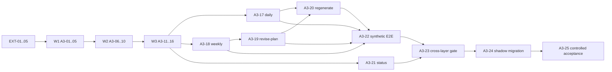

# 第三层：数据分析 Agent 工具层详细开发需求清单

状态：开发中（A3-01～10 已完成；A3-11～25 与正式集成/真实验收门未完成）

基线日期：2026-07-23

## 0. 适用范围与权威快照

本清单只拆分第三层的可开发、可验证需求；不授权修改五层大契约、SQLite schema、依赖、配置、生产入口，也不授权运行同步、分析或邮件。每个开发项开始前都必须重新确认下列权威文件仍与本快照一致；哈希发生变化时停止该项，回到总控重新评审。

| 契约 | 版本 | SHA-256 |
|---|---:|---|
| `01-data-foundation.md` | v2.4 | `9bf0a91e61bda47c9dba971c731ca6ec79e064b7f0ea4eb8124a5a216d67e396` |
| `02-data-collection.md` | v1 | `afdffa6268d64403d170906ee6a42d10f873a75b1615b806d893982aea86db14` |
| `03-data-analysis.md` | v2 | `4a9b3f1ffb92ba1ad4f56e68380344007e48a43e03a3e0f746399c50da794eb8` |
| `04-mail-agent.md` | v2 | `47175280f917dee55d2aa5f663f0705da8ec7baf463eae5933ea391c0770be94` |
| `05-orchestration-monitoring.md` | v1 | `5b1d5abf15689cec2507bd20e36aa83fe49626dd82247a4c0a1b91cc266ce804` |

本层唯一长期业务状态是第一层 SQLite 中的 `analysis_*`、`training_*`、`analysis_delivery_*`。本层进程必须按请求启动、完成后退出；第五层是唯一调度者。

## 1. 外部前置条件（不属于第三层开发项）

| ID | 前置条件与提供者 | 第三层可依赖的证据 | 第三层禁止替代的工作 |
|---|---|---|---|
| EXT-01 | 第一层 v2.4 已通过显式 init/migrate 建立兼容 schema、ready 标记、稳定视图与第三层表；提供者：第一层/发布流程。 | `foundation status/verify`、schema version、只读 stable views。 | 不创建/迁移表，不修复 foundation，不改写其他层表。 |
| EXT-02 | 第二层已把目标日期或候选周所需 Garmin canonical、coverage、cursor、gap、活动阶段及质量事实写入；提供者：第二层。 | 第二层 receipt、`resource_coverage`、cursor/gap/quality 稳定读取结果。 | 不调用 Garmin、不解析 FIT、不推进 cursor、不修复 gap。 |
| EXT-03 | 第四层已接受并持久化 active user facts 与 `plan_revision_reason_recorded`；提供者：第四层。 | `v_active_user_facts`、`v_plan_revision_reason_events` 的受控只读记录。 | 不读 Gmail、邮件正文或 thread；不写 `mail_*`、fact、event 或 mail delivery。 |
| EXT-04 | 已安装且受部署约束的 Gmail MCP 能执行 `get_self`、精确搜索、`send_html_self`、TrainLab 标签；账号与 `subject_identities` 匹配；提供者：部署/邮件边界。 | allowlist 校验、self identity HMAC 对账、受控测试回执。 | 不读取 token/凭据，不扩展为收件箱或 thread 读取，不允许任意收件人。 |
| EXT-05 | 第五层按静态 argv 调用本层、传入稳定 invocation ID，并消费 receipt；提供者：第五层。 | `WorkflowRequest/Receipt` 兼容测试与受控子进程样例。 | 不实现调度、cron、daemon、邮件轮询、incident 或跨层重试策略。 |

## 2. 固定边界

- 第三层可写：`analysis_runs`（daily/weekly/regeneration）、`analysis_artifacts`、`analysis_artifact_inputs`、`analysis_artifact_relations`、`training_plans`、`training_plan_items`、`analysis_deliveries`、`analysis_delivery_artifacts`。
- 第三层只读：第一层 stable views、第二层质量与运行事实、第四层 accepted active facts/plan revision reasons、自己的历史 artifacts/plans/deliveries。
- 第三层绝不写 Garmin、Gmail、`mail_*`、`conversation_events`、`user_facts`、`mail_agent_*`、`mail_response_*`、`mail_delivery_*`、第五层运行/incident 表。
- 分析 Codex invocation 只能取得受限 JSON 与只读 Harness，零工具权限；投递 Codex invocation 只能取得已 accepted 的精确 revision、确定性正文/HTML/subject/idempotency key 和限定 Gmail MCP 工具。两者不得合并。
- 所有正常生产分析继续遵守项目 `AGENTS.md` 的 `trainlab run` 约束，直到独立切换任务完成；本清单中的目标 `trainlab analyze` 仅是未来契约接口。

## 3. 需求单元

### Wave 1：接口、隔离与可测试骨架

- [x] **A3-01｜版本快照与第三层模块边界**
  - **目的：** 建立仅属于第三层的包、版本清单和依赖注入边界，使后续工作不会回流到旧 Drive/Gmail 单体路径。
  - **依赖与起始快照：** 上表五份契约哈希、EXT-01；开始时记录当前生产入口与 Harness 哈希，仅作迁移基线。
  - **负责范围：** 目标代码布局、第三层组件接口、版本/能力 manifest、禁止 legacy 直接调用的静态检查。
  - **禁止触碰范围：** 旧 `trainlab run` 行为、任何大契约、DDL、依赖锁定、第四/五层包。
  - **预期产物：** 第三层 package skeleton、模块责任说明、版本 manifest、静态 import 边界测试。
  - **验证方法与证据：** 单元测试证明第三层不导入 Drive/ingest/mail inbox 适配器；保存 import graph 与 manifest JSON。
  - **完成定义：** 可被测试加载但不发生网络、数据库写入、后台线程或模型调用。
  - **集成顺序与失败回退：** Wave 1 首项；失败时删除未引用的新骨架并保持现生产路径不变。
  - **完成证据（2026-07-23）：** 新增 `trainlab.analysis` 只读骨架、`module_manifest.json` 和 `tests/test_analysis_a3_01.py`；`.venv/bin/pytest tests/test_analysis_a3_01.py` 为 `4 passed`，完整 `.venv/bin/pytest` 为 `132 passed`，`.venv/bin/python -m compileall -q src tests` 与 `git diff --check` 均通过。测试证明五份权威 SHA 一致、任一契约哈希失配阻断、第三层包无 legacy Drive/ingest/mail/Garmin/调度 import，且该骨架没有网络、数据库、subprocess、Codex、Gmail MCP 或调度能力。**基线语义补强（2026-07-23）：** `migration_baseline` 固定为 A3-01 初始 `AGENTS/shared/runtime` 快照，绝不由当前文件动态重算；当前 active Harness 哈希由 A3-04 的 immutable `harness_manifest.json` 单独证明。

- [x] **A3-02｜版本化公共请求、回执与 CLI 参数契约**
  - **目的：** 实现 `AnalysisTool.execute(AnalysisRequest) -> AnalysisReceipt` 的单一 application service 边界。
  - **依赖与起始快照：** A3-01、第三层 §5–6；从 v2 固定 modes/fields/exit code 开始。
  - **负责范围：** `daily`、`weekly`、`revise-plan`、`regenerate`、`retry-delivery`、`reconcile-delivery`、`status` 的 JSON Schema、参数互斥、CLI→API 映射、receipt 脱敏序列化与退出码。
  - **禁止触碰范围：** 调度日期决定、任意 Gmail/Garmin 调用、业务 SQL、stdout 输出正文。
  - **预期产物：** Request/Receipt Schema、类型、CLI parser、exit-code mapper、契约测试夹具。
  - **验证方法与证据：** 对每种 mode 的合法/非法请求、null 字段、日期格式、receipt/exit-code 一致性测试；保存 schema validation report。
  - **完成定义：** CLI 不复制同步/分析规则，且 stdout 只可能输出一个无敏感正文的 receipt JSON。
  - **集成顺序与失败回退：** A3-01 后；失败时接口保持未发布，调用方继续使用既有入口。
  - **受控解释（2026-07-23）：** 冻结第三层 §5 已定义 `status [--run-key RUN_KEY]`，而 §6 的 `AnalysisRequest` 字段清单漏列该 selector。经总控确认，新增可空 `run_key`：仅 `mode=status` 可携带，只选择历史 analysis run；它不参与创建、恢复、改写 run，不替代 `invocation_id`，也不构成写入幂等身份。第五层 manifest 必须将其标为 `status-only selector`。非 status 请求携带该字段一律拒绝；指定 selector 时 receipt 回显该值，未指定时使用稳定的只读 `current` selector。
  - **完成证据（2026-07-23）：** 新增第三层专属 request/receipt JSON Schema、`contracts.py`、`service.py`、未注册到全局 CLI 的 `cli.py` 与 `tests/test_analysis_a3_02.py`。`.venv/bin/pytest tests/test_analysis_a3_01.py tests/test_analysis_a3_02.py` 为 `36 passed`，完整离线 `.venv/bin/pytest` 为 `209 passed`，`.venv/bin/python -m compileall -q src tests` 与 `git diff --check` 均通过；五份冻结大契约 SHA-256 均匹配。测试覆盖 mode 互斥、日期/ID/UTC 规则、禁止控制字段、status-only `run_key`、CLI/API 同一 service、stdout receipt 脱敏、退出码映射和零外部副作用边界。
  - **一致性补强证据（2026-07-23）：** `AnalysisTool.execute` 现校验 `receipt.run_key == build_run_key(request)`，以拒绝任意 service 返回另一历史 run 的回执。新增普通 mode、带 selector 的 status、无 selector 的 status 三类负向与正向测试；聚焦结果为 `42 passed`。全量测试稳定重跑结果为 `223 passed, 2 failed`；两个失败均在第一层 Foundation 的 migrate/incompatible status 断言（`tests/test_foundation_interface_contract.py`），与第三层文件无调用/修改关系，未作跨层修复。

- [x] **A3-03｜配置、路径与进程隔离加载器**
  - **目的：** 实现第三层允许配置的严格加载与路径约束，为后续 runner/delivery 提供安全输入。
  - **依赖与起始快照：** A3-01、第三层 §23、EXT-01；起始配置不得含模型名、凭据或调度字段。
  - **负责范围：** `analysis` 配置 schema、timezone、允许根目录验证、temp/lock 路径权限、静态超时/上下文限额读取。
  - **禁止触碰范围：** 修改现有配置、保存 Gmail/Garmin secret、cron/schedule、动态 Harness 路径。
  - **预期产物：** 配置数据类型、只读 loader、权限/路径 validator、最小测试配置。
  - **验证方法与证据：** 路径逃逸、模型名、凭据、调度字段、邮件覆盖路径均被拒绝；记录脱敏错误码。
  - **完成定义：** 未通过配置校验时在任何数据库/Codex/Gmail 副作用前失败。
  - **集成顺序与失败回退：** 可与 A3-02 并行；失败时不启用新层配置。
  - **完成证据（2026-07-23）：** 新增第三层专属 `analysis_config.schema.json` 与只读 `config.py`；只接受固定 `Asia/Singapore`、固定 Harness/Schema/lock/temp 相对路径和静态 context/timeout 上限。模型名、凭据、cron/调度、邮件覆盖、额外字段、路径逃逸及不安全 `0700` runtime 目录均在任何数据库/Codex/Gmail 操作前拒绝；加载器不创建目录、不修改权限。`.venv/bin/pytest tests/test_analysis_a3_01.py tests/test_analysis_a3_02.py tests/test_analysis_a3_03.py` 为 `56 passed`，完整离线 `.venv/bin/pytest` 为 `252 passed`，`.venv/bin/python -m compileall -q src tests`、`git diff --check` 与五份冻结契约 SHA-256 复核均通过。

- [x] **A3-04｜Shared/Analysis/Route Harness 装载与版本证据**
  - **目的：** 将可信 Harness 固定为 Shared + Analysis + 当前 route，并把内容哈希写入后续审计输入。
  - **依赖与起始快照：** A3-03、`harness/shared/HARNESS.md`、`harness/runtime/HARNESS.md`、第三层 §17–18；禁止读取 `archive/` 或 development Harness。
  - **负责范围：** allowlist loader、route bundle、版本/哈希、只读临时引用准备、缺失/漂移检测。
  - **禁止触碰范围：** 除本单元受控 shared/runtime 拆分外编辑既有 Harness；加载邮件专用 Harness、由数据库/邮件指定 prompt、读取 archive。
  - **预期产物：** Harness resolver、manifest schema、hash tests、加载审计记录模型。
  - **验证方法与证据：** route 仅加载允许文件；archive/development/path traversal 被拒绝；同一文件稳定复算 hash。
  - **完成定义：** 每次将来 generation 可证明实际使用的 Shared/Analysis/route Harness 和 Schema 版本。
  - **集成顺序与失败回退：** A3-03 后；失败时不启动 Codex，返回配置/Harness failed。
  - **受控解释（2026-07-23）：** 原“禁止编辑 Harness”仍禁止从邮件、数据库、archive 或 development 等不可信来源动态编辑/加载 Harness，也禁止改变既有 shared/runtime 的业务含义；但经总控针对本单元批准，允许一次受控拆分：将 shared 中的旧 `source/Drive/rclone`、旧 runtime schema、邮箱收件/投递及当前 `trainlab run` 专属规则原样移至 runtime，而非删除。runtime 明确在 shared 之后应用，因此既有生产 `shared → runtime` 组合保留旧语义；新的分析组合严格为 `shared → analysis → route`，永不加载 runtime。冻结第三层 §17 所列 `harness/analysis/HARNESS.md`、`daily.md`、`weekly.md`、`revise-plan.md`、`delivery.md` 原先不存在，且没有其他单元负责创建；本单元获准首次创建这些全新 production analysis Harness。它们创建后由第三层静态 manifest 固定内容哈希，成为只读、版本化输入。
  - **完成证据（2026-07-23）：** 新增五份 §17 production analysis Harness、静态 `harness_manifest.json`、manifest Schema 与 allowlist resolver；受控拆分 shared/runtime 并**保留 A3-01 初始 migration baseline**、仅更新 active immutable Harness manifest 哈希。resolver 固定 `shared → analysis → daily|weekly|revise-plan`，delivery 固定 `shared → analysis → delivery`；不读取/返回正文，只产生路径标识、文件/组合哈希和注入的 schema version/hash 审计记录。测试同时证明历史 baseline 不随当前 Harness 改写、旧生产 `shared → runtime` 仍保留 source/Drive/rclone、runtime schema、邮箱扫描和自投递规则，且全部新 analysis bundle 不含这些旧规则并保留时区、原始值/来源、安全、隐私和不固定模型规则。mail/runtime/archive/development/路径穿越、软链接逃逸、缺失/非普通文件、组或其他用户可写权限、内容漂移、缺失 schema 与 schema hash 不匹配均在任何 Codex 调用前拒绝。`.venv/bin/pytest tests/test_analysis_a3_01.py tests/test_analysis_a3_02.py tests/test_analysis_a3_03.py tests/test_analysis_a3_04.py` 为 `74 passed`，完整离线 `.venv/bin/pytest` 为 `325 passed`，`.venv/bin/python -m compileall -q src tests`、`git diff --check` 与五份冻结契约 SHA-256 复核均通过。

- [x] **A3-05｜分析运行、幂等键与单写锁状态机**
  - **目的：** 让同一 invocation 可恢复、同一 subject 的发布互斥，且 status 为纯只读。
  - **依赖与起始快照：** A3-02、EXT-01、第三层 §21–22；使用既有 `analysis_runs` 语义而非自建表。
  - **负责范围：** run key、invocation uniqueness、PID-aware lock、started/recovered/unchanged 状态查询、短事务边界。
  - **禁止触碰范围：** 改 DDL、清理锁时仅按时间删除、跨 subject 并行发布、第五层 workflow 表。
  - **预期产物：** run repository、lock adapter、crash-recovery decision table、并发测试。
  - **验证方法与证据：** 相同 invocation、并发同 subject、陈旧锁/活跃锁、receipt 丢失后恢复测试；保存 run transition trace。
  - **完成定义：** 任何一次请求最多产生一组 accepted revision；锁忙立即 `lock_busy`，不无限等待。
  - **集成顺序与失败回退：** A3-02 后，所有写路线前；失败时不发布 artifact/plan/delivery。
  - **完成证据（2026-07-24）：** 总控独立验收 A3-05，含 PID-aware owner-only fd 锁、canonical run-key/state invariant、一次性 Coordinator finish 授权与 post-unlink parent-fsync blocker hidden probe；聚焦 A3-01..05 回归 134 passed，`compileall` 与 `git diff --check` 均通过。

### Wave 2：只读数据、质量与确定性上下文

- [x] **A3-06｜稳定视图读取与受限数据快照仓储**
  - **目的：** 以只读、稳定排序的方式取得第三层允许的 canonical、历史、facts 和质量数据。
  - **依赖与起始快照：** A3-03、A3-05、EXT-01/02/03、第三层 §9。
  - **负责范围：** listed stable views、coverage/cursor/gap/activity-stage/quality 的只读 query、subject/date scope、短只读事务。
  - **禁止触碰范围：** raw JSON/FIT/Gmail MIME/附件、整表高频 sample 扫描、Garmin 调用、任何跨层写入。
  - **预期产物：** repository interfaces、snapshot DTO、受限 technical-review sample reader、synthetic DB fixtures。
  - **验证方法与证据：** query allowlist、稳定排序、subject 隔离、禁止表访问和事务寿命测试；保存 query audit。
  - **完成定义：** 日常 route 不读取 raw/high-frequency data；专项读取必须含 activity/metric/time 限制并输出摘要。
  - **集成顺序与失败回退：** A3-05 后；失败或 schema 不兼容时返回 failed，不猜测空值。
  - **完成证据（2026-07-24）：** `src/trainlab/analysis/stable_views.py` 以固定 SQL allowlist 读取 §9 的 stable views 及明确允许的 coverage/cursor/gap/activity-stage/quality/fact/capability/reason 事实；全部 subject/date 条件、确定排序、行数/总量上限、短 `query_only` 读事务和 caller connection-state 恢复均由仓储强制。日常 snapshot 不触及 `activity_samples` 或 raw/FIT/Gmail 字段；technical reader 仅接受 allowlisted metric、activity ID、严格 UTC 窗口及 1–100 行上限，并只返回有界统计摘要。A3-06C 复核确认 activity stage 和 technical samples 同时要求唯一 active `activity_source_revisions` 角色、current/parsed `source_revisions`、匹配 activity provider/resource kind/provider object identity；samples 还要求其 `source_revision_id` 与该 active FIT relation 相同，故跨 subject、跨 activity、错误 role/resource/revision 均 fail closed。`tests/test_analysis_a3_06.py` 的 82 项覆盖上述 binding、跨活动复用、schema 缺失、scope/排序/limit、raw-field 拒绝、transaction snapshot 与 restore-fault fail-closed；`.venv/bin/pytest -q tests/test_analysis_a3_01.py … tests/test_analysis_a3_07.py` 为 243 passed，`compileall`、`git diff --check` 与五份冻结契约 SHA-256 复核见本轮验收。

- [x] **A3-07｜路由数据质量门禁**
  - **目的：** 在调用 Codex 前把 ready、ready_with_warnings、blocked 明确化，阻断不完整周分析。
  - **依赖与起始快照：** A3-06、EXT-02、第三层 §7、§20、§24；质量结论只来自已持久化事实。
  - **负责范围：** daily/weekly/revise-plan 的 coverage、cursor、gap、activity fallback、quality issue、not_available/not_enabled 区分及 next_action 映射。
  - **禁止触碰范围：** 写 coverage/cursor/gap、把缺行当零、调用第二层 repair、人工绕过 gate。
  - **预期产物：** versioned quality policy、gate result schema、route fixtures、阻断原因目录。
  - **验证方法与证据：** yesterday partial、周内 open error gap、supported vs unavailable、snapshot replacement、warning-only fixture 测试。
  - **完成定义：** blocked/deferred 时没有 Codex、artifact、plan 或 delivery 副作用，且 receipt 给出 `rerun_collection`/`repair_data`。
  - **集成顺序与失败回退：** A3-06 后；失败时保守阻断并保留旧 current。
  - **完成证据（2026-07-24，当前实现 revision）：** 新增版本化 `quality_policy.json`、`quality_gate_result.schema.json` 与纯函数 `quality_gate.py`，以 A3-06 immutable snapshot 为唯一输入；门禁使用 canonical `as_of_utc` 并将 capability check/probe 转为 `Asia/Singapore` 日期，要求所有已选择 capability 使用同一 environment，逐日校验 required/supported 与 optional unavailable coverage、cursor、gap、每个活动的 inventory + summary + FIT/fallback 证明、每个 fetched sleep 日期的主睡眠、open/acknowledged quality issue、subject、plan/reason/artifact lineage。coverage 会校验所有历史候选，忽略 `as_of_utc` 之后的 observation，按最新合法 `observed_at_utc` 选择 completed-day 结论；同 timestamp 仅允许语义相同记录合并，冲突 tie 保守阻断，并以所选 inventory row 验证 activity proof。畸形或超量证据返回有界、排序、去重的 fail-closed code 与确定性 next action。`tests/test_analysis_a3_07.py` 23 项覆盖 UTC 23Z 跨日、optional 缺行、旧 partial/error→新 fetched、旧 fetched→新 error、相同历史重复、冲突 latest tie、snapshot partial replacement、future observation、混合 environment、活动/睡眠逐项证明、跨 subject/lineage、quality 生命周期、畸形 shape、reason 上限和零副作用；A3-01..07 聚焦回归为 239 passed，全量离线回归为 1723 passed，`compileall`、`git diff --check`、冻结五份大契约 SHA-256 复核均通过。

- [x] **A3-08｜确定性特征、来源与冲突处理**
  - **目的：** 计算允许的趋势、汇总、活动/计划匹配与影响范围，不重算 Garmin 专有算法。
  - **依赖与起始快照：** A3-06、A3-07、第三层 §11–12。
  - **负责范围：** 7/14/28 天统计、计划遵从、活动匹配置信度、训练间隔、分布、revision impact、trust/value-origin 标签。
  - **禁止触碰范围：** 模拟 Body Battery/Training Readiness/VO₂ Max/Training Effect、以 time-in-zone 推导心率边界、把 `prior_model_output` 升格为事实。
  - **预期产物：** pure-function feature library、版本号、冲突 policy、golden fixtures。
  - **验证方法与证据：** 可复算输出、单位/缺失/冲突测试、历史计划未自动视为完成测试。
  - **完成定义：** 每项派生统计可指出窗口、输入 revision 和 value origin，且没有任何模型参与计算。
  - **集成顺序与失败回退：** A3-06/07 后；失败时不以臆测特征补齐上下文。
  - **完成证据（2026-07-24）：** `tests/test_analysis_a3_08.py` 58 项、A3-01～08 聚焦回归 301 项均通过；总控独立验证 provider coverage 必须全窗口逐日闭合、严格绑定 subject/provider/resource、使用 current revision，并确认缺日、错误资源及 stale/partial/error 证据均 fail closed。

- [x] **A3-09｜心率来源与训练安全规则引擎**
  - **目的：** 固化 Garmin/用户/HRR/RPE 优先级及跑步、攀岩、力量、休息的保守验证规则。
  - **依赖与起始快照：** A3-06–08、第三层 §13–14；策略为版本化静态输入。
  - **负责范围：** zone source selection、HRR evidence gate、红旗/药物/疼痛约束、Zone 4/5、primary-item、跑步/攀岩/strength/rest 规则。
  - **禁止触碰范围：** 医疗诊断、从单次最高 HR 推最大 HR、力量组次重量剂量、攀岩等级/线路剂量、训练钟点。
  - **预期产物：** policy schema、rule engine、reason codes、边界 fixture。
  - **验证方法与证据：** 无可靠 BPM→RPE、time-in-zone-only 拒绝 BPM、red flag→rest/suspended、禁用 strength/climbing 字段测试。
  - **完成定义：** 规则可独立运行、版本可记录，任何高风险输出被确定性拒绝而非交给模型解释。
  - **集成顺序与失败回退：** A3-08 后；规则/证据不足时降级或拒绝，绝不提高强度。
  - **完成证据（2026-07-24）：** 版本化静态安全策略 `1.0.1-a3-09`（SHA-256 `71adbcf18ff547cfbd0d1c55da646a8427a17178fe3adcec5895c32610c24937`）、strict request/result/policy Schema 与纯规则引擎已实现；A3-09 聚焦 48 项及总控额外 hidden probes 通过，覆盖自由文本及诊断/药物/力量/攀岩剂量绕过、连续无重叠 HRR、provider 重叠 fail-close，以及高 RPE 无合法结构时拒绝或保守降级。A3-01～09 可见聚焦回归、`compileall`、`git diff --check`、禁止导入与五份冻结契约哈希均通过。

- [x] **A3-10｜有界 Context Builder 与输入血缘快照**
  - **目的：** 组装 `analysis_input.schema.json`、稳定 manifest/hash 和确定性裁剪结果。
  - **依赖与起始快照：** A3-04、A3-06–09、第三层 §10；默认上限 1,000,000 UTF-8 bytes。
  - **负责范围：** daily/weekly/revise/regenerate context、windows、prior artifacts、facts、policy、omissions、stable serialization/input manifest。
  - **禁止触碰范围：** 完整 sensor stream、原始邮件/HTML/附件、无界历史、把裁剪项表述为不存在、完整 prompt 日志。
  - **预期产物：** context schemas/builder、pruner、snapshot hash calculator、manifest-to-input mapping tests。
  - **验证方法与证据：** 同输入 hash 一致、排序稳定、限额裁剪顺序、不可裁剪字段保留、prior model trust class 测试。
  - **完成定义：** 每个被发布 artifact 的有序输入可由 stored snapshot/manifest 复算，且上下文永不泄露到 stdout/log。
  - **集成顺序与失败回退：** Wave 2 收口；超限无法安全裁剪时 deferred/failed，不调用 Codex。
  - **完成证据（2026-07-24）：** 已实现 strict `analysis_input.schema.json`（SHA-256 `aa4faf89d324ea2d8ca228a131e144dca05e47609e37d716714b176e10b46329`）、版本化 Context policy（SHA-256 `3b189416ac59460320c81bf31589119093fb19ed55e52cd53f0a4ad73a08d3b3`）、纯 Context Builder、A3-06 repository seam、manifest/内容一一绑定及可复算哈希、固定 route 窗口、UTF-8 字节上限与四级确定性裁剪。裁剪器已消除逐项完整 render/Schema 验证造成的 O(n²) 路径，改为逐阶段探测、二分最小裁剪前缀，并在最终结果执行一次 strict validate。总控复验 A3-10 聚焦 `22/22` 通过（`0.585s`），A3-01～10 可见回归 `371/371` 通过；`compileall`、`git diff --check`、禁止导入和五份冻结契约哈希复核均通过。

### Wave 3：两段式 Codex、校验与原子发布

- [ ] **A3-11｜分析 Codex 无工具 runner**
  - **目的：** 以隔离的 `codex exec --ephemeral` 执行一次 route-specific 分析 generation。
  - **依赖与起始快照：** A3-04、A3-10、第三层 §18；仅使用允许的 Harness 和 input JSON。
  - **负责范围：** 临时目录/0600 文件、stdin/受控文件输入、无模型名、进程组超时终止、输出上限/捕获/清理。
  - **禁止触碰范围：** Gmail/Garmin/MCP/shell/network/database/file-write 工具、二次自动 prompt 修复、把原始输出输出到 CLI。
  - **预期产物：** runner adapter、sandbox launch profile、timeout/cleanup tests、runner audit metadata。
  - **验证方法与证据：** 工具不可见、工作目录隔离、非零/超时/超限/遗留子进程模拟测试。
  - **完成定义：** 一次 run 最多一次 generation；失败没有 accepted artifact，临时目录和进程组均清理。
  - **集成顺序与失败回退：** A3-10 后；异常为 failed/rejected，保留旧 current。

- [ ] **A3-12｜分析结果 Schema、安全与训练校验器**
  - **目的：** 只允许符合 route 输出、信任标签和安全政策的 JSON 进入发布器。
  - **依赖与起始快照：** A3-02、A3-09、A3-11、第三层 §19–20。
  - **负责范围：** `analysis_result.schema.json`、daily/weekly/revision cardinality、日期/subject/run-key、中文/单位、source usage、safety、plan rule validation。
  - **禁止触碰范围：** 重新提示模型修改、保存 hidden reasoning/原始协议响应、让模型宣称投递已完成。
  - **预期产物：** validator pipeline、rejection code catalog、sanitized failure record schema、fuzz fixtures。
  - **验证方法与证据：** 非 JSON、未知字段、虚构 BPM、医学诊断、all-out、七日缺项、改写历史 item、内部路径泄露均被拒绝。
  - **完成定义：** validator failure 只产生脱敏 code/path；不切 current、不发邮件、不创建半套 plan。
  - **集成顺序与失败回退：** A3-11 后；任何未通过输出状态为 rejected。

- [ ] **A3-13｜analysis/training 原子发布器**
  - **目的：** 把 accepted artifact、inputs、relations、plan/items 与 current 切换置于一个短事务。
  - **依赖与起始快照：** A3-05、A3-10、A3-12、EXT-01、第三层 §21。
  - **负责范围：** immutable revision、input ordinals、relation、paired/supersedes/derived_from/references_prior_plan、weekly/revision plan 发布、run 状态。
  - **禁止触碰范围：** 修改旧 artifact/plan 内容、跨层表、在事务内跑 Codex/Gmail、投递状态。
  - **预期产物：** publisher/repository、transaction tests、revision/current invariants、publish receipt DTO。
  - **验证方法与证据：** 故意在每个事务阶段失败；验证无半套 plan、旧 current 保持、accepted relation/input 可复算。
  - **完成定义：** 提交后 artifact/plan 才可被读取为 current；提交前任何故障完全回滚。
  - **集成顺序与失败回退：** Wave 3 核心收口；失败保留旧 current 和可恢复 run。

- [ ] **A3-14｜分析投递记录创建与确定性邮件渲染**
  - **目的：** 在 accepted 后固定精确 revision、`analysis_deliveries(status=pending)`、关联和无副作用的 plain/inline-HTML 表示。
  - **依赖与起始快照：** A3-13、第三层 §7、§21、§24；需 daily/weekly/plan-revision delivery kinds。
  - **负责范围：** idempotency key、delivery state seed、精确 artifact relation、subject、header/run-id、内容安全渲染。
  - **禁止触碰范围：** 发送 Gmail、读取 thread/reply、修改 artifact、创建第四层 `mail_delivery_*`。
  - **预期产物：** delivery factory、renderer、render snapshot/hash tests、state transition diagram。
  - **验证方法与证据：** accepted-before-delivery、同 revision 不重复创建、HTML 禁止 script/remote content、精确 revision 不随 current 漂移测试。
  - **完成定义：** artifact/plan 已提交后才有 pending delivery；渲染失败不回滚 accepted 内容并可报告 partial。
  - **集成顺序与失败回退：** A3-13 后、A3-15 前；失败保留 accepted artifact 并标记可恢复 delivery。

- [ ] **A3-15｜受限 Gmail MCP 自投递 runner**
  - **目的：** 执行第二段 Codex invocation：仅将固定 artifact revision 投递给 authenticated self。
  - **依赖与起始快照：** A3-03、A3-14、EXT-04、第三层 §1、§3、§18、§24。
  - **负责范围：** delivery Harness、`get_self` identity check、精确 idempotency search、`send_html_self`、TrainLab label、delivery result schema/receipt 更新。
  - **禁止触碰范围：** 健康 DB/context、本地文件/credential、任意 inbox/thread 读取、任意 recipient、重跑 analysis Codex、第四层投递表。
  - **预期产物：** least-privilege delivery adapter/runner、allowlist verifier、delivery result validator、sanitized audit events。
  - **验证方法与证据：** tool allowlist、self mismatch abort、search-before-send、already-sent、label、no health input、no thread read 测试。
  - **完成定义：** 成功回写 provider IDs；失败只改变 `analysis_delivery_*`，receipt 为 partial/`retry_delivery`，绝不回滚 accepted artifact/plan。
  - **集成顺序与失败回退：** A3-14 后；MCP 不可用/认证失败时 pending/failed 保留给 A3-16。

- [ ] **A3-16｜投递恢复状态机：retry-delivery 与 reconcile-delivery**
  - **目的：** 仅恢复已持久化的精确 delivery，消除发送未知状态且不产生第二封邮件。
  - **依赖与起始快照：** A3-02、A3-14–15、EXT-04/05、第三层 §5、§24、第五层 §10.1。
  - **负责范围：** pending/failed/unknown/already_sent/sent 状态、retry/reconcile request validation、search evidence、`next_retry_at_utc`、receipt 状态。
  - **禁止触碰范围：** 重新生成 artifact/plan、调用 daily/weekly/revise Codex、第四层代发、盲目 send after timeout。
  - **预期产物：** delivery state machine、reconcile evidence validator、idempotency/unknown fixtures、operator-review code path。
  - **验证方法与证据：** send timeout→unknown→reconcile found/not-found、重复 retry→already_sent、多个匹配→operator_review、原 revision 保持不变测试。
  - **完成定义：** `retry-delivery`/`reconcile-delivery` 只引用 delivery ID；第五层可依 receipt 精确恢复且不会重复发送。
  - **集成顺序与失败回退：** A3-15 后；证据不足时冻结为 unknown/operator review，不重发。

### Wave 4：业务路由与只读状态

- [ ] **A3-17｜daily 路由编排**
  - **目的：** 对已结束的 summary date 生成 `daily_summary` 与下一日 `daily_training_advice`，并创建一个 daily delivery。
  - **依赖与起始快照：** A3-05–16、EXT-02/03、第三层 §7.1。
  - **负责范围：** default date、跨午夜睡眠语义、daily gate/context/runner/validator/publisher/delivery 编排、plan relation handling。
  - **禁止触碰范围：** 修改当前正式计划、把无活动认定为未训练、使用当天 partial 做完整趋势、读取邮件 thread。
  - **预期产物：** daily route handler、route fixtures、receipt target periods、daily report delivery mapping。
  - **验证方法与证据：** 完整昨日→两 artifact；partial→deferred/no Codex；follow/reduce/substitute/rest；跨午夜睡眠；同 invocation unchanged 测试。
  - **完成定义：** 两 artifact 均 accepted 才发布并固定到同一 delivery；投递失败只导致 partial，不影响分析结果。
  - **集成顺序与失败回退：** Wave 4 第一条；失败保持旧 artifact/plan，按 receipt 请求采集/repair/投递恢复。

- [ ] **A3-18｜weekly 路由与七天计划发布**
  - **目的：** 生成过去七个结束日的 `weekly_summary`、未来连续七日 `weekly_training_plan` 和一份 plan/items revision。
  - **依赖与起始快照：** A3-05–16、A3-17、EXT-02/03、第三层 §7.2。
  - **负责范围：** as-of 解释、七天窗口、prior plan/summary、adherence、paired relations、七个唯一 item、weekly report delivery。
  - **禁止触碰范围：** ISO 周隐式假设、每日多个 primary、训练钟点、用日期流逝自动认定计划完成、第四层邮件回复。
  - **预期产物：** weekly route handler、plan serializer、weekly fixtures、atomic relation evidence。
  - **验证方法与证据：** Sunday-like window、first-run `no_prior_artifact`、周内 gap blocked、exact seven items、allowed kinds/high-intensity rule、delivery pair 测试。
  - **完成定义：** summary、plan artifact、plan/items 作为原子集合发布；质量不满足时不调用 Codex、不替换 current。
  - **集成顺序与失败回退：** A3-17 后；失败不影响已存在计划，等待质量修复或显式新 invocation。

- [ ] **A3-19｜revise-plan 路由与第四层原因事件边界**
  - **目的：** 基于已接受的 reason event 只重建原计划剩余范围，并由第三层主动投递新版计划。
  - **依赖与起始快照：** A3-05–16、A3-18、EXT-03/05、第三层 §7.3、第四层 §8.3、第五层 §5.3。
  - **负责范围：** plan/event/subject validity、effective date、past-item preservation、supersession/lineage、plan revision delivery、receipt return to fifth layer。
  - **禁止触碰范围：** 接受自由邮件文本、写 user facts/events、改变生效日前 items、直接回复原 Gmail thread、让第四层修改 plan。
  - **预期产物：** revise-plan handler、reason-event adapter、past-item invariant tests、handoff DTO.
  - **验证方法与证据：** valid event revision、revoked/cross-subject/untrusted event deferred/rejected、past immutable、fourth-layer resume contract test。
  - **完成定义：** 只接受已持久化 event；成功后新 plan 与旧 plan 均可追溯，投递由第三层完成。
  - **集成顺序与失败回退：** A3-18 后；失败不更新旧计划，第四层保持 awaiting_analysis。

- [ ] **A3-20｜regenerate 路由**
  - **目的：** 以受控 reason code 显式重生成 artifact（必要时 plan），不将故障重试伪装为 regeneration。
  - **依赖与起始快照：** A3-05–16、A3-17–19、第三层 §7.4。
  - **负责范围：** artifact lookup、reason-code allowlist、current inputs/policy/Harness、new revision/supersession、content-same 标记、new delivery。
  - **禁止触碰范围：** 相同 delivery 的重发、自由文本 reason、删除旧 revision、失败时切换 current。
  - **预期产物：** regenerate handler、reason catalog、revision lineage tests。
  - **验证方法与证据：** 六类 reason、内容同 hash 仍新 revision、weekly plan 一并重建、rejection/failed retains old current 测试。
  - **完成定义：** 每次显式 regeneration 使用新 invocation/reason；投递恢复始终走 A3-16。
  - **集成顺序与失败回退：** A3-17–19 后；失败保留原 artifact/plan/delivery。

- [ ] **A3-21｜status 只读路由**
  - **目的：** 以无副作用的摘要提供 run、artifact、plan、delivery 和质量阻断状态。
  - **依赖与起始快照：** A3-02、A3-05–07、A3-13–16、第三层 §7.5。
  - **负责范围：** run-key lookup、current revisions、delivery pending/unknown/failed counts、next action、脱敏 status receipt。
  - **禁止触碰范围：** Codex/Gmail/Garmin 调用、锁、任何 write、上下文或正文返回。
  - **预期产物：** status query service、redaction tests、CLI/API parity fixtures。
  - **验证方法与证据：** status 不产生 run/lock/MCP/Codex 调用；不同 subject/range 不泄露正文或跨 subject ID 测试。
  - **完成定义：** 第五层可仅凭 status/receipt 决定 reconcile/retry，不需解析日志或邮件内容。
  - **集成顺序与失败回退：** Wave 4 末；失败仅影响可观测性，不触碰业务状态。

### Wave 5：集成、迁移与验收

- [ ] **A3-22｜跨模块端到端合成测试与安全回归**
  - **目的：** 用无真实健康/Gmail 数据的 fixture 验证全部第三层契约路径和失败边界。
  - **依赖与起始快照：** A3-01–21、第一层 §15、第三层 §27。
  - **负责范围：** synthetic DB/response fixtures、route matrix、fault injection、privacy/redaction、process cleanup、contract coverage report。
  - **禁止触碰范围：** 真实账号、生产数据、运行真实同步/分析/邮件、修改其它层测试契约。
  - **预期产物：** fixture factory、end-to-end suite、coverage report、security test evidence。
  - **验证方法与证据：** daily/weekly/revise/regenerate/status/retry/reconcile 全路径；Codex/MCP mock；crash/transaction/unknown delivery/lock cases；敏感内容扫描。
  - **完成定义：** 每条覆盖矩阵均有至少一个可自动化证据，且无后台线程、timer、daemon 或残留进程。
  - **集成顺序与失败回退：** 所有功能完成后；失败项回退到对应需求单元，不降低安全/质量规则。

- [ ] **A3-23｜与第四、第五层的接口集成门**
  - **目的：** 验证第三层交给第四层/第五层的边界不是共享实现或重复投递。
  - **依赖与起始快照：** A3-02、A3-16、A3-19、A3-21、EXT-03–05；第四层 v2、第五层 v1 固定接口。
  - **负责范围：** reason event→revise-plan→fourth resume、receipt schema/ID/date consistency、analysis delivery retry/reconcile handoff、ownership contract tests。
  - **禁止触碰范围：** 实现第四层 poll/process/delivery、第五层 scheduler/incident，或由它们代发 third-layer artifact。
  - **预期产物：** 第三层 provider-side contract fixtures、stub executor、interface
    compatibility report；完整跨层端到端测试由总控 `X-03/X-04` 唯一拥有。
  - **验证方法与证据：** fifth layer only invokes exact delivery ID after partial; fourth never sends analysis delivery; invalid receipt rejected; no shared write table test。
  - **完成定义：** 第三层一侧的计划修订与 delivery 恢复可通过公开 Request/Receipt
    和 stable views 验证，不调用对方内部函数；完整闭环是否成立由总控门最终判定。
  - **集成顺序与失败回退：** A3-22 前后均可；不兼容时停止切换并报告总控，不自行改变大契约。

- [ ] **A3-24｜旧 Harness/入口影子迁移与回滚演练**
  - **目的：** 在不产生 current artifact 或邮件副作用的条件下比较旧/新上下文与新路由输出，准备独立生产切换。
  - **依赖与起始快照：** A3-22–23、第三层 §26、第五层 §21；需获发布流程明确授权。
  - **负责范围：** shadow mode、non-current 标记、输入/输出差异报告、备份/回滚检查表、切换前置条件。
  - **禁止触碰范围：** 删除/改名 `trainlab run`、启用 `trainlab analyze` 生产投递、双路径对同日期发布 current、修改 AGENTS.md。
  - **预期产物：** shadow protocol、comparison report template、backup/rollback evidence checklist、cutover request。
  - **验证方法与证据：** 影子无 email/no current invariant、同逻辑日 collision prevention、rollback drill evidence。
  - **完成定义：** 仅在差异经审查、备份/回滚通过且总控批准时，才可进入独立切换任务。
  - **集成顺序与失败回退：** A3-22–23 后；任何不一致保持现生产入口，停止迁移。

- [ ] **A3-25｜受控真实环境验收与交付门**
  - **目的：** 在明确授权的受控账号和小日期范围内，验证真实 self-delivery 与幂等恢复。
  - **依赖与起始快照：** A3-22–24、EXT-01–05，且必须有书面运行授权；本计划阶段不执行。
  - **负责范围：** smoke test protocol、敏感日志审查、delivery already-sent/reconcile proof、退出进程检查、验收签字。
  - **禁止触碰范围：** 无授权发送邮件、全量生产切换、真实数据导出到测试夹具、跨层修复。
  - **预期产物：** 受控验收脚本清单、脱敏 evidence package、go/no-go report。
  - **验证方法与证据：** 第二层短窗成功后 daily；同 invocation unchanged；Sunday-like weekly；accepted-before-send；失败后 retry/reconcile；无残留进程。
  - **完成定义：** 真实结果与数据库精确 revision/delivery 对账且无敏感泄露；未通过即 no-go。
  - **集成顺序与失败回退：** 最终功能验收；失败保持旧入口和未切换状态，交由总控决定后续。

## 4. 依赖图与开发波次

| 波次 | 可开始项 | 进入门 | 离开门 |
|---|---|---|---|
| W0 | EXT-01..05 | 权威哈希一致、外部接口可由 synthetic adapter 代替 | 不存在跨层语义冲突 |
| W1 | A3-01..05 | W0 | API/配置/Harness/lock 可独立测试，无业务副作用 |
| W2 | A3-06..10 | W1 | 只读快照、quality gate、features/context hash 可复算 |
| W3 | A3-11..16 | W2 | 两段 Codex 隔离、校验、原子发布、delivery 恢复均有 mock 证据 |
| W4 | A3-17..21 | W3 | 全部业务 mode 通过合成端到端测试 |
| W5 | A3-22..25 | W4 + 外部层接口稳定 | 总控批准后才可进入影子、真实验收或切换 |

## 5. 集成门与验收门

| 门 | 条件 | 必须证据 | 失败处理 |
|---|---|---|---|
| IG-01 基线门 | 五份权威契约 hash/version 与 §0 一致；EXT-01 可读。 | 哈希报告、foundation compatible 证据。 | 停止并报告总控；不得本地改契约。 |
| IG-02 数据门 | A3-06–10 可从合成 stable views 得到可复算 context/gate。 | Query allowlist、manifest hash、blocked/warning fixtures。 | 阻断 Codex，回退 A3-06–10。 |
| IG-03 发布门 | A3-11–13 证明 rejected/事务失败无 current 变化。 | Runner isolation、validator、transaction fault evidence。 | 保留旧 current，修复相应单元。 |
| IG-04 投递门 | A3-14–16 证明先落库、self-only、查重、unknown reconcile。 | 精确 delivery relation、MCP allowlist mock、idempotency traces。 | 保留 pending/unknown；不得重跑分析或第四层代发。 |
| IG-05 跨层门 | A3-23 的 receipts/ownership/revise-plan handoff 均兼容。 | Contract test report。 | 停止迁移，报告总控。 |
| RAG-01 真实环境门 | A3-25 获书面授权，真实账号为 self-only，小范围、脱敏日志。 | Go/no-go record、receipt/DB 对账、进程清理。 | 立即停止真实调用，保留证据，不自动重试发送。 |
| FCG-01 最终完成门 | A3-01..25 全部仍为本层已勾选项、IG/RAG 均通过，独立切换获批准。 | 完整 checklist、覆盖矩阵、回滚演练和总控签字。 | 不宣告层完成；维持现生产入口。 |

## 6. 大契约覆盖矩阵

| 权威条款（摘要） | 覆盖需求单元 |
|---|---|
| L3 §1–4：被动一次性工具、两段式 Codex、第三/四层所有权 | A3-01, A3-04, A3-11, A3-14–16, A3-23 |
| L3 §5–6：CLI、API、Request/Receipt、退出码 | A3-02, A3-05, A3-21 |
| L3 §7：daily/weekly/revise-plan/regenerate/status 语义 | A3-17, A3-18, A3-19, A3-20, A3-21 |
| L3 §8–10：组件、读取边界、bounded context/manifest | A3-04, A3-06, A3-10 |
| L3 §11–14：trust、Garmin 边界、HR、训练安全 | A3-08, A3-09, A3-12, A3-17–20 |
| L3 §17–20：Harness、runner、输出 schema、确定性校验 | A3-04, A3-11, A3-12 |
| L3 §21–25：表所有权、原子发布、锁、配置、恢复、安全 | A3-03, A3-05, A3-13–16, A3-21–22 |
| L3 §26–29：旧系统迁移、测试、完成定义、跨层接口 | A3-22–25 |
| L1 v2.4 §1–3、§7、§8.6、§10–13、§17：analysis/training/delivery 所有权、revision、stable views、先落库 | A3-05–07, A3-10, A3-13–16, A3-23 |
| L2 §20、§23–25：coverage/cursor/gap、质量/接口、第三层只读 | A3-06–08, A3-17–18, A3-22 |
| L4 v2 §1–4、§8.3、§26、§29：入站边界、reason event、不得重复发送第三层内容 | A3-06, A3-15–16, A3-19, A3-23 |
| L5 v1 §5、§7、§10.1、§12.3、§21、§24：07:00/周日由第五层、精确 delivery retry/reconcile、状态/健康接口 | A3-02, A3-16, A3-17–19, A3-21, A3-23–25 |

## 7. 计划维护规则

- 只有实际代码、测试和对应证据均满足某单元的“完成定义”时，实施任务才可把该单元由 `[ ]` 改为 `[x]`，并附证据链接、日期与实现 revision。
- 任何影响 §0 哈希、表所有权、CLI/API、投递权限或跨层接口的发现，都是总控问题；本层停止受影响单元，不自行修订大契约。
- 本清单不构成生产执行授权。真实 Garmin、Codex、Gmail MCP、数据库 migration 或邮件发送必须由后续获授权实施/验收任务单独执行。
