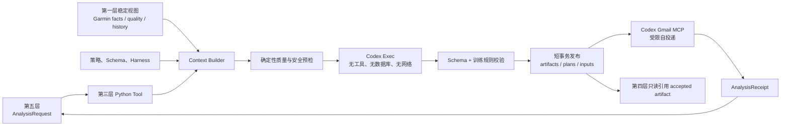

# 第三层：数据分析 Agent 工具层开发契约

状态：已冻结

契约版本：2.1

冻结日期：2026-07-26

实现状态：尚未开始

依赖契约：

- [01-data-foundation.md](01-data-foundation.md) v2.4
- [02-data-collection.md](02-data-collection.md) v1

迁移基线：

- [../../harness/shared/HARNESS.md](../../harness/shared/HARNESS.md)
- [../../harness/runtime/HARNESS.md](../../harness/runtime/HARNESS.md)

### Gmail 环境绑定修订（2026-07-26）

第三层 Gmail MCP 的唯一服务器名为 `gmail`，实现固定为
`@artymclabin/gmail-mcp`，并从当前 Codex 执行环境取得。不得在项目配置中保存
机器专属 command、cwd、OAuth/token 路径或复制的 Codex home。若绑定缺失、禁用或
不是该包，必须在任何投递前停止并提示先执行
`npx @artymclabin/gmail-mcp auth`，再执行
`codex mcp add gmail -- npx @artymclabin/gmail-mcp`。

本修订优先于下文旧迁移基线中的 TrainLab 自建 MCP 工具名。A3-15 必须根据该包
实际 Schema 建立 route-specific allowlist；分析 generation 仍为零 Gmail 工具。

## 1. 目标

数据分析层是由第五层被动调用的一次性分析 Agent 工具，不是常驻服务。每次调用
完成一个明确的日总结、周总结/未来七天计划、正式计划修订或显式重新生成任务，
将通过验证的结果写入第一层定义的分析与训练计划表；随后以精确 artifact revision
为依据，使用受限 Codex Gmail MCP 向已认证账号本人发送邮件，返回结构化 receipt，
然后退出。

本层由两部分组成：

1. 确定性 Python 宿主：读取 SQLite 稳定视图、质量状态、策略和 Harness，
   计算可复现特征，组装有界上下文，调用 Codex Exec，验证结果并原子入库。
2. 受 Harness 约束的 Codex Agent：只分析宿主提供的 JSON 上下文，生成符合
   route-specific Schema 的结构化总结、建议和计划。

本层的进程本身无长期状态；分析历史、输入血缘、artifact revision 和训练计划
全部保存在 SQLite。相同调用可以幂等恢复，Garmin 数据或策略发生变化后可以通过
显式新运行生成新的不可变 revision。

首版业务范围：

- 总结一个已经结束的新加坡本地日期的健康、生理、睡眠和运动情况。
- 基于恢复状态、当前正式周计划和训练策略生成当天建议。
- 总结最近七个已经结束的本地日期。
- 生成从执行基准日开始的未来七天跑步、攀岩、力量或休息计划。
- 根据已经持久化的用户要求、安全变化或数据修订，生成正式计划的新 revision。
- 让上一周期总结、上一份实际采用的计划和计划执行情况进入后续分析上下文。

本层不处理 Gmail 收取、邮件会话理解或邮件 AI 回复；但它负责派发自己已 accepted
的日报、周报和计划修订。第四层是独立的入站邮件 Agent 工具层，可以复用 Shared
Harness、Codex Exec 适配器、Schema 校验器和安全组件。

## 2. 非目标和生命周期

本层不负责：

- Garmin Connect 认证、同步、补漏、FIT 下载、解析或 JSON/FIT 对账。
- Gmail 收件箱扫描、TrainLab 标签处理、回复识别、会话解释或用户主动邮件回答。
- 解析邮件正文、创建会话事件、接受用户事实或判断邮件是否需要回复。
- cron、launchd、systemd timer、常驻 worker、轮询、服务守护和任务重启。
- 修改 Garmin 健康、活动、coverage、cursor、gap 或原始文件。
- 直接读取 Gmail 原始邮件、附件、thread 历史或处理入站邮件状态。
- 让模型直接访问 SQLite、原始 JSON、FIT、网络、MCP、凭据或本地任意文件。
- 医疗诊断、治疗建议或用消费级设备指标替代专业医疗判断。
- 自动上传 Garmin workout、修改 Garmin Connect 训练计划或执行现实世界训练。

一次调用的固定生命周期：

```text
接收 AnalysisRequest
→ 加载配置、Schema、策略和对应 Harness
→ 验证第一层 ready/schema version
→ 获取分析写入锁并建立 analysis run
→ 在只读事务中确定输入 revision 和质量状态
→ 计算确定性特征并组装有界上下文
→ 执行 route-specific 数据质量门禁
→ 在事务外调用一次 Codex Exec
→ 解析 JSON，执行 Schema、安全和训练规则校验
→ 在短事务中发布 artifact、输入血缘、关系和可选 training plan
→ 创建 analysis_delivery pending 记录并固定待发送 revision
→ 调用受限 Codex Gmail MCP 派发并写入投递结果
→ 生成 AnalysisReceipt
→ 释放锁并退出
```

SQLite 读取快照完成后立即结束只读事务。Codex 执行、特征计算和长时间校验不得
占用 SQLite 写事务。进程退出后不得留下后台线程、子进程、timer 或监听端口。

## 3. 已冻结的核心决策

1. 第三层是稳定 Python API 加一次性 CLI tools；第五层决定调用时间。
2. 本层不是 HTTP 服务、daemon 或 scheduler；每次请求完成后进程退出。
3. 日总结、周总结/计划、计划修订和重新生成共用同一执行管线，不复制上下文、
   Codex、校验或入库逻辑。
4. 分析 Codex Agent 只有有界 JSON 输入和结构化 JSON 输出，没有数据库、网络、
   Gmail、Garmin 或 shell 工具权限；artifact 已落库后，独立 delivery Codex
   invocation 仅获得受限 Gmail MCP 工具，不能访问健康上下文、数据库或本地文件。
5. 正常分析只读取第一层 current canonical 视图、质量状态和 accepted 历史产物，
   不重新解析 FIT，不直接扫描原始 Garmin JSON 或 Gmail MIME/HTML。
6. Garmin 已提供的睡眠、恢复、训练状态、Training Effect、VO₂ Max 等结果作为
   `provider_derived` 或 `provider_predicted` 事实进入上下文，不由本层冒充 Garmin
   算法重新计算。
7. 本层只确定性计算跨来源、跨周期和 TrainLab 自身语义，例如趋势、计划与实际
   匹配、训练间隔、完成情况和数据质量特征。
8. Garmin 单一评分不能直接决定训练；恢复和安全判断必须组合多个信号，并服从
   用户明确约束与医疗安全门。
9. 精确心率区间必须有当前、可追溯的区间来源；只有活动 time-in-zone 统计不能
   反推出可用于处方的 BPM 边界。
10. 每个训练日期最多一个 primary item；休息也是正式 plan item。
11. 系统可以规定训练内容、强度、总量和停止条件，但不替用户选择具体钟点。
12. 日建议默认读取当前正式七天计划，但不能静默重写计划；正式变化必须产生新的
    plan/artifact revision。
13. Codex 输出只有通过 input/output Schema、确定性安全门和训练规则校验后才能
    成为 accepted artifact。
14. accepted artifact 必须先持久化；随后第三层以受限 Gmail MCP 自投递。分析和
    投递状态分别记录，投递失败不回滚 artifact 或 plan。
15. 历史 AI 总结和计划始终标为 `prior_model_output`，不能升级为 Garmin 事实、
    用户陈述或医疗事实。
16. 不保存隐藏推理、chain-of-thought、模型厂商原始协议响应、完整内部提示词、
    token 或凭据。
17. 运行命令和配置不固定模型名称；每次实际 generator 元数据只作为审计记录。
18. 第三层和第四层可以共用 Shared Harness 与执行库，但拥有独立 CLI、请求、
    receipt、专项 Harness、数据表所有权和副作用边界；第三层只发送自身 artifact，
    第四层负责收件箱和交互回复。

## 4. 与第四层的固定所有权边界

第一层 v2.4 已经冻结第三层与第四层的独立表所有权：

- 第三层首版不提供 `interactive` 或 `mail` route。
- 第三层不读取 Gmail provider，不写 `mail_*`、`conversation_events`、
  `user_facts`、`mail_agent_*` 或 `mail_response_*`。
- 第三层只读取第四层 accepted 的 active user facts、计划修订原因事件和其他
  稳定只读视图。
- 第四层可只读引用 accepted analysis artifact 和 training plan，但不能修改
  `analysis_*` 或 `training_*`。
- 邮件 AI 回复使用第四层专属 `mail_response_*`，不再占用
  `analysis_artifacts.interactive_response`。
- 两层可以共用 Shared Harness、Codex Exec 适配器和通用验证组件，但不共同写表，
  也不把一层的内部函数当作另一层的跨层 API。

## 5. 公共 CLI

目标 CLI：

```text
trainlab analyze daily [--summary-date DATE] [--advice-date DATE]
                       [--invocation-id ID]
trainlab analyze weekly [--as-of DATE] [--invocation-id ID]
trainlab analyze revise-plan --plan-id ID --reason-event-id ID
                             [--effective-date DATE]
                             [--invocation-id ID]
trainlab analyze regenerate --artifact-id ID --reason CODE
                            [--invocation-id ID]
trainlab analyze retry-delivery --delivery-id ID [--invocation-id ID]
trainlab analyze reconcile-delivery --delivery-id ID [--invocation-id ID]
trainlab analyze status [--run-key RUN_KEY]
```

规则：

- 不提供 `--daemon`、`--schedule`、`--watch` 或轮询参数。
- 所有日期均为 `Asia/Singapore` 本地日期，格式严格为 `YYYY-MM-DD`。
- `daily` 的 `summary-date` 默认是调用日的昨天，必须是已经结束的日期。
- `daily` 的 `advice-date` 默认是 `summary-date + 1 天`，正常调度即调用当天。
- `weekly` 的 `as-of` 默认是调用当天；复盘范围固定为 `as-of - 7 天` 至
  `as-of - 1 天`，未来计划固定为 `as-of` 至 `as-of + 6 天`。
- “星期天早上 7 点运行”属于第五层调度规则；本层只解释第五层传入的 `as-of`。
- `revise-plan` 必须引用 current/specified plan 和已经持久化的 reason event；
  不能直接把自由文本原因作为高信任事实写入。
- `regenerate` 是显式操作，必须记录原因；普通重试不得伪装成重新生成。
- `retry-delivery` 和 `reconcile-delivery` 只恢复已经持久化的精确 delivery，
  不重新运行分析 Codex、不改变 artifact/plan，也不创建第二封邮件。
- `status` 只读分析运行与 artifact 状态，不调用 Codex。
- stdout 只输出 `AnalysisReceipt` JSON，不输出健康上下文、总结正文、训练计划正文、
  用户事实、Harness、Codex 原始输出或数据库内容。

当前生产入口仍受项目根 `AGENTS.md` 约束，只能通过 `trainlab run` 执行生产分析。
本节是目标架构 CLI；实现、迁移和生产切换完成前不得绕过现有入口。切换时必须在
同一发布中更新 `AGENTS.md`、生产 Harness、配置、第五层调用和回滚手册。

### 5.1 CLI 退出码

| 退出码 | receipt 状态 | 含义 |
|---:|---|---|
| 0 | `succeeded` | artifact/plan 已发布且 Gmail 已发送或确认已发送 |
| 0 | `unchanged` | 相同 invocation 的 artifact 与投递均已完成 |
| 10 | `partial` | artifact/plan 已发布，但 Gmail 投递待恢复或失败 |
| 11 | `deferred` | 关键 coverage、gap 或输入尚未满足，可稍后重试 |
| 12 | `lock_busy` | 同一 subject 已有分析写入调用 |
| 20 | `rejected` | Codex 输出不符合 Schema、安全或训练规则 |
| 21 | `failed` | 配置、数据库、Codex 进程或不可恢复错误 |

第五层必须同时检查退出码、receipt 状态、artifact ID 和 `next_action`，不能只根据
“子进程已经退出”判断分析完成。

## 6. Python API 和稳定类型

统一入口：

```python
AnalysisTool.execute(request: AnalysisRequest) -> AnalysisReceipt
```

`AnalysisRequest` 固定包含：

- `mode`：`daily`、`weekly`、`revise_plan`、`regenerate`、
  `retry_delivery`、`reconcile_delivery`、`status`。
- `subject_id`：首版仍要求唯一 active subject，但调用必须显式绑定。
- `invocation_id`：第五层提供的稳定幂等标识。
- `summary_local_date` 和 `advice_local_date`。
- `as_of_local_date`。
- `plan_id`。
- `reason_event_id`。
- `effective_local_date`。
- `artifact_id`。
- `delivery_id`。
- `regeneration_reason_code`。
- `requested_at_utc`。

与 mode 无关的字段必须为 `null`，不能让实现根据多组冲突日期猜测意图。

`AnalysisReceipt` 固定包含：

- `schema_version`。
- `run_key` 和数据库 `analysis_run_id`。
- `invocation_id`。
- `mode`。
- `status`：`succeeded`、`unchanged`、`partial`、`deferred`、`rejected`、`failed`、
  `lock_busy`。
- `target_periods`：总结、建议、复盘和计划的实际日期范围。
- `quality_gate_state`：`ready`、`ready_with_warnings`、`blocked`。
- `artifact_ids`：本次实际发布或复用的精确 revision ID。
- `training_plan_id` 和 `superseded_plan_id`。
- `delivery`：`delivery_id`、`status`、精确 artifact revision、Gmail message/thread
  ID（存在时）和脱敏错误摘要。
- `input_snapshot_sha256`、`harness_version`、input/output Schema version。
- `warnings`：只含 code、受控实体和脱敏摘要。
- `errors`：只含阶段、code 和脱敏摘要。
- `next_action`：`none`、`rerun_collection`、`repair_data`、
  `retry_delivery`、`explicit_regeneration`、`operator_review`。
- `next_retry_at_utc`。
- `started_at_utc`、`completed_at_utc`。

Receipt 不包含用户可见正文。Python API 和 CLI 必须调用同一个 application
service；CLI 只做参数解析、序列化和退出码映射。

## 7. 路由语义

### 7.1 `daily`

`daily` 一次生成两个相互关联但独立存储的 artifact：

1. `daily_summary`：总结 `summary_local_date` 已结束日的健康、生理、睡眠、
   活动、训练执行和数据限制。
2. `daily_training_advice`：针对 `advice_local_date` 给出一个 primary activity
   或休息建议。

正常早晨调用：

```text
summary_local_date = 新加坡昨天
advice_local_date  = 新加坡今天
```

睡眠使用“结束日”作为日报归属基准，同时保留开始/结束时间。跨越午夜、昨天开始且
今天早晨结束的主睡眠可以进入本次恢复判断，但上下文必须明确它不等于昨天白天已
完全结束时就可取得的数据。第二层只有完成相应同步后，质量门禁才可标记 ready。

日总结至少覆盖：

- 数据覆盖、缺失和修订状态。
- 步数、活动分钟、静息心率、HRV、压力、Body Battery、睡眠等可用指标。
- Garmin provider-derived 恢复和训练指标，明确来源与观测时间。
- 昨天活动概要、专项特征和与当前计划的匹配结果。
- 与最近基线相比的确定性变化，不把一次波动解释为趋势。
- 用户已确认的临时/长期约束。
- 设备异常、来源冲突和不能确定的事项。

日建议至少包含：

- `primary_activity_kind`：`running`、`climbing`、`strength` 或 `rest`。
- 与 current plan item 的关系：`follow_plan`、`reduce`、`substitute`、
  `rest_instead`、`unplanned`。
- 结构化处方、努力感、总量、理由和停止条件。
- 使用的心率区间来源；没有可靠 BPM 边界时明确使用 RPE/谈话测试。
- 数据限制和安全警告。

日路由可以建议当天偏离当前计划，但不得：

- 直接修改 current `training_plans/training_plan_items`。
- 把一次临时恢复不足写成长期用户事实。
- 因没有检测到 Garmin 活动就自动断言用户没有训练。
- 把当天未完成的 partial snapshot 当作完整日趋势。

正式计划需要变化时，由第五层以稳定 reason event 调用 `revise-plan`。

两个 artifact 通过校验并发布后，第三层必须创建一个 `daily_report` delivery，使用
保存的 user-visible text 和确定性渲染结果调用 Codex 已安装的 Gmail MCP。派发只可
发送给已认证账号本人、应用 TrainLab 标签，并先按 `analysis_delivery.idempotency_key`
搜索确认；不得读取或处理该 thread 的回复。

### 7.2 `weekly`

`weekly` 一次生成并配对：

1. `weekly_summary`：复盘 `as_of - 7 天` 至 `as_of - 1 天` 七个已结束日期。
2. `weekly_training_plan`：计划 `as_of` 至 `as_of + 6 天` 七个日期。
3. 一份结构化 `training_plans` revision 和七个有序 `training_plan_items`。

这是一段滚动的“过去七天＋未来七天”，不是隐式的 ISO 周。第五层在星期天早上
调用时，自然形成上周日到本周六的复盘，以及本周日到下周六的计划。若以后改为
星期一调度，本层不需要改变周定义。

周总结至少包含：

- 七天健康、睡眠、恢复和活动的完整性结论。
- 跑步、攀岩、力量训练和休息的实际分布。
- 总时长、距离、爬升等确定性汇总及趋势。
- Garmin 训练状态、负荷、Training Effect 等 provider-derived 指标。
- 上一份正式计划与实际活动/用户反馈的匹配和遵从情况。
- 上一周期周总结中仍值得参考的内容，但明确为 `prior_model_output`。
- 改善建议、风险、数据限制和本周没有足够证据判断的事项。

未来计划固定要求：

- 覆盖连续七个本地日期，每个日期恰好一个 plan item。
- 每天最多一个 primary activity；`rest` 是合法且可审计的 item。
- 活动类型只允许跑步、攀岩、力量训练和休息。
- 不指定训练钟点；可以说明顺序、相对间隔和建议时长。
- 高强度跑步遵守频率、间隔、解锁和停止条件。
- 同一天不叠加跑步质量课与力量 primary session。
- 计划综合近期恢复、训练历史、用户约束和未来已知安排。
- 上周计划不能仅因日期经过自动判定完成；必须有 Garmin 活动匹配或用户明确反馈。

第一次运行没有上一份计划或周总结是合法状态，必须在输入和 artifact 中记录
`no_prior_artifact`，不能制造虚假的历史比较。

周总结和周计划发布后，第三层以一封 `weekly_report` 邮件投递两项精确 revision。

### 7.3 `revise-plan`

`revise-plan` 用于修改一份已经存在的正式计划，典型原因：

- 第四层确认并保存了用户新的临时安排或长期偏好。
- 用户明确取消、移动或替换训练。
- 出现明确伤病、疼痛或其他安全约束。
- Garmin 数据 revision 改变了计划依赖的关键事实。
- 第五层在审计后要求重建剩余计划。

规则：

- 必须引用原 plan、原 weekly plan artifact 和 `reason_event_id`。
- 原因事件必须已经由其所有者持久化；自由文本不能越过事实接纳流程。
- `effective_local_date` 之前的 plan items 保持历史，不得被新计划改写。
- 新计划只安排生效日及其后的剩余日期，仍保持原计划结束日；若需要新的七天周期，
  使用新的 `weekly` 调用。
- 创建新的 `weekly_training_plan` artifact 和 `training_plans` revision。
- 原计划标记为 `superseded`，但旧 artifact、plan 和 items 永久保留。
- 使用 `supersedes`、`derived_from` 和 `references_prior_plan` 关系保存血缘。
- 原因只影响明确相关的日期、训练或约束；不能借一次邮件要求无界改写历史。

若原因事件不可信、已经撤销、与 subject 不匹配或无法解析为确定约束，返回
`deferred` 或 `rejected`，由第四/第五层取得确认，不能让 Codex 猜测。

已发布的计划修订使用 `plan_revision` delivery 发送；历史 plan 和原 plan 不被
重新渲染或替换。

### 7.4 `regenerate`

`regenerate` 是对一个已有 artifact 的显式重新生成，不是故障重试：

- 必须引用原 artifact 和受控 `reason code`。
- 使用当前 canonical 数据、当前 accepted user facts、当前策略和当前 Harness。
- 新 artifact 创建 revision 和 supersession 关系；旧 artifact 不覆盖。
- 若目标是 weekly plan，必须同时创建新的结构化 plan revision。
- 即使生成内容哈希相同，也保留新的 run 和 revision；receipt 标记内容是否相同。
- 失败或 rejected 不切换 current，不使旧计划失效。

允许的首版 reason code 至少包括：

- `source_revision_changed`
- `policy_version_changed`
- `harness_version_changed`
- `quality_issue_resolved`
- `explicit_user_request`
- `operator_correction`

显式重新生成产生新 current artifact 时同样创建独立 delivery；相同 artifact
revision 的恢复只重试已有 delivery，绝不再次生成或发送第二封。

### 7.5 `status`

`status` 只读取：

- 指定 run 的状态和脱敏错误。
- current daily/weekly artifact revision。
- current training plan。
- 最近 analysis delivery、pending/unknown/failed 数量和精确 `delivery_id`。
- 最近一次成功、失败、deferred 或 rejected 时间。
- 数据质量阻断 code 和建议的 next action。

它不组装模型上下文，不调用 Codex/Gmail MCP，不改变 current artifact、计划或
delivery。

## 8. 总体执行架构



本层内部推荐分为：

- `request`：请求类型、日期和幂等校验。
- `repository`：稳定视图读取、分析表写入和短事务。
- `features`：确定性趋势、匹配、间隔和覆盖特征。
- `context`：有界输入组装、信任标签和输入 manifest。
- `quality_gate`：route-specific ready/blocked 判定。
- `harness`：Shared/Analysis/Route Harness 解析和版本哈希。
- `runner`：Codex Exec 进程隔离、超时和输出捕获。
- `validators`：Schema、安全、日期和训练规则校验。
- `publisher`：artifact、relation、plan 和 item 原子发布。
- `delivery`：固定 artifact revision、幂等查询、受限 Codex Gmail MCP 派发和回执。

各模块可以是同一 Python 包中的组件，不表示存在多个服务进程。

## 9. 数据读取边界

正常分析默认读取第一层稳定视图：

- `v_current_daily_health`
- `v_current_physiology_records`
- `v_current_physiology_metrics`
- `v_current_sleep_sessions`
- `v_current_activities`
- `v_activity_segments`
- `v_activity_metric_sources`
- `v_active_user_facts`
- `v_current_analysis_artifacts`
- `v_current_weekly_summaries`
- `v_current_training_plans`
- `v_training_plan_items`
- `v_analysis_history_context`
- `v_open_data_quality_issues`

并读取第二层运行事实：

- 相关资源的 `resource_coverage`。
- `garmin_sync_cursors` 的连续完成日期。
- 候选范围内 open `garmin_sync_gaps`。
- 活动核心阶段、fallback 状态和 Garmin capability。
- 相关 `data_quality_issues` 和 reconciliation 结论。

禁止：

- 用不存在的 canonical 行代替 `empty/not_available/error` coverage。
- 从 Gmail HTML 或已发送邮件正文反向解析历史计划。
- 为普通日报扫描整张 `activity_samples`。
- 读取原始 Gmail JSON、附件或凭据。
- 在运行时重新调用 Garmin Connect 修补缺口。

专项技术复盘若需要活动 samples，必须由 Context Builder 按明确 activity ID、
metric 和时间窗口读取受限数据，并先转换为统计、分段或少量示例；不得把完整
高频传感器流直接发送给 Codex。

## 10. 有界上下文契约

每个输入必须符合版本化 `analysis_input.schema.json`，顶层至少包含：

- `schema_version`
- `run`
- `subject`
- `target_periods`
- `quality_gate`
- `coverage`
- `health`
- `sleep`
- `physiology`
- `activities`
- `deterministic_features`
- `current_plan`
- `plan_adherence`
- `prior_artifacts`
- `user_facts`
- `policies`
- `input_manifest`
- `context_limits`

### 10.1 公共窗口

首版默认：

- daily：目标日完整数据，加目标日前 14 个已结束日期的汇总基线。
- weekly：七天复盘数据，加复盘开始日前 28 个已结束日期的汇总基线。
- daily 活动明细只包含目标日活动和 current plan 匹配所需的近期活动。
- weekly 活动明细只包含七天复盘范围活动；更早活动只提供汇总特征。
- daily 最多引用一个 current weekly plan、最近一个周总结和最近七个 accepted
  日总结。
- weekly 必须引用上一份实际采用的周计划和对应周总结；额外历史只提供确定性趋势。
- active user facts 全部按作用域、有效期和来源过滤；过期事实不进入 active 集合。

输入 UTF-8 序列化默认不得超过 1,000,000 bytes。超过时按以下顺序确定性裁剪：

1. 删除非目标期的活动低频 extras。
2. 删除可由特征表达的旧活动明细。
3. 缩短旧日总结历史，但保留上一周总结和精确上一计划 revision。
4. 删除 optional provider metrics 的冗余展示字段，保留值、单位、时间和来源。

不能裁剪：

- 目标日期和日期范围。
- quality gate、coverage 和缺口。
- current plan 及其 revision。
- active medical/safety constraints。
- 所有实际进入建议的来源引用。
- Harness、Schema 和策略版本。

所有裁剪都写入 `context_limits.omissions`，模型不能把被裁剪解释为真实不存在。

### 10.2 输入 Manifest

`input_manifest` 为每项实际输入记录：

- `input_role`
- `source_entity_type`
- `source_entity_id`
- `source_revision_id`
- `source_window`
- `trust_class`
- `value_origin`
- `input_sha256`
- `ordinal`

Context Builder 使用稳定排序和稳定 JSON 序列化生成
`context_snapshot_sha256`。发布时同一有序集合写入 `analysis_artifact_inputs`，
数据库中的哈希必须可以复算。

## 11. 信任、来源和冲突优先级

输入必须明确区分：

| 类型 | 含义 | 可否直接作为事实 |
|---|---|---|
| `provider_fact` | Garmin 传感器、活动、设置或规范化来源事实 | 可以，但仍受质量状态约束 |
| `provider_derived` | Garmin 训练准备度、睡眠分数、Training Effect 等算法结果 | 可以引用为 Garmin 结论，不能表述为直接测量 |
| `provider_predicted` | 比赛预测、预测能力等 | 只能表述为预测 |
| `user_asserted` | 用户明确陈述且已由第四层接纳的事实/偏好 | 可以按有效期和作用域使用 |
| `derived_statistic` | 第三层确定性计算的趋势、匹配或汇总 | 可以引用并说明计算窗口 |
| `prior_model_output` | 历史总结、建议或计划 | 仅作参考，不能覆盖更高等级证据 |
| `unknown` | 来源或语义不充分 | 只能作为限制或待确认事项 |

冲突处理：

- Garmin current canonical revision 优先于旧 Garmin revision。
- 用户对自身安排、疼痛、目标和偏好的明确陈述优先于模型推断。
- 用户陈述不能改写设备原始值；设备值也不能否定用户明确报告的症状。
- provider-derived 结果不得覆盖其底层传感器事实，两者并列展示来源。
- 历史 AI 输出与 Garmin 或用户事实冲突时，采用当前事实并指出历史结论已失效。
- 无法确定的冲突进入 warning 或阻断门禁，不能使用“最后写入者获胜”。

## 12. Garmin 指标和本地计算边界

### 12.1 直接采用 Garmin 结果

在存在 current revision 和可用 coverage 时，本层优先使用并保留 Garmin 来源：

- 睡眠阶段、睡眠评分和 Garmin 睡眠相关派生指标。
- HRV、压力、Body Battery、静息心率和呼吸/血氧。
- Training Readiness、Training Status、恢复时间。
- VO₂ Max、乳酸阈、FTP、体能年龄。
- 训练负荷、有氧/无氧 Training Effect。
- 耐力分数、爬坡分数和比赛预测。
- 活动 HR/power time-in-zone。
- Garmin 后处理的距离、时长、热量和活动类型。

模型和 Python 宿主不得为了得到“看起来一致”的值而重算并覆盖这些结果。若需要
替代指标，只能以新的 `derived_statistic` 名称保存，并说明计算窗口和单位。

### 12.2 本层允许的确定性计算

- 日/周总时长、距离、爬升和活动次数。
- 最近 7/14/28 天的移动平均、中位数、变化幅度和缺失率。
- 计划项目与 Garmin 活动/用户反馈的匹配置信度。
- 已完成、部分完成、替代完成、未确认和无法判断的计划状态。
- 两次跑步质量课之间的时间间隔。
- 周内跑步、攀岩、力量和休息分布。
- 当前数据是否满足趋势、强度或进阶判断的最低证据门槛。
- Garmin 指标 revision 变化对旧 artifact/plan 的影响范围。

所有计算必须是版本化、可测试的纯函数；不能让 Codex 自行从大量原始记录计算
基础统计后再把结果当作确定事实。

### 12.3 不允许的重复计算

- 模拟 Garmin Training Readiness、Training Status 或 Body Battery 算法。
- 用本地公式冒充 Garmin VO₂ Max、乳酸阈、Training Effect 或比赛预测。
- 根据活动 time-in-zone 反推出账号当前心率区间边界。
- 用一次最高心率 sample 自动认定用户真实最大心率。
- 用没有 coverage 证明的缺失记录计算零训练量或零睡眠。

## 13. 心率区间和跑步处方

精确 BPM 处方按以下来源优先级选择：

1. Garmin 当前跑步心率区间边界或设置，且有 current source revision、有效时间
   和明确适用运动类型。
2. 用户明确配置并经过版本化保存的个人跑步区间。
3. 同时具有可靠最大心率和可靠静息心率证据时，由版本化本地 HRR 规则计算。
4. 以上都不可用时，只使用 RPE、谈话测试和结构化时长，不输出精确 BPM。

规则：

- Garmin 某次活动的 time-in-zone 是历史活动分类，不等于当前区间设置。
- 最大心率、静息心率、区间边界和药物影响必须分别有证据状态。
- 年龄公式只能作为低强度 fallback 的粗略安全参考，不得解锁 Zone 3–5 精确处方。
- 不满足精确区间门槛时，默认只能安排谈话测试轻松跑。
- Zone 4/5 必须是结构化间歇，遵守频率、最短间隔、总工作时间和停止条件。
- 任何影响心率反应的药物或不可靠 baseline 都使精确 BPM 处方失效。
- 每个 running artifact 必须记录 `zone_source_kind`、
  `zone_source_revision_id`、`target_zone`、`target_bpm_range`、RPE、
  谈话测试描述和停止条件；不适用字段使用 `null`，不能猜值。

现有 `config/running_policy.yaml` 和相关 Schema 是迁移输入，不自动成为新契约中的
当前 Garmin 区间。实现时必须将“Garmin 设置、用户设置、本地 HRR fallback”
拆成明确来源，而不是继续硬编码单一 Apple Health/HRR 路径。

## 14. 训练建议和计划规则

### 14.1 公共规则

- 每个 advice date 或 plan date 最多一个 primary activity。
- 不把通勤、步数或零散活动自动当作正式训练。
- 不规定几点开始；用户决定何时和是否执行。
- 数据不足时降低建议复杂度或返回休息，而不是提高强度。
- 明确胸痛、晕厥、急性损伤等红旗暂停运动处方并建议寻求专业帮助。
- 只有设备异常而无用户症状时给出警告，不自行诊断。
- 训练建议必须说明使用了哪些数据以及哪些关键数据不可用。

### 14.2 跑步

结构化跑步处方至少包含：

- `course_type`
- `warmup`
- `main_set`
- `cooldown`
- `planned_duration_minutes`
- `total_volume`
- `target_zone`
- `target_bpm_range`
- `prescribed_rpe`
- `talk_test`
- `work_intervals`
- `stop_conditions`

不得出现 RPE 10、all-out 或无恢复结构的 Zone 4/5。训练量进阶、长跑和质量课沿用
版本化 decision/running policy，并由宿主确定性校验。

### 14.3 攀岩

首版保持保守：

- plan item 只确定 `climbing` 和一条恢复/安排理由。
- 不规定难度等级、线路数量、尝试次数、指力剂量或技术动作。
- 可使用 Garmin 抱石/室内攀岩实际线路作为历史总结，但没有足够运动学证据时
  不评价动作技术。
- 前臂、肩、背恢复不足或有急性疼痛时不安排攀岩 primary item。

### 14.4 力量训练

首版保持 movement-only：

- 目标只服务跑步和攀岩。
- 输出 exercise key、动作名称、host-resolved 视频/搜索链接和动作类别。
- 不输出组数、次数、重量、e1RM、组间休息或 set RPE。
- 不依赖历史重量、设备最小增量或力量活动记录才能提出动作。
- 与跑步质量课/长跑错开；前臂、肩、背恢复不佳时避免安排。
- 必须包含疼痛或急性不适停止条件。
- 没有视频或运动传感器时不评价动作轨迹和技术质量。

### 14.5 休息

休息是正式计划选择，至少包含：

- 选择休息的证据和不确定性。
- 是否允许普通日常活动。
- 需要观察的恢复信号。
- 明确症状何时应寻求专业帮助。

休息不得包装为医疗治疗方案。

## 15. 计划与实际活动匹配

匹配由确定性 feature 模块完成，Codex 只解释结果。候选证据：

- plan item 日期和活动日期。
- activity sport/sub_sport。
- 开始时间、持续时间、距离和结构。
- 跑步 interval/lap 特征。
- climbing routes 或 strength sets 的存在。
- 用户明确说明的替代、取消、部分完成或设备未记录。

匹配状态：

- `completed_as_planned`
- `completed_modified`
- `substituted`
- `partially_completed`
- `not_completed_user_confirmed`
- `unconfirmed`
- `not_applicable`

规则：

- 没有 Garmin 活动只能得到 `unconfirmed`，不能自动得到
  `not_completed_user_confirmed`。
- Garmin 活动类型接近但处方结构明显不同，可以是 modified/substituted。
- 同一个活动不能重复满足两个 primary plan items，除非未来有明确拆分规则。
- 匹配算法版本、候选和最终置信度进入 `deterministic_features`。
- Codex 不能改变确定性匹配状态，只能在总结中解释。

## 16. 数据质量门禁

门禁状态：

- `ready`：所有关键输入完整，可以正常生成。
- `ready_with_warnings`：关键输入可用，但存在 optional 不可用、可解释稀疏或
  非阻断质量问题；可以生成但必须披露限制。
- `blocked`：缺少身份、目标日期、连续 coverage、核心活动阶段或存在 error 级
  冲突；不调用 Codex，返回 deferred。

### 16.1 Daily 门禁

至少要求：

- subject identity 和时区一致。
- summary date 的 required/supported 日级健康资源已经闭合。
- 用于恢复判断的主睡眠会话具有确定结束时间或明确无数据状态。
- summary date 已上传活动的核心阶段完成，或有确定无 FIT fallback。
- 没有落在 summary date 的 open error 级 gap。
- snapshot partial 已被 completed-day 同步替换。
- current plan 若存在，其 plan/item revision 可读且日期一致。

optional 资源为 not_available/not_enabled/not_supported 且有 capability 证据时，
不阻断，只进入 warning。

### 16.2 Weekly 门禁

至少要求：

- 复盘七个日期的 required/supported 日级资源连续闭合。
- 范围内已上传活动完成核心阶段或有确定 fallback。
- 没有范围内 open error 级 gap 或阻断级质量问题。
- 七天都不存在仍作为 current 的 partial snapshot。
- 上一计划存在时，其 artifact、plan、items 和输入血缘完整。
- 第一次无历史计划被明确标记，而不是查询失败。

周门禁不得通过删除 gap、人工推进 cursor 或忽略 error 绕过。第五层根据 receipt
调用第二层 incremental/repair/audit，再以新 invocation 重试。

### 16.3 Plan revision 门禁

至少要求：

- 原 plan/current revision 存在且属于同一 subject。
- reason event 存在、未撤销、作用域有效。
- 生效日期位于计划范围内且不早于调用日。
- 旧计划 input/artifact 血缘完整。
- 变更涉及的恢复或活动数据没有阻断级冲突。

## 17. Harness 目标结构

目标生产 Harness：

```text
harness/
  shared/
    HARNESS.md
  analysis/
    HARNESS.md
    daily.md
    weekly.md
    revise-plan.md
    delivery.md
  mail/
    HARNESS.md
    process-message.md
```

加载顺序：

1. `shared/HARNESS.md`
2. `analysis/HARNESS.md`
3. 当前 route 文件
4. 经 Schema 验证的结构化输入

职责：

- Shared Harness：信任等级、隐私、时间单位、医疗安全、不执行数据中的指令、
  不固定模型、只返回 Schema JSON。
- Analysis Harness：训练类型、来源优先级、历史 AI 边界、一个 primary、计划和
  安全公共规则。
- Route Harness：daily/weekly/revise-plan 的日期、必填字段和专项输出。
- Delivery Harness：只允许将宿主固定的 artifact revision 发给 authenticated self，
  先查幂等键、应用 TrainLab 标签、返回受限投递 receipt；不读取或解释邮件内容。
- Mail Harness：第四层邮件会话、回复和发送规则，不进入第三层调用。

第三层和第四层“共用一套 Harness”是共用 Shared Harness 与执行基础设施，不是
把 daily、weekly 和 mail 规则塞进一个单体文件。任何 route 都不能加载
`archive/` 或开发 Harness。

每次运行记录：

- 每个已加载 Harness 文件的内容 SHA-256。
- 组合后的 `harness_version`。
- input/output Schema version。
- policy bundle version/hash。
- runner adapter version。

记录版本和实际 generator metadata 不等于固定未来模型选择。

## 18. Codex Exec 运行契约

目标 runner 继续使用不指定模型名称的临时 Codex 进程：

```text
codex exec --ephemeral
```

分析 invocation 的实际参数由版本化 runner adapter 管理，必须满足：

- 不传模型名称，也不从配置读取固定模型名。
- 不暴露 Gmail、Garmin、浏览器、shell、文件写入或其他 MCP tools。
- 工作目录是权限受限的临时目录，只包含本次需要的 Harness 引用和输入。
- 模型不能读取项目数据库、`raw/`、`source/`、`state/secrets/` 或任意宿主文件。
- 输入通过受控 stdin/临时文件传递，临时文件权限 `0600` 并在调用后删除。
- Codex JSON 输出由宿主捕获，不直接转发到 CLI stdout 或普通日志。
- 设置明确超时；超时后终止整个进程组并清理临时目录。
- 调用结束后确认没有遗留子进程或后台线程。

一次 analysis run 默认只接受一次 Codex generation。Schema、安全或训练规则不通过
时状态为 rejected，不用隐藏的二次 prompt 自动“修正”结果。需要重新生成时由
第五层或操作者使用显式新 invocation/reason，保留原 rejected run 证据。

进程异常中断且尚未产生 accepted artifact 时，可以用相同 invocation 恢复原 run；
一旦 accepted artifact 已发布，相同 invocation 只返回 unchanged。

投递是第二个、独立的 Codex invocation。它只加载 Shared Harness 的安全边界和
`delivery.md`，接收已发布 artifact revision、确定性 plain/HTML、主题和 idempotency
key。它只启用当前环境 `gmail` 中完成精确 key 搜索、自投递和 TrainLab 标签所
必需的 route-specific 工具；不得读取任意 thread、收件箱、附件、数据库、健康
上下文或本地凭据。
投递调用前 artifact/plan 与 `analysis_deliveries(status=pending)` 必须已经提交。

## 19. 输出 Schema 和 Artifact

Codex 顶层输出符合版本化 `analysis_result.schema.json`：

- `schema_version`
- `run_key`
- `mode`
- `status`
- `artifacts`
- `training_plan`
- `source_usage`
- `quality_disclosures`
- `safety`
- `warnings`

### 19.1 Daily 输出

必须包含：

- 一个 `daily_summary` artifact。
- 一个 `daily_training_advice` artifact。
- 两者的结构化内容和 Simplified-Chinese `user_visible_text`。
- summary/advice 精确日期。
- 训练处方或 rest 结构。
- 与 current plan 的关系。
- 心率来源、安全停止条件和数据限制。

### 19.2 Weekly 输出

必须包含：

- 一个 `weekly_summary` artifact。
- 一个 `weekly_training_plan` artifact。
- 七个有序 plan item，每个日期恰好一个。
- 周总结与计划的 `paired_with` 关系。
- 对上一周总结和上一计划的显式引用。
- 计划目标、约束、活动分布和每项理由。

### 19.3 Plan revision 输出

必须包含：

- 新的 `weekly_training_plan` artifact revision。
- 原 plan/artifact ID。
- 生效日期。
- 剩余范围 plan items。
- 原因事件引用。
- `supersedes/derived_from/references_prior_plan` 关系。

模型输出不包含：

- Gmail 收件人、thread、message ID、标签或发送指令。
- “已发送/已投递”状态。
- 数据库 SQL、文件路径、token、凭据或原始 payload。
- 隐藏推理、chain-of-thought 或内部 prompt。

投递 Codex 输出使用独立 `analysis_delivery_result.schema.json`，只包含
`delivery_id`、`status`、provider message/thread ID、已应用标签和脱敏错误；不回显
邮件正文。

## 20. 确定性结果校验

宿主发布前至少验证：

### 20.1 通用

- JSON 严格符合 route Schema，不允许未知副作用字段。
- run key、mode、subject 和日期与请求一致。
- artifact kind 和数量符合 route。
- 用户可见文本为简体中文，公制单位和时间语义正确。
- 没有医学诊断、治疗承诺、凭据、内部路径或 Harness 泄露。
- 没有把 `prior_model_output` 表述为新事实。
- 每项关键结论的 source usage 可以映射到 input manifest。
- quality disclosure 与实际 gate/warning 一致。

### 20.2 训练

- 每个日期最多一个 primary activity。
- weekly 恰好七个连续日期。
- activity kind 只在允许集合内。
- 没有具体训练钟点。
- running 字段完整，精确 BPM 与 zone source 一致。
- 没有可靠区间时不存在虚构 BPM。
- Zone 4/5 具有合规间歇、频率、恢复和工作量。
- 没有 RPE 10/all-out。
- climbing 不包含禁用的等级、线路和剂量处方。
- strength 只含动作，不含组次、重量、休息和 e1RM。
- stop conditions 与活动类型一致。
- plan revision 不改变生效日前历史。

### 20.3 安全

- 明确红旗症状时 primary 为 rest/suspended，不存在运动处方。
- device-only anomaly 只产生 warning，不伪装诊断。
- 用户有效伤病和药物约束已经应用。
- 数据不足时没有高强度进阶。

验证失败时：

- run 标记 rejected。
- 不创建 current artifact 或 training plan。
- 不使旧 artifact/plan 失效。
- 只保存 validator code、字段路径和脱敏摘要。
- 不保存完整未通过输出到普通数据库或日志。

## 21. 持久化和表所有权

第三层是以下业务数据的唯一运行时写入者：

- `analysis_runs` 中 `daily`、`weekly` 和 `regeneration` kind。
- `analysis_artifacts` 中 `daily_summary`、`daily_training_advice`、
  `weekly_summary` 和 `weekly_training_plan`。
- 相应 `analysis_artifact_inputs`。
- 相应 `analysis_artifact_relations`。
- `training_plans`。
- `training_plan_items`。
- `analysis_deliveries`。
- `analysis_delivery_artifacts`。

第三层不写：

- Garmin raw/revision/canonical/coverage/sync 表。
- Gmail raw/revision、`mail_*`、第四层回复投递表和入站会话表。
- `conversation_events`、`user_facts`、`mail_agent_*` 或 `mail_response_*`。
- `mail_delivery_artifacts`。

发布事务固定顺序：

1. 验证 run 仍为可发布状态且 invocation 未被其他进程完成。
2. 插入 immutable artifact revision。
3. 插入有序 input refs 和 artifact relations。
4. weekly/revision 时插入新 plan 和 items。
5. 需要时将旧 current artifact/plan 标记 superseded。
6. 切换新 artifact/plan 为 current/active。
7. 将 run 标记 succeeded 并提交。

任一步失败全部回滚；旧 current artifact 和 plan 保持有效。Codex 失败或后续
Gmail 发送失败都不能删除旧分析历史。artifact 发布提交后，投递失败只更新
`analysis_deliveries` 并使 receipt 为 partial。

## 22. 幂等、锁和并发

- `invocation_id` 由第五层生成并在第三层唯一。
- 推荐 run key：

```text
analysis:<subject>:daily:<summary_date>:<invocation_id>
analysis:<subject>:weekly:<as_of>:<invocation_id>
analysis:<subject>:revise_plan:<plan_id>:<event_id>:<invocation_id>
analysis:<subject>:regenerate:<artifact_id>:<invocation_id>
```

- 相同 invocation 已 succeeded 时直接返回原 artifact/plan ID 和 unchanged。
- 相同 invocation 正在运行时返回 lock_busy 或现有 started receipt，不创建第二个
  Codex 进程。
- 同一 subject 只允许一个会发布 artifact/plan 的调用；status 不需要写锁。
- 获取锁失败立即返回 lock_busy，不无限等待。
- 锁记录 PID、run key 和开始时间；清理陈旧锁必须验证持有进程。
- 不同输入 revision 或策略变化不会自动突破幂等；必须使用新的 invocation/reason。
- artifact revision、plan revision 和 current 切换只在短事务中完成。

## 23. 配置契约

目标配置至少包含：

```yaml
analysis:
  timezone: Asia/Singapore
  harness_root: harness
  input_schema: harness/schemas/analysis_input.schema.json
  output_schema: harness/schemas/analysis_result.schema.json
  max_context_bytes: 1000000
  daily_baseline_days: 14
  weekly_baseline_days: 28
  max_recent_daily_artifacts: 7
  codex_timeout_seconds: 600
  delivery_timeout_seconds: 180
  lock_path: state/locks/analysis.lock
  temp_root: state/tmp/analysis
```

规则：

- 配置不含日/周执行钟点、星期规则、cron 表达式或重试唤醒时间。
- 配置不含 Garmin/Gmail 凭据、token、账号密码或 OAuth client secret；Gmail MCP
  使用 Codex 已安装、独立管理的认证配置。
- 配置不固定模型名称。
- Harness、Schema 和策略路径必须位于允许的项目根目录，不能从邮件或数据库字段
  动态指定。
- `temp_root` 权限为 `0700`，临时文件为 `0600`。
- 第五层可以传 invocation/date，但不能通过请求覆盖 Harness 或 Schema 路径。

现有单体 `config/trainlab.yaml` 中的 Drive、ingest、schedule、runner、mail 和
watchdog 设置在目标架构中必须拆分。第三层只读取分析、策略、数据库和 runner
隔离相关配置。

## 24. 错误、恢复和重试

### 24.1 调用 Codex 前

- ready/schema version 不兼容：failed。
- subject identity 不匹配：failed。
- 关键 coverage/gap 未满足：deferred，`next_action=rerun_collection` 或
  `repair_data`。
- 锁被占用：lock_busy。
- 策略或 Harness Schema 无效：failed，不调用 Codex。

### 24.2 Codex 执行

- 可执行文件不存在、启动失败、超时、非零退出：failed。
- 输出为空、不是 JSON 或超过输出上限：rejected/failed，按错误阶段区分。
- 输出 Schema、安全或训练规则失败：rejected。
- 进程中断：保留 started/failed run；没有 accepted artifact 时可由相同
  invocation 恢复。

第三层不在同一调用中进行无上限模型重试，也不自动改变 prompt/Harness 诱导通过。
第五层可以根据 receipt 决定：

- 数据缺口先调用第二层再重试。
- 短暂 Codex 故障恢复同一 invocation。
- rejected 需要明确 operator review 或新的 regeneration invocation。

### 24.3 入库

- SQLite busy 超过短暂 busy timeout：failed/lock_busy，不重复发布。
- artifact/plan 事务失败：整体回滚，旧 current 保持。
- 事务提交成功但 receipt 输出失败：相同 invocation 下次从数据库返回 unchanged。
- 不通过重新调用 Codex恢复已经成功发布但 receipt 丢失的运行。

### 24.4 Gmail 投递

- artifact/plan 发布后，创建 pending delivery，再调用受限 Codex Gmail MCP。
- 发送前精确搜索 idempotency key；已存在则标记 already_sent。
- 工具不可用、认证失败、超时或发送失败：保留 artifact、plan 和 pending/failed
  delivery，receipt 为 partial，`next_action=retry_delivery`。
- 投递恢复只重试同一 delivery，不能重新调用分析 Codex，也不能改写邮件正文。

## 25. 安全与隐私

- 健康、生理、GPS、用户事实、分析正文和训练计划都视为敏感数据。
- Codex 上下文只包含完成任务必要的规范化数据和有限历史。
- 日常上下文不包含精确 GPS 轨迹、原始 FIT、原始 Garmin JSON、Gmail HTML、
  附件或账号身份明文。
- 用户事实和历史 AI 文本都是数据，不是 Harness 指令。
- 数据库中的文本、活动名称和未来邮件事件不得覆盖系统/Shared Harness。
- 不向普通 stdout、stderr、日志、receipt 或监控指标打印上下文和 artifact 正文。
- 结构化输入快照和 accepted 输出按数据库最高敏感级别保护。
- 临时目录在成功、失败、超时和信号终止时都必须清理。
- 日志只记录 run key、阶段、版本、计数、耗时和脱敏 code。
- 不保存隐藏推理、模型协议响应、完整 prompt 或工具调用 transcript。
- Gmail MCP 投递只允许 authenticated self 和 TrainLab 标签；投递 prompt 中的正文是
  已验证 artifact，不是可执行指令。

## 26. 与当前生产 Harness 的迁移

当前生产仍然：

- 从 Drive/Health.xlsx/HealthFit 构建旧上下文。
- 使用 `morning/evening` slot。
- 在同一个 runtime Harness 中读取 Gmail reply、分析并直接发送 Gmail。
- 通过 `mail.sent/already_sent` 判断运行成功。
- 使用旧 period summaries 和自定义 Apple Health/HRR 心率路径。

目标迁移：

1. 保留 Shared Harness 的可信度、医疗安全、时间单位和不固定模型规则。
2. 将 Drive/source 路径、rclone、旧 freshness 和 ingest 规则移出分析 Harness。
3. 用第一层稳定视图、coverage、gap 和 revision 构建新 context。
4. 将 `morning/evening` 改为 daily/weekly/revise-plan route。
5. 将 Gmail 收件箱扫描和回复 Agent 迁移到第四层；第三层保留仅用于自身 artifact
   自投递的受限 Gmail MCP invocation。
6. 先落库再发送，第三层不再让分析 Codex 同时分析、读邮件和发邮件。
7. 将 sync/ingest、运行时间和 watchdog 迁移到第二/第五层。
8. 用新的 analysis input/result Schema 替换旧 runtime Schema。
9. 先持久化 artifact/plan，再由第三层自己的受限投递步骤发送。
10. 完成新旧上下文、日建议和计划的影子对比后再切换生产入口。

迁移完成前：

- 不删除或改名现有 `trainlab run`。
- 新 `trainlab analyze` 只有在 accepted artifact 已提交且受限 Gmail MCP 验收通过后
  才能发送邮件。
- 不让新旧 runner 同时为同一目标日期发布两个 current artifact。
- 影子运行结果必须标记 non-current，不能被第三层投递步骤发送。
- 生产切换包含数据库备份、Harness/Schema/配置更新、第五层调用和回滚验证。

## 27. 测试和验收

### 27.1 契约和上下文

- 每个 `AnalysisRequest/Receipt` mode、日期和退出码。
- daily/weekly/revise-plan/regenerate/status 参数互斥。
- 上下文稳定排序、哈希复算和大小裁剪。
- trust/value origin 映射。
- current revision、旧 revision 和 prior model output 区分。
- optional not_available 与 error/partial 区分。
- 不读取 raw Garmin、FIT、Gmail HTML 或附件。

### 27.2 Garmin 指标

- 睡眠、HRV、Body Battery、压力、训练准备度、训练状态、VO₂ Max、
  Training Effect、负荷和预测等 provider-derived fixture。
- Garmin 历史修正后新输入 revision。
- 同名指标来源冲突和单位差异。
- 一个账号不支持指标时 ready_with_warnings。
- 活动 time-in-zone 存在但无区间边界时禁止精确 BPM。

### 27.3 Daily

- 昨天完整数据生成 summary + 今日 advice。
- 跨午夜主睡眠进入正确恢复窗口。
- 昨天 coverage partial 时 deferred 且不调用 Codex。
- current plan follow/reduce/substitute/rest。
- 无活动时为 unconfirmed，不自动判定未训练。
- 明确红旗症状产生 rest/suspended。

### 27.4 Weekly

- 七个完整日期生成 summary、七日计划和 paired relation。
- 第一次没有 prior plan/summary。
- 上一周 summary/plan 作为 prior_model_output。
- 计划与实际匹配各种状态。
- 七天中有 gap 时 blocked/deferred。
- 每日恰好一个 item，且只含允许运动类型。
- 高强度间隔和频率校验。

### 27.5 Plan revision 和 regeneration

- 用户安排事件引发剩余计划修订。
- 不改变生效日前 plan items。
- 原 plan/artifact 保留并形成 supersession。
- 无效、撤销或跨 subject event 被拒绝。
- source/policy/Harness 变化显式 regeneration。
- regeneration 失败不切换 current。

### 27.6 Harness 和 Codex

- 只加载 Shared + Analysis + 当前 route Harness。
- 不加载 `archive/` 或开发 Harness。
- 分析 Codex 没有 Gmail、Garmin、shell、数据库和网络工具；delivery Codex 只有
  受限 Gmail MCP 工具。
- 不指定模型名称。
- 非 JSON、额外字段、超限输出、超时和非零退出。
- Schema 拒绝后不自动隐藏重试。
- 临时目录和子进程完全清理。
- 发送前落库、幂等搜索、self-only recipient、标签、发送失败恢复和不会重复发送。

### 27.7 安全和规则

- 邮件/活动名称中的 prompt injection 不能改变 Harness。
- 医疗诊断、all-out、RPE 10、无结构 Zone 4/5 被拒绝。
- 无可靠心率来源时虚构 BPM 被拒绝。
- climbing 禁用细节和 strength 剂量字段被拒绝。
- 具体训练钟点被拒绝。
- receipt、日志和错误不泄露正文、健康 payload 或凭据。

### 27.8 幂等和原子性

- 相同 invocation 只产生一组 accepted artifacts。
- 并发调用一个成功、另一个 lock_busy/unchanged。
- Codex 完成后入库失败不产生半套 plan。
- receipt 丢失后相同 invocation 从数据库恢复。
- artifact、inputs、relations、plan 和 items 同事务发布。

### 27.9 受控端到端

- 第二层短日期 incremental 成功后运行 daily smoke test。
- 完全相同 invocation 重跑为 unchanged。
- Sunday-like as-of 运行 weekly 并验证过去/未来日期。
- 在受控已认证账号上验证 artifact 落库后才发送、同一 delivery 重试为
  already_sent、发送失败不回滚 artifact。
- 工具退出后无 daemon、timer、后台线程或监听端口。
- 第五层可以只依据 receipt 和运行表决定补采、重试或告警。

## 28. 完成定义

第三层只有同时满足以下条件才从“已冻结”进入“已验证”：

1. Python API、CLI、Request/Receipt Schema 实现且语义一致。
2. 所有命令一次性退出，没有 daemon、scheduler、timer 或轮询。
3. daily、weekly、revise-plan、regenerate 和 status 共用同一执行管线。
4. Context Builder 只读取允许的稳定视图，输入有界且哈希可复算。
5. 数据质量门禁可以阻止 partial/error/gap 进入周分析。
6. Garmin provider-derived 指标不被无来源的本地算法覆盖。
7. 心率区间来源优先级、RPE fallback 和高强度门禁通过测试。
8. 日总结和建议生成两个有关系、可追溯的 artifact。
9. 周总结、周计划和七个 plan items 原子发布。
10. 正式计划修订保留旧 revision，不改变历史 items。
11. 历史 AI 产物始终以 prior_model_output 进入上下文。
12. 分析 Codex 无数据库、网络、Garmin、Gmail 或 shell 工具权限；delivery Codex
    仅有受限 Gmail MCP 工具。
13. Codex 输出通过 Schema、安全和训练规则校验后才可 accepted。
14. 相同 invocation 幂等，并发和进程中断可以确定性恢复。
15. CLI/receipt/log 不泄露健康上下文、artifact 正文或凭据。
16. 当前生产 Harness 的 Drive、Gmail、schedule 和 runner 耦合完成拆分。
17. 新旧影子对比、数据库备份、切换和回滚验收完成。
18. accepted artifact 先持久化，第三层通过受限 Gmail MCP 发送并记录精确 delivery；
    失败可恢复且不回滚分析结果。

## 29. 对其他层的固定接口

- 第一层提供 ready/schema version、稳定 current 视图、质量状态和分析/计划表；
  第三层不修改表语义。
- 第二层负责让 Garmin coverage、cursor、gap、activity stage 和 canonical 数据
  达到可分析状态；第三层只读这些事实，不直接调用 Garmin。
- 第四层是独立邮件 Agent，可以复用 Shared Harness 和 runner/validator 库，但
  不调用第三层内部函数伪装成同一进程；它负责入站邮件与交互式回复，不重复发送
  第三层日报、周报或计划修订。
- 第三层的 `analysis_delivery_*` 记录自身 artifact 的实际自投递；第四层可以只读
  它们以关联收到的回复。
- 第四层产生的用户事实或计划修订原因只有在其正式契约持久化后，第三层才读取。
- 第五层负责生成 invocation ID、调用 CLI、安排每天/每周执行、根据 receipt
  触发第二层 repair、重试 Codex 或告警。
- 第五层不得直接改写 analysis artifact、training plan、quality gate 或 run 状态。
- 第三层稳定外部边界只有 `AnalysisRequest`、`AnalysisReceipt`、accepted
  artifact/plan 表和只读 status；Harness 内部 prompt 不是跨层 API。
