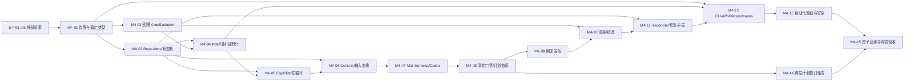

# 第四层：邮件 Agent 工具层详细开发需求清单

状态：开发中（M4-01～13、M4-14A 已完成；v2.3 固定 recipient 投递离线终验通过；
M4-14B、M4-15 真实验收与 IG-0～7 未完成）
适用契约：第四层 v2.3；直接基线为第一层 v2.4、第三层 v2、第五层 v1
规划日期：2026-07-26
本文件性质：后续开发的唯一逐项清单；不修改五层冻结大契约，也不替代它们。

## 1. 冻结输入与边界

本清单开始前已核验并完整读取下列权威契约；哈希均匹配。开发启动前的任何人都必须
再次核验，若不匹配则停止本层开发并报告总控。

| 契约 | 版本 | SHA-256 |
|---|---:|---|
| `01-data-foundation.md` | v2.4 | `9bf0a91e61bda47c9dba971c731ca6ec79e064b7f0ea4eb8124a5a216d67e396` |
| `02-data-collection.md` | v1 | `c39ae1b82afcafe9f4fc3c54d1f851b4992c48021c5238038f078fab1ec885d6` |
| `03-data-analysis.md` | v2.1 | `2bc279170dfd7f8fc50acaf96ca631bad0fcd65069f3402a0c6d1b67c0caa99a` |
| `04-mail-agent.md` | v2.3 | `8d90aa7c3c871e9f76426a21b2344cba719ec4b2e95e091c1eef69243bcc935c` |
| `05-orchestration-monitoring.md` | v1.1 | `f46aca332f146fa2efffb4da8a03b48037989b7e4e4f31df9d562932e46db356` |

第四层的唯一业务职责是：收件、原始归档、会话与用户事实、邮件 AI 回复及该回复的
投递/对账。它是被第五层调用后即退出的工具，不是常驻服务。

明确禁止越界：

- 不恢复 `deliver-artifacts`，不代发第三层日报、周报、建议或计划修订。
- 不写 `analysis_*`、`training_*`、`analysis_delivery_*`，不直接变更正式计划。
- 不自行调度、轮询、启动 daemon/timer/webhook，不决定邮件检查频率。
- 不直连 Gmail HTTP；Gmail 网络边界仅为受限 Gmail MCP adapter。
- 不让 Codex 获得 Gmail、SQLite、文件系统、网络、shell 或凭据权限。
- 不修改第一层 DDL/初始化、第三层分析逻辑或第五层 workflow/incident 表。

## 2. 外部前置条件与起始快照

以下不是第四层实现项，须由对应层完成并提供可验证证据。未满足时，第四层只能完成
不依赖该条件的隔离开发，不得自行补建或绕过。

- [ ] **EP-01｜第一层 v2.4 已初始化且兼容**：`foundation init` 已创建并验证 ready/
  schema 标记、Gmail raw/revision、`mail_*`、`conversation_events`、`user_facts`、
  `mail_agent_*`、`mail_response_*`、`mail_deliveries`、`mail_delivery_artifacts`、
  `mail_poll_cursors` 及只读视图；证据为脱敏 `foundation init/status` receipt 与
  schema 版本。此项由第一层负责，第四层不得执行迁移或 DDL。
- [ ] **EP-02｜固定 recipient 与安全目录可用**：本地、Git 忽略的
  `config/trainlab.json` 已提供有效且唯一的 `mail.recipient_email`；数据、raw、state、
  tmp 权限符合冻结契约；证据为不回显地址的只读 verify/doctor。第四层不得通过 MCP
  获取或判断 Gmail 登录账号，也不要求它等于 recipient。
- [ ] **EP-03｜第三层 v2 只读交接可用**：已提供 accepted/current
  `analysis_*`、`training_*`、`analysis_delivery_*` 只读视图，以及可由第四层引用的
  精确 plan/artifact/delivery revision；证据为只读 fixture 或 contract test。第四层
  不得等待或伪造第三层结果。
- [ ] **EP-04｜第五层 v1 编排接口可用**：第五层能提供稳定 `invocation_id`，识别
  `MailReceipt.next_action=invoke_analysis`，按“reason event → `revise-plan` → 传回精确
  新 revision → resume process”执行；证据为跨层 stub/integration contract。第四层
  不实现调度器。
- [ ] **EP-05｜当前环境 Gmail MCP 已认证并受限**：当前 Codex 环境必须把
  `@artymclabin/gmail-mcp` 注册为唯一名称 `gmail`；项目不保存机器 command/cwd、
  token 或 OAuth 路径。缺失或不匹配时返回标准 auth/register 指引，实际宽工具面
  由第四层确定性 adapter 收敛为 route-specific allowlist。

每个第四层单元开始时必须记录：五份契约哈希、当前 schema/harness/config/adapter
版本、所依赖 EP 的证据 ID、测试 fixture 版本和 git commit。若基线漂移，停止该单元，
重新评审，不把兼容猜测写入代码。

## 3. 依赖图与开发波次

| 波次 | 可开始的单元 | 目标 | 写入冲突控制 |
|---|---|---|---|
| W0 | EP-01..05、M4-01 | 冻结边界、类型和测试基线 | 只建立第四层专属接口/文档；不改大契约。 |
| W1 | M4-02、M4-03 | 本地持久化状态机与 Gmail adapter | 分别拥有 repository 与 adapter 目录；合并前跑接口编译/contract test。 |
| W2 | M4-04、M4-05、M4-06 | 入站发现、归档、分类和有界上下文 | M4-04 先落库；M4-05/06 只消费稳定 repository 接口。 |
| W3 | M4-07..M4-10 | AI 处理、事实门禁、发布和回复投递 | 先做到 accepted-but-unsent，再接外部发送。 |
| W4 | M4-11、M4-12、M4-13 | 恢复、统一入口、全量自动化证据 | 不使用真实账号做此波次测试。 |
| W5 | M4-14、M4-15 | 与第三/第五层联调、影子迁移和受控真实验收 | 真实 send 须单独授权；第五层仍是唯一调度者。 |

## 4. 集成门与验收门

- [ ] **IG-0｜冻结基线门**：五份哈希、EP 状态、表所有权、禁止范围和“不代发
  第三层 artifact”均通过静态检查；失败即停止，不进入 W1。
- [ ] **IG-1｜本地持久化与 adapter 门**：M4-02/03 的假 MCP fixture 能给出固定 recipient
  配置结论、错误分类和无敏感日志；未通过时禁止 poll。
- [ ] **IG-2｜收件但不生成/不发送门**：M4-04/05 能完成 overlap cursor、raw archive、
  normalization、eligibility、防循环；不得调用 Codex 或 `send_email`。
- [ ] **IG-3｜生成但不发送门**：M4-06..09 能从已归档 message 发布 immutable accepted
  response、事实、事件和输入血缘；失败不切换 current，不发邮件。
- [ ] **IG-4｜精确回复投递与恢复门**：M4-10/11 证明固定 recipient、thread participant
  边界、查重、
  unknown→reconcile、label 独立恢复；禁止涉及 `analysis_delivery_*`。
- [ ] **IG-5｜跨层计划修订门**：由 stub 第五层驱动完整依赖，不出现“计划已修改”的
  虚假回复，第三层自行投递新计划，第四层仅回复原 thread。
- [ ] **IG-6｜真实环境验收门**：在受控账号完成只读 recipient-config/poll、明确授权的一次
  固定-recipient send、无标签 thread reply 发现和 send 中断 reconcile；证据脱敏。
- [ ] **IG-7｜最终完成门**：M4-01..15 全部完成、覆盖矩阵无空项、shadow 对账与回滚
  演练通过，并由总控确认可进入第五层生产编排切换。

## 5. 可独立开发需求单元

### [x] M4-01｜边界冻结、稳定请求/回执与第四层包骨架

- **目的**：建立唯一 `MailTool.execute(MailRequest) -> MailReceipt` application
  service 边界，防止 CLI、第五层和内部阶段各自复制语义。
- **依赖与起始快照**：EP-01、EP-02；记录五份哈希、第一层 schema 版本及现有
  `trainlab run` 行为；不假设现有代码已符合目标架构。
- **负责范围**：定义 `run/poll/process/deliver_response/reconcile/status` 的互斥请求
  字段、receipt/退出码、稳定 run key、受控错误码、计数和 `next_action`；建立第四层
  专属包边界及无后台线程的生命周期约束。
- **禁止触碰范围**：不新增 `deliver-artifacts`；不改第一层表、第三层
  `AnalysisRequest`、第五层 workflow，也不实现 CLI 网络副作用。
- **预期产物**：版本化 request/receipt Schema、类型定义、错误码表、mode→阶段矩阵、
  CLI 参数契约测试清单。
- **验证方法与证据**：Schema 参数互斥/序列化测试；每个退出码与 receipt 状态映射；
  静态检查请求不能携带 recipient、label、query、MCP tool、Harness 路径或正文。
- **完成定义**：API/CLI 共用同一 service 入口的调用图已被测试锁定；所有模式都有
  明确的无副作用边界。
- **集成顺序与失败回退**：W0 首先合入；若与冻结契约不一致，撤回本单元实现并报告
  总控，不以兼容层扩大 API。

  **实施证据（2026-07-23）**：新增仅含边界的 `trainlab.mail_agent` 包、request/
  receipt JSON Schema 与聚焦测试；实现不含数据库、Gmail MCP、Codex、后台线程或
  全局 CLI 接入。已通过 `./.venv/bin/python -m pytest -q
  tests/test_mail_agent_m4_01.py`（25 项）、完整 `./.venv/bin/python -m pytest -q`
  （163 项）、`./.venv/bin/python -m compileall -q src`、
  `./.venv/bin/python -m compileall -q tests` 与 `git diff --check`；因此勾选。

  **`status --run-key` 解释（2026-07-23）**：冻结第四层 §5 明确该 CLI selector，
  但 §6 的 `MailRequest` 列表未重复列出。实现将 `run_key` 严格限制为
  `mode=status` 的只读历史 run selector；它不参与 `stable_run_key`，不创建、恢复或
  改写任何 run。M4-01 测试锁定此约束。第五层 manifest 现阶段尚未列该 selector，
  后续其接口实现/manifest 更新时必须将其标为 `status` 专用 selector，而不能作为
  任意 mode 的写入 identity。

### [x] M4-02｜Repository、单写锁与持久化状态机

- **目的**：将消息、run、item、cursor、event、fact、response、delivery 的状态转换
  固化为短事务和可恢复记录。
- **依赖与起始快照**：M4-01、EP-01；以第一层 v2.4 已创建表/视图为只读 schema
  事实，记录 migration ID。
- **负责范围**：第四层 repository、row mapping、`mail_messages.processing_state`、
  `mail_agent_runs/items` 阶段、`mail_poll_cursors`、PID/run-key 单写锁、陈旧锁验证、
  current revision 与精确 response/delivery relation 的事务封装。
- **禁止触碰范围**：不写 DDL/migration，不写第三层或第五层表；不在事务内做 Gmail、
  Codex、渲染或 sleep。
- **预期产物**：repository 接口、状态迁移表、事务边界实现、锁实现、只读 status
  query 和 synthetic database fixture。
- **验证方法与证据**：状态非法跳转、并发写入、进程中断、事务回滚、receipt 丢失后
  同 invocation 恢复、status 无写锁测试；数据库外键/unique 证据。
- **完成定义**：同一 inbound message/event/accepted response/delivery 不会因重试
  重复；accepted 发布与其输入/事实/事件在同一短事务。
- **集成顺序与失败回退**：W1 合入 M4-01 后；失败回退为仅撤销第四层 repository
  代码，保留原始数据与已提交 revision，绝不重置数据库。

  **完成记录（2026-07-24，总控已独立验收）**：第四层专属 SQLite repository 只写第一层
  现有 `mail_agent_*`、事件、事实、response、输入和 delivery 表，不写 DDL/migration。
  Foundation v2 当前 DDL 已完整允许第四层 §11 的细粒度
  `mail_messages.processing_state` 主链、等待态和终态；本单元直接校验并持久化这些
  状态，不再将该列误述为仅含 `new/processed/ignored/error` 的粗粒度投影。此次候选
  进一步锁定规范 envelope、摘要与完整 request identity，精确 replay receipt
  relations、NULL event 的 actor/trust/type/run 所有权、response/fact supersession、
  严格有界 JSON、逐项输入和 item relation 血缘、unknown delivery 仅 reconcile
  恢复、analyzing 显式 crash recovery、发送完成的精确已验证 delivery 证据，以及
  run/item error/retry/dependency-wait 组合；accepted
  response、inputs、events、facts、current 切换和 delivery relation 保持同一短事务。
  PID/run-key 单写锁仍只接受 Foundation 已有 owner-only `state/locks` 目录，并保留
  无跟随原子创建、inode 保护的回收/释放与目录 fsync。候选验证：
  `./.venv/bin/python -m pytest -q tests/test_mail_agent_m4_01.py
  tests/test_mail_agent_m4_02.py` 111 项通过；同命令扩至 `M4-01..M4-07` 281 项通过；
  `tests/test_mail_agent_*.py` 396 项通过；src/tests `compileall` 与
  `git diff --check` 通过。总控另行执行八类攻击探针及 digest/trust/quarantine/
  crash-recovery/sent/retry 隐藏探针，均通过，并独立确认 M4-02 focused 111/111；
  五份冻结大契约 SHA-256 逐一匹配本计划 §1。额外全仓
  pytest（清空项目 addopts）结果为 2,497 项通过、2 项第三层顺序相关失败；失败项
  `test_import_boundary_is_empty_and_reproducible` 与
  `test_same_priority_zone_conflict_fails_closed_to_rpe_fallback` 单独复跑 2 项均通过，
  不作为本单元完成证据。未访问真实 Gmail/Codex，未改第一层 DDL、migration 或冻结
  契约。

### [x] M4-03｜受限 Gmail MCP adapter 与固定 recipient/能力校验（旧自建映射基线已禁用；待环境绑定迁移）

- **目的**：把 Gmail MCP 映射为最小、可审计的确定性 transport，拒绝任何通用 Gmail
  操作和身份漂移。
- **依赖与起始快照**：M4-01、EP-02、EP-05；记录 `gmail` / `@artymclabin/gmail-mcp`
  package、允许的实际 capability mapping Schema、adapter 版本与 recipient 配置有效性
  结论（不得记录 recipient、credential 路径、token 或 secret）。
- **负责范围**：server/package allowlist 验证、`config/trainlab.json` 固定 recipient
  校验、当前环境 transport、固定 search/read/thread 标准化，以及 `send_email` 的
  `to=[recipient]` / `threadId/inReplyTo` 映射；不传 `from`；错误归类与 3 次只读短重试。
- **禁止触碰范围**：禁用旧自建 adapter；不开放任意 recipient/forward/delete/archive/
  spam/任意标签、CC/BCC、任意 query、header 或 attachment；不把 MCP 给 Codex；不由
  adapter 解释业务 eligibility。
- **预期产物**：adapter 接口、capability probe、稳定 DTO、错误分类表、假 MCP server
  fixture、脱敏诊断。
- **验证方法与证据**：工具名/配置/recipient 缺失或无效拒绝；401 refresh 一次后
  auth_required、403 forbidden、429 短/长等待、5xx/transport timeout；确认 stdout/
  日志不含正文或凭据。
- **完成定义**：所有网络调用可映射到稳定 typed result；recipient 配置无效时零搜索、
  零读取、零发送；不得通过 MCP identity probe 补全配置。
- **集成顺序与失败回退**：W1 可与 M4-02 并行；adapter 合约不兼容时禁用 Gmail 路径并
  返回 failed/auth_required，不退化为直接 HTTP 或扩大权限。

  **返修验证（2026-07-23）**：adapter 严格拒绝 provider 的缺失或额外 tool（不忽略额外
  工具）；旧 `get_self/search/read_thread` 仅为历史离线 fixture 名称，不能作为生产绑定。
  当前 package search/thread-read capability 均最多三次短重试。仅 transport 实现
  `refresh_auth` 时才允许一次 401 refresh；否则首个 401 即 `auth_required`。stdio 路径
  对 JSON-RPC error 与 `tools/call.isError` 只提取数值 HTTP status/Retry-After，丢弃
  message/data/stderr/正文；initialize、list-tools 与 get-self 失败均关闭子进程/transport，
  `close` 和失败重建均清空 identity、transport、capability probe，不能复用陈旧状态。真实
  stdio 以 `DEVNULL` 隔离 provider stderr，避免 PIPE 回压；close 幂等地 terminate、必要时
  kill 后有界 wait 以回收子进程，并关闭 stdin/stdout/stderr。仅有界纯数字字符串可作为
  status/Retry-After，其余 metadata 一律丢弃。
  `capability_probe` 仅提供 mapping schema version 与布尔结论；不得
  读取、stat 或记录凭据路径。搜索仅有固定 delivery marker 查重与 TrainLab label + 至多
  7 日窗口两种类型化 intent，不接受任意 query/label/tool/recipient。M4-01～03 聚焦测试
  72 项及兼容 Gmail/runtime 回归共 87 项、
  `compileall`、`git diff --check` 与五份冻结 SHA-256 均通过，且未访问真实 Gmail、Codex
  或网络。完整离线 pytest 336 项全部通过；因此勾选。

### [x] M4-04｜Poll、raw archive、规范化与分流 cursor

- **目的**：可靠发现两类入站消息，并在任何 AI/发送前保留可重建的原始证据。
- **依赖与起始快照**：M4-02、M4-03、EP-01；记录两个 cursor 的初始窗口、48 小时
  overlap、raw root 与 provider 分页上限。
- **负责范围**：TrainLab 标签流、tracked-thread 流、时间窗口确定性拆分、raw JSON
  临时写/校验/fsync/原子重命名、source revision、thread/message/header/plain-text/
  attachment metadata 规范化、`reply_received/new_request_received` 候选事件、cursor
  仅在完整窗口后推进。
- **禁止触碰范围**：poll 不调用 Codex、不发送、不作事实接纳；不解析附件、不让原始
  HTML 进入模型；不扫描未跟踪且无标签私人邮件。
- **预期产物**：discovery/archive/normalizer 组件、分页/窗口算法、raw object
  manifest、poll receipt 投影、失败 item 记录。
- **验证方法与证据**：重复/后加标签/延迟消息、无标签 tracked reply、达到上限拆窗、
  thread 失败不跨 cursor、原子写中断、正文/标签变化产生 revision、空/缺 ID 拒绝。
- **完成定义**：`poll` 可以独立完成 discover→archive→normalize，且重复 poll 无
  新 event/response/发送副作用。
- **集成顺序与失败回退**：W2 在 IG-1 后；单 thread/raw 失败标记 partial/deferred 并
  保留已归档项，回退只停止推进受影响流 cursor。

  **完成证据（2026-07-24）**：候选仅由
  `mail_agent_items` 的 `discover/archive/normalize` 阶段记录；不写
  `conversation_events`、事实、response 或 delivery。每个规范邮件以其 provider message ID
  维护独立 `message_json` revision；可选 `thread_json` revision 的变化不会改写未变邮件的
  revision 或附件。两流在调用开始冻结 tracked 集合，按稳定 ID 顺序共享读取/预算去重；
  任一流出现失败、页上限不可拆分或预算耗尽即停止该流且不推进其 cursor，另一流独立完成。
  partial receipt 冻结未完成流的精确窗口；后续新 invocation 从既有 run/item 证据聚合该
  窗口已完成与失败 thread，先处理未见项、再公平重试失败项，并在两流都 continuation 时
  轮换共享预算的优先流，避免稳定前缀和单个失败造成饥饿。只有该流当前候选集合均有
  normalize 成功证据时才推进 cursor；一旦完整窗口完成，旧 continuation 因 cursor 校验
  立即失效，下次 48 小时 overlap 会重新读取而不是永久跳过。
  标签窗口固定保留 48 小时 overlap，长窗口先拆至不超过 7 日，满页窗口继续有界拆分，
  完整 no-op 以 receipt `unchanged` 表达。raw 归档采用 owner-only 目录、无跟随验证、
  临时文件完整哈希校验与 fsync、create-only 原子发布和目录 fsync；投影失败仍保留 raw
  与 archive item。反例覆盖后加标签、延迟消息、正文/标签修订、无标签 tracked reply、
  私人邮件排除、空/冲突 provider ID、跨 thread message reparent、分页拆分、共享预算、
  跨流失败、跨 invocation budget continuation、失败后公平恢复、完整窗口后 overlap
  更新、同 invocation 零 provider replay、投影回滚、临时文件损坏、symlink/替换竞态和
  重复 no-op。M4-01～04 加 lock/raw/receipt 聚焦回归 245 项、完整离线 pytest 1999 项、`compileall` 与
  `git diff --check` 均通过；因此勾选。

### [x] M4-05｜Eligibility、actor 判定、处理队列与防循环

- **目的**：确保只有合格的用户新消息进入 AI，任何 TrainLab outbound 或自动循环都
  被确定性排除。
- **依赖与起始快照**：M4-02、M4-04；起始输入为已规范化 canonical message、
  local delivery evidence、tracked-thread 状态和 label evidence。
- **负责范围**：`tracked_thread_reply`/`labeled_new_request` 判定、固定 recipient +
  单一一致 mailbox counterpart actor 优先级、ignore/quarantine/store-only/queued 转换、稳定排序、acknowledgement、
  自动回复/退信/附件-only 处理与 reason code。
- **禁止触碰范围**：不得仅依赖可伪造 header 认定 outbound；不让 Codex 决定
  eligibility；不以主题文字扩大扫描范围。
- **预期产物**：classifier、actor evidence model、queue selector、loop-prevention
  policy 和 reason-code 目录。
- **验证方法与证据**：本地 delivery outbound、伪造 header/subject/body marker、同 thread
  多消息、普通私人邮件、仅主题、participant 边界未知、acknowledgement、auto-reply fixture。
- **完成定义**：每个 eligible inbound 的处理资格可由本地证据复算；outbound 永不进入
  process 队列，同一 event type/message 只创建一次。
- **集成顺序与失败回退**：W2 在 poll 后；分类不确定时 quarantine/operator_review，
  不调用 Codex、不发送、不推进该 item 的完成状态。

### [x] M4-06｜有界 Mail Context、信任标签与输入血缘

- **目的**：为邮件 AI 提供足够而最小的可复算上下文，同时把事实、用户陈述和历史模型
  输出严格区分。
- **依赖与起始快照**：M4-02、M4-05、EP-03；以当前稳定视图和 accepted revision 为
  输入，记录 context/schema/policy/harness 版本。
- **负责范围**：`mail_agent_input` 组装、64 KiB trigger/128 KiB thread/20 messages/
  5 prior responses/14 completed days/8 related artifacts 等窗口、1 MiB 上限、稳定排序、
  truncation omissions、`mail_response_inputs` manifest、trust/value-origin 标注。
- **禁止触碰范围**：不读 raw Gmail JSON/HTML/附件、不读 token；不读取全量 samples；
  不把 prior model output 或 untrusted content 升格为事实；不修改 analysis/plan。
- **预期产物**：context builder、限制器、input hash/manifest 计算、只读 data access
  policy 与 fixture。
- **验证方法与证据**：哈希复算、稳定排序、超限裁剪、不可裁剪字段、日期扩展、过期
  facts 排除、精确 GPS/敏感字段最小化、历史模型输出 trust class 测试。
- **完成定义**：同一快照生成同一 JSON/hash/manifest；任何实际用于回复的来源均能
  回链到具体 entity/revision，且无禁止原始数据进入输入。
- **集成顺序与失败回退**：W2；上下文无法满足 schema/质量要求时返回 deferred 或
  operator_review，禁止以空值伪造正常状态。

  **完成证据（2026-07-24）**：`mail_agent_input` 已严格约束投影、状态、格式和
  omission；context builder 验证双射 manifest、lineage、裁剪与计数，并对 token/OAuth
  参数、嵌套 JSON 敏感字段和精确坐标最小化。聚焦 M4-06 为 19 项通过，M4-01..06
  回归为 163 项通过；SQLite authorizer 证明不读取 raw/附件/activity sample 表。

### [x] M4-07｜Mail Harness、受限 Codex runner 与输出 Schema

- **目的**：把意图识别、普通回复、事实候选和计划修订依赖交给受 Harness 约束的单次
  Codex generation，而不让模型触达外部副作用。
- **依赖与起始快照**：M4-01、M4-06；完整读取生产 `shared/HARNESS.md`、目标
  `mail/HARNESS.md`、`process-message.md` 与 input/output Schema，记录组合哈希。
- **负责范围**：Mail Harness 路由、`codex exec --ephemeral` runner、受限临时目录、
  timeout/进程组清理、`mail_agent_result` 解析、一次 generation 规则和受控
  regeneration reason。
- **禁止触碰范围**：不加载 archive/development Harness；不固定模型名；不提供 Gmail、
  Garmin、浏览器、shell、DB、网络、文件写入工具；不自动二次 prompt 修正。
- **预期产物**：mail Harness 文件、runner adapter、Schema validator、process sandbox、
  rejection record abstraction。
- **验证方法与证据**：Harness 加载白名单/哈希、无工具 sandbox、非 JSON/额外字段/
  超限/timeout/nonzero、prompt-injection 中英文 fixture、无遗留子进程/临时文件测试。
- **完成定义**：每一 Codex run 只有受控 JSON 输入和结构化输出；失败为 failed/rejected
  且不会产生 response 或发送。
- **集成顺序与失败回退**：W3、IG-3 前；runner 故障保留 queued/started 脱敏证据，
  同 invocation 先查 accepted 再恢复，绝不隐藏重试。

  **完成证据（2026-07-24）**：生产 runner 以 `shared → runtime → mail → route` 固定
  顺序把 exact Harness、package capability schema 和经同包 Schema 验证的有界 context 全部放入
  首轮 in-band 输入；隔离 HOME/CODEX_HOME、最小环境、read-only sandbox、固定
  output inode、严格 JSON/Schema/lineage/source/evidence 门禁均已覆盖。真实 subprocess
  测试证明 stdout/stderr 并发有界读取、timeout/nonzero/坏输出、TERM→KILL 进程组清理、
  后台子孙与 reader thread 无残留；accepted store 跨实例恢复绑定完整 bundle，篡改
  paths/hashes/version/combined hash 均拒绝且不 spawn，cleanup failure 不被 capture
  overflow 掩盖。总控独立复验聚焦 M4-07 为 72 项通过，cache 篡改探针稳定
  `mail_codex_cache_identity_conflict`、cleanup+capture 探针稳定
  `mail_codex_cleanup_failed`；M4-01..07 回归 235 项通过，`compileall`、
  `git diff --check` 与五份冻结 SHA-256 均通过，且未调用真实 Codex/provider。

### [x] M4-08｜确定性事实门禁、会话事件与计划修订依赖

- **目的**：从模型候选中仅接纳有用户原文证据的事实，并将正式计划变更交接给第五层/
  第三层而非第四层直接改计划。
- **依赖与起始快照**：M4-05、M4-06、M4-07、EP-03；输入为验证后的 output、latest
  authored text、current plan 与 active facts。
- **负责范围**：intent→action（reply/store_only/await_analysis/ignore/operator_review）、
  fact evidence span、scope/effective/expiry、long-term 明确措辞、temporary injury
  安全约束、supersession、`plan_revision_reason_recorded` 结构化事件和
  `awaiting_analysis` 状态。
- **禁止触碰范围**：不让模型直接写事实/状态；不写 `training_*` 或 `analysis_*`；
  不把无回复当健康正常；不在 await_analysis 阶段声称计划已修改。
- **预期产物**：fact gate、event builder、reason-event payload contract、action policy、
  rejected/deferred 分类。
- **验证方法与证据**：长期/临时/过期/撤销/supersede、引用旧 AI/第三方、疼痛与恢复、
  cross-subject、无 current plan、plan change 与 acknowledgement fixture。
- **完成定义**：accepted fact 均能定位到触发邮件最新用户文本；计划变更只生成可供
  第三层读取的 reason event 和依赖信息。
- **集成顺序与失败回退**：W3；不可信候选拒绝或 operator_review，保留原邮件且不改变
  active fact/current response/plan。

  **完成证据（2026-07-24，总控已独立验收）**：新增纯确定性
  `fact_gate.py`、closed/versioned `mail-fact-gate-v1` policy 与 Schema，严格拒绝
  duplicate/non-finite/oversize/deep JSON，并在 M4-07 Schema 复验后精确绑定
  subject/thread/message/run/current source revision、用户 actor/trust、eligibility 和
  no-accepted-response。事实只接受触发邮件 latest authored text 的精确 span 与
  9-key allowlist，覆盖 scope/effective/expiry、长期明确措辞、exact replay、
  conflict 和显式 supersession；医疗诊断、无来源 Garmin/provider 断言、工具/收件人/
  thread/计划写入声明均 fail closed。Repository 接缝在事务外执行纯门禁，在短事务内
  重读相同 evidence 后，只原子写入 `plan_revision_reason_recorded` 的
  trainlab/system-generated envelope、`awaiting_analysis` 与 deferred dependency
  item；payload 保留精确 user-asserted/untrusted message/thread/revision/run 血缘，
  不写 `training_*`、`analysis_*` 或 mail response revision。dependency ready 还要求
  accepted/current、同 subject、`weekly_training_plan`、相同 period/plan/reason；
  missing/stale/rejected/cross-period 均保持合法 dependency wait。总控独立复验
  M4-08 focused 30 项通过，且与 Layer-2 focused 合并命令 exit 0；M4-01..08 回归
  311 项、全 Mail Agent 426 项通过，`compileall`、`git diff --check`、policy Schema
  自校验及五份冻结 SHA-256 均通过。未调用 `trainlab run`、真实 Codex/provider，
  未改 Foundation DDL/迁移，未进入 M4-09、未暂存或提交。

### [x] M4-09｜不可变回复发布、修订与精确输入关系

- **目的**：在发送前原子发布可审计的邮件回复，令发送失败不丢失用户可见内容。
- **依赖与起始快照**：M4-02、M4-07、M4-08；使用 validation-approved result 和
  ordered input manifest。
- **负责范围**：`mail_response_artifacts` immutable revision、`mail_response_inputs`、
  `conversation_events`、accepted facts、current 切换、`mail_agent_runs/items` 发布状态、
  `ready_to_send` 初始化及 explicit regenerate。
- **禁止触碰范围**：不保存 hidden reasoning/原始模型协议/完整内部 prompt；不在此阶段
  发送；不更改第三层 artifact/plan 或其 delivery。
- **预期产物**：publisher transaction、revision/supersession policy、response render
  source contract、publication audit queries。
- **验证方法与证据**：事务任一点失败无半成品、相同 invocation unchanged、显式
  regeneration 新 revision、输出相同仍有 run history、输入 hash 可复算、发送失败后
  accepted response 仍在。
- **完成定义**：每个 current accepted response 有成功 run、有效 Schema、完整有序输入
  血缘和唯一 current revision；所有关联在同一短事务提交。
- **集成顺序与失败回退**：W3、M4-10 前；发布失败完整回滚到旧 current，绝不通过发送
  成功反推或重建内容。
- **完成证据（2026-07-27）**：已实现 immutable response/input/event/fact/delivery
  原子发布、精确 `mail:response:<artifact>:<thread>` 幂等键、revision supersession、
  publish item 与消息状态推进；精确 replay 不重复写。M4-01～15 当前离线邮件回归
  501 项通过。未调用 Gmail/Codex，未修改 Foundation DDL。

### [x] M4-10｜确定性渲染与 `deliver-response`

- **目的**：只将已 accepted 的精确 mail response revision 安全地回复给固定
  `mail.recipient_email`，并建立精确投递证据。
- **依赖与起始快照**：M4-03、M4-09、EP-05；输入仅为 accepted response、已验证
  thread/subject 和 pending delivery。
- **负责范围**：UTF-8 plain text、等义 inline HTML、由本地 delivery idempotency key
  派生的固定 subject/body marker、send 前受控精确查询、package `send_email` reply
  （固定 `to=[recipient]`、不传 `from`、精确 `threadId/inReplyTo`）、recipient 参与、
  单一一致 mailbox counterpart 且 CC/BCC 为空的 participant validation、TrainLab label、
  `mail_deliveries/mail_delivery_artifacts` 和
  `mail_response_sent` event。
- **禁止触碰范围**：不重新调用 Mail Agent/Codex，不渲染/发送第三层 artifact，不允许
  recipient/CC/BCC/任意 thread/HTML 注入；不从用户原始 HTML 拼接内容。
- **预期产物**：renderer、delivery service、idempotency key 实现、MCP DTO mapping、
  pending/sent/label-pending 状态处理。
- **验证方法与证据**：HTML 禁止 script/event/javascript/form/iframe/tracker/remote CSS，
  recipient 配置、recipient 参与/单一一致 counterpart/CC-BCC 为空、固定 to、不传 from、
  精确 threadId/inReplyTo、拒绝 CC/BCC/header/query/attachment、new/reply thread、
  already_sent、精确 artifact relation、label failure 不重发、
  provider receipt 原子记账测试。
- **完成定义**：`mail:response:<response_artifact_id>:<thread_id>` 最多一个 sent；历史
  delivery 永远指向实际发送 revision，current 改变不漂移。
- **集成顺序与失败回退**：W3；发送前失败可按规则重试，发送结果不确定立即交 M4-11，
  绝不重新生成或盲发。
- **完成证据（2026-07-27）**：确定性 renderer、受限 delivery service、生产
  environment adapter/application composition 和 SQLite 原子投递证据链已完成并通过
  离线集成测试。当前环境
  `gmail`（`@artymclabin/gmail-mcp`）使用 `send_email`，固定
  `to=[config/trainlab.json:mail.recipient_email]`、不传 `from`、精确
  `threadId/inReplyTo`；recipient 可以不同于 MCP 登录账号；
  不使用 `reply_all`（它会排除 self 而导致空收件人），不要求自定义 header 或稳定
  Message-ID。查重、participant/CC/BCC 校验、固定 recipient、label-only 恢复和原子
  provider receipt 均有脱敏 fixture 覆盖；未调用真实 Gmail。

### [x] M4-11｜`reconcile`、重试预算、错误恢复与并发治理

- **目的**：使中断、provider 不确定结果和跨调用延期可从持久化证据恢复，而不重复回复
  或发送。
- **依赖与起始快照**：M4-02、M4-03、M4-04、M4-09、M4-10；记录 run/item/delivery 的
  原状态、deadline 与 `next_retry_at_utc`。
- **负责范围**：read retry/backoff/jitter、429 Retry-After、401 refresh once、403、
  send unknown→reconcile、固定 delivery marker 的受控搜索/唯一匹配验证、label 独立
  重试、crash recovery、partial/deferred/auth_required/lock_busy/rejected/failed 映射。
- **禁止触碰范围**：不由第五层/本层直接改第三层 plan；不将 unknown 当普通网络失败
  重发；不无限等待/轮询；不让 status 访问 Gmail/Codex。
- **预期产物**：retry policy、reconcile service、recovery decision table、timeout/
  process-cleanup hooks、operator-review conflict record。
- **验证方法与证据**：短/长 429、5xx、timeout、401/403、send 后 DB 中断、多个
  Gmail 匹配、receipt 输出丢失、stale lock、deadline 达到、进程组清理 fixture。
- **完成定义**：每种故障有唯一恢复动作；未知发送先对账，无法唯一确认即
  `duplicate_delivery_conflict/operator_review`，不会再发送。
- **集成顺序与失败回退**：W4；恢复逻辑失败时保持原 delivery/item 状态和原始证据，
  返回受控 next action 给第五层，而非新建 invocation 绕过幂等。
- **完成证据（2026-07-27）**：有限 retry/backoff/deadline、401/403/429 决策、
  unknown 零/一/多匹配、label-only 恢复和 v2.3 `gmail` environment adapter 已完成并
  离线验证。只有唯一、完整且通过 thread/recipient/marker 校验的 provider 证据才能
  将 unknown 收敛为 sent；零匹配保持 deferred/operator review，多匹配进入冲突，
  两者均不会重新发送。原 send 失败证据永久保留。

### [x] M4-12｜CLI/API 编排、`run` 组合与只读 `status`

- **目的**：将内部可恢复阶段暴露为一致的一次性工具，供第五层可靠调用而不泄露业务
  正文或内部实现。
- **依赖与起始快照**：M4-01、M4-04、M4-09、M4-10、M4-11；起始快照包括全部 mode
  Schema、exit-code mapping 和第五层 request/receipt contract。
- **负责范围**：`poll` 只归档、`process` 指定 message、`deliver-response` 精确 revision、
  `reconcile` 精确 delivery、`status` 本地只读、`run` 在 `max_items/deadline` 内组合
  poll→稳定排序→process→delivery/reconcile，并输出唯一 `MailReceipt` JSON。
- **禁止触碰范围**：不提供 daemon/watch/schedule/interval；不允许自由 query/thread/
  recipient/Harness 参数；不把 stdout 当日志或输出正文。
- **预期产物**：CLI command layer、request validation、receipt serializer、exit mapper、
  deadline/max-items policy、API/CLI contract tests。
- **验证方法与证据**：所有 mode 参数互斥、同一 service、run partial 后续恢复、
  status 零 MCP/Codex 调用、stdout 唯一 JSON、退出码/receipt 一致、工具退出无后台
  线程/端口。
- **完成定义**：第五层仅凭 request/receipt/exit code 即可按冻结状态处理；`run` 不会
  因单 item 失败回滚已完成 item 或无限循环。
- **集成顺序与失败回退**：W4；CLI 出现语义差异时停用有问题 mode 并保留更细粒度
  mode，禁止用 shell 包装或 stdout 文本兼容。
- **完成证据（2026-07-27）**：六种 mode 的统一 application service、有界 `run`、
  只读 `status`、顶层 `trainlab mail` CLI、fail-closed receipt 和 v2.3 生产组合根已
  完成。除 `status` 外均严格读取项目通用 `config/trainlab.json` 并校验固定 recipient；
  配置缺失/无效或当前环境 `gmail` 绑定不符合规范时安全失败。`status` 不构造
  Gmail/Codex，所有 mode 均为一次性进程；未执行真实外部调用。

### [x] M4-13｜自动化验证、隐私回归与质量审计工具

- **目的**：将第四层冻结条款转化为可重复证据，特别覆盖安全、幂等、raw/revision、
  cursor、事实和投递边界。
- **依赖与起始快照**：M4-01..12；脱敏/合成 fixture 仅，不使用真实 Gmail、健康、
  token 或真实邮件正文。
- **负责范围**：unit/contract/integration fixture、fault injection、数据质量检查、
  secret/log scanner、process-leak test、coverage report 与受控 test data generator。
- **禁止触碰范围**：不将真实数据复制到测试夹具；不把测试 Gmail 发送作为默认 CI；
  不改其他层测试的所有权。
- **预期产物**：fixture catalog、测试矩阵、质量/audit check、脱敏日志断言、CI gate
  定义和可复算证据索引。
- **验证方法与证据**：覆盖 04 契约 §27 的 request、发现、身份、防循环、archive、
  Mail Agent、第三层协作、delivery、故障；并检查 receipt/log/DB 错误没有正文、
  health payload、credential、hidden reasoning。
- **完成定义**：M4-01..12 的完成证据全部可自动重跑；任何新增 message type/header
  drift 形成 warning/fixture，而非静默忽略。
- **集成顺序与失败回退**：W4；测试不稳定时隔离 fixture/adapter mock，禁止放宽安全
  断言或以真实账号掩盖问题。
- **完成证据（2026-07-27）**：已增加纯合成 fixture 目录、privacy scanner 和
  response/revision/input/delivery 持久化不变量审计；finding 不回显正文、凭据或
  hidden reasoning。完整离线邮件回归 501 项通过。

### [ ] M4-14｜第三/第五层计划修订交接与防越权集成

- **目的**：验证邮件触发的正式计划修订是跨层有状态交接，而不是第四层伪造计划或
  第五层重复邮件。
- **依赖与起始快照**：M4-08、M4-12、EP-03、EP-04；记录 reason event、原 plan、
  triggering message、第三层 returned plan/artifact/delivery 精确 ID。
- **负责范围**：`awaiting_analysis` receipt/pending dependency、恢复 `process` 的
  dependency artifact IDs 校验、读取精确新 plan revision、只在原 thread 形成必要交互
  回复、reason-event 生命周期与 supersession/撤销处理。
- **禁止触碰范围**：第四层不调用第三层内部函数、不写 training tables、不发新版计划
  全文；第五层逻辑仍由第五层实现，第三层投递仍由第三层实现。
- **预期产物**：cross-layer contract fixtures、handoff state diagram、dependency
  validator、resume process contract 和 failure matrix。
- **两阶段边界**：
  - `M4-14A` 只使用冻结 DTO 和 fake orchestrator 验证第四层 provider contract，不等待
    第五层实现，也不拥有完整端到端链路。
  - `M4-14B` 在 S5-10 完成后，由总控方案 `X-04` 唯一执行完整合成闭环；第四层只提供
    fixture，不重复建立另一套端到端测试。
- **验证方法与证据**：move/cancel/replace/availability/injury/preference、无效/撤销/
  跨 subject reason、第三层 deferred/rejected/partial、重复 resume、第三层 delivery
  未知及第四层仅回复原 thread 的端到端 stub。
- **完成定义**：M4-14A 和 M4-14B 均通过；唯一链路为
  `message → reason event → MailReceipt.invoke_analysis → Layer 5 → Layer 3
  revise-plan/self-delivery → exact revision → Layer 4 resume reply`，无任何重复
  artifact 投递或直接计划写入。
- **集成顺序与失败回退**：W5、IG-5；任一依赖 ID 不一致则保留 awaiting_analysis，
  返回 operator_review/deferred，不猜测新计划内容。
- **M4-14A 完成证据（2026-07-27）**：provider-side handoff DTO、pending dependency
  和 resume identity validator 已完成；跨 subject、stale、reason/plan/artifact/period
  mismatch 全部 fail closed。`M4-14B` 仍由 S5-10 后的 X-04 唯一执行，本项保持未勾选。

### [ ] M4-15｜迁移影子对账、受控真实账号验收与切换回滚包

- **目的**：在不双重处理/双重发送的前提下，将第四层从现有耦合 runtime 迁移到独立
  Mail Agent，并提供可审计回滚证据。
- **依赖与起始快照**：IG-0..5、EP-01..05；记录生产备份 ID、tracked thread 清单
  哈希、旧入口状态、Harness/Schema/config/adapter 版本和第五层 shadow 计划。
- **负责范围**：隔离数据库 shadow poll、message/delivery idempotency 对账、受控
  real-Gmail read-only smoke、明确授权的一次固定-recipient send、无标签 reply、send receipt
  interruption reconcile、切换/runbook/rollback evidence。
- **禁止触碰范围**：不删除或改名现有 `trainlab run`；不同时让新旧流程处理同一
  provider message；不自行启用第五层调度；无明确授权不得真实发送。
- **预期产物**：migration checklist、shadow comparison report、真实验收记录（脱敏）、
  rollback runbook、cutover decision record。
- **验证方法与证据**：第四层 §27.9 全部案例；新旧 tracked thread、cursor、response/
  delivery 幂等对账；切换后重复 invocation unchanged；回滚后无重复发送；无残留
  MCP/Codex 子进程。
- **完成定义**：IG-6/IG-7 通过，且总控确认第五层可把邮件 workflow 指向本层；真实
  邮箱和数据库中均不存在重复 reply 或第三层 artifact 被第四层代发。
- **集成顺序与失败回退**：W5 最后；任何差异/未知投递立即冻结 cutover、保持 backup
  与旧路径单一写入，先 reconcile/人工审查，再由独立切换任务决定恢复。
- **当前进展（2026-07-27，未完成）**：已提供纯 metadata shadow comparator、
  单 writer/cutover/rollback gate 和
  [迁移回滚手册](04-mail-agent-migration-runbook.md)。这只是离线准备，不代表
  real-Gmail read-only、固定-recipient send、send interruption reconcile 或 IG-6/IG-7 已完成。

## 6. 大契约覆盖矩阵

下表映射第四层 v2 全部章节，并补充直接基线中的跨层约束。`主单元`负责实现，
`证据单元`负责自动化/验收闭环；没有“未覆盖”条目。

| 权威条款 | 核心要求 | 主单元 | 证据单元 |
|---|---|---|---|
| 04 §1–2 | 一次性入站工具、目标/非目标/生命周期 | M4-01、M4-12 | M4-13、IG-7 |
| 04 §3–4 | 核心决策、组件边界、第三层不代发 | M4-01、M4-02、M4-10 | M4-13、M4-14 |
| 04 §5–6 | CLI、退出码、MailRequest/MailReceipt | M4-01、M4-12 | M4-13 |
| 04 §7 | Gmail MCP allowlist、identity、adapter 数据 | M4-03 | M4-13、IG-1、IG-6 |
| 04 §8 | run/poll/process/deliver/reconcile/status 路由 | M4-04、M4-09、M4-10、M4-11、M4-12 | M4-13 |
| 04 §9 | eligibility、cursor、48h overlap、拆窗 | M4-04、M4-05 | M4-13 |
| 04 §10 | raw archive、revision、normalization、附件不解析 | M4-04 | M4-13 |
| 04 §11 | message processing state machine | M4-02、M4-05、M4-09、M4-11 | M4-13 |
| 04 §12 | intent 与 action 语义 | M4-07、M4-08 | M4-13 |
| 04 §13 | user facts 与 plan revision reason | M4-08 | M4-13、M4-14 |
| 04 §14 | 有界 context、manifest、trust | M4-06 | M4-13 |
| 04 §15–16 | Mail Harness 与隔离 Codex Exec | M4-07 | M4-13 |
| 04 §17–18 | 输出 Schema、确定性安全/事实门禁 | M4-07、M4-08 | M4-13 |
| 04 §19 | response 保存、渲染、发送 | M4-09、M4-10 | M4-13、IG-4 |
| 04 §20 | 幂等、修订与防循环 | M4-02、M4-05、M4-09、M4-10 | M4-13 |
| 04 §21–22 | retry/reconcile/lock/并发 | M4-02、M4-03、M4-11 | M4-13、IG-4 |
| 04 §23 | 静态配置与权限限制 | M4-01、M4-03、M4-07 | M4-13 |
| 04 §24–25 | 质量审计、安全与隐私 | M4-04、M4-06、M4-13 | IG-1..7 |
| 04 §26 | 旧生产流程迁移 | M4-15 | IG-7 |
| 04 §27 | 测试与验收范围 | M4-13、M4-14、M4-15 | IG-0..7 |
| 04 §28 | 第四层完成定义 | M4-01..15 | IG-7 |
| 04 §29 | 对各层固定接口 | M4-01、M4-06、M4-08、M4-12、M4-14 | IG-0、IG-5 |
| 01 v2.4 §7、§8.5、§11、§13、§17 | Gmail/会话/事实/response/delivery 表所有权、revision、只读视图 | M4-02、M4-04、M4-06、M4-09、M4-10 | M4-13 |
| 01 v2.4 §10、§12、§14–16 | 质量、敏感数据、重建/备份、基础层仅 init 生命周期 | M4-04、M4-06、M4-13、M4-15 | IG-6、IG-7 |
| 03 v2 §4、§17、§21、§29 | 与分析层独立所有权、prior_model_output、分析自行投递 | M4-06、M4-10、M4-14 | M4-13、IG-5 |
| 05 v1 §5.3、§7、§10.2、§12.4、§22–24 | 第五层编排邮件/计划修订、receipt 状态、健康检查与恢复边界 | M4-01、M4-11、M4-12、M4-14 | IG-5、IG-7 |

## 7. 最终完成判定

第四层可标记“已验证”的必要且充分条件为：所有 M4 单元和 IG-0..7 均已勾选；EP
均有当前有效证据；覆盖矩阵无遗漏；受控真实验收与回滚演练完成；并由总控确认没有
违反第三层自投递、第五层唯一调度及第一层表所有权。此前，任何完成只表示相应单元
完成，不表示可投入生产。
