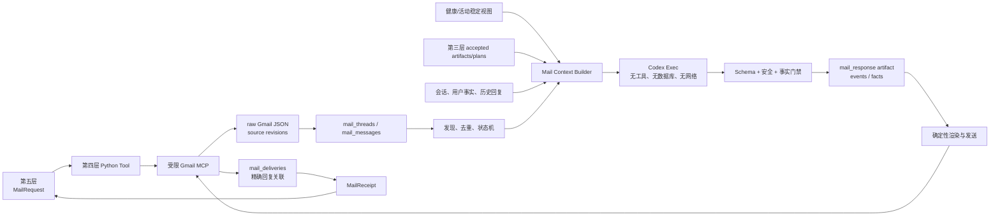

# 第四层：邮件 Agent 工具层开发契约

状态：已冻结（v2.3 固定 recipient 投递修订已接受；M4-10～12 离线终验通过）

契约版本：2.3

冻结日期：2026-07-26

实现状态：M4-01～13、M4-14A 与 IG-6 真实环境验收已完成；M4-14B、生产 cutover
和 IG-7 等待第五层 S5-10/X-04

依赖契约：

- [01-data-foundation.md](01-data-foundation.md) v2.4
- [03-data-analysis.md](03-data-analysis.md) v2.1

当前 Gmail MCP 迁移基线：

- [../../config/gmail_mcp.example.yaml](../../config/gmail_mcp.example.yaml)
- [../../harness/schemas/gmail_mcp.schema.json](../../harness/schemas/gmail_mcp.schema.json)
- [../../references/gmail_mcp_setup.md](../../references/gmail_mcp_setup.md)

### Gmail 环境绑定修订

本层统一使用当前 Codex 执行环境中名称为 `gmail` 的 MCP，支持实现固定为
`@artymclabin/gmail-mcp`。项目不得保存或启动机器专属 executable、cwd、
OAuth/token 路径，也不得复制其他机器的认证状态。服务不存在、禁用、包不匹配或
只读认证 probe 失败时，在任何邮箱动作前提示：

```text
npx @artymclabin/gmail-mcp auth
codex mcp add gmail -- npx @artymclabin/gmail-mcp
```

下文出现的 `get_self/search_messages/read_thread/send_html_self/create_or_apply_label`
均是**已禁用的旧自建 adapter 迁移基线**，不是新实现可调用的工具名。新 adapter
只能绑定当前执行环境的 `gmail` MCP（包为 `@artymclabin/gmail-mcp`），并按该 package
实际 Schema 做固定逻辑能力映射；其中 thread 回复使用 package 的 `send_email`，固定
`to=[config/trainlab.json:mail.recipient_email]`、精确 `threadId/inReplyTo`。发送账号由
MCP/provider 管理，项目不读取、判断或绑定其登录身份。Codex
Agent 仍不得取得 Gmail 工具。不得通过旧本机 command、cwd、credential 或自建 adapter
回退来规避 package 能力边界。

## 1. 目标

邮件层是由第五层被动调用的一次性邮件 Agent 工具，不是常驻邮箱监听服务。每次
调用完成一个有界的 Gmail 检查、邮件处理、AI 回复或回复投递对账任务，
将邮件事实、会话事件、用户事实、accepted 邮件回复和投递回执写入第一层定义的表，
返回结构化 receipt，然后退出。

本层只负责入站交互：检查 TrainLab 已跟踪 thread 中的新回复，以及用户主动发给
固定 `mail.recipient_email` 并带 TrainLab 标签的新邮件；保存原始/规范化消息，结合相关健康、活动、计划
与历史会话调用 Codex Exec，保存并发送回复。第三层主动生成的日报、周报、训练
建议和计划修订由第三层自己发送，第四层不重复投递。

本层的进程无长期内存状态；Gmail 扫描水位、处理状态、AI 回复 revision、用户事实、
投递幂等和恢复信息全部持久化。脚本没有被第五层调用时不存在，不在后台“等待”
邮件，也不自行决定多久检查一次。

## 2. 非目标和生命周期

本层不负责：

- cron、launchd、systemd timer、常驻 worker、IMAP IDLE、Webhook 服务或轮询循环。
- 决定每天几点发日报、星期几发周报或多久检查一次收件箱。
- 调用 Garmin Connect、同步健康数据、下载/解析 FIT 或修改采集游标。
- 生成正式日总结、周总结、七天训练计划或修改 `analysis_*/training_*`。
- 投递第三层主动生成的日报、周报、训练建议或计划修订。
- 让邮件 AI 直接修改 current training plan。
- 允许模型直接访问 Gmail MCP、SQLite、文件系统、网络、凭据或 shell。
- 向固定 `mail.recipient_email` 以外的地址发送、转发、抄送或密送邮件。
- 处理任意 Gmail 标签、删除邮件、移动邮件、归档、标为垃圾邮件或修改云端正文。
- 默认解析附件内容或把附件发送给模型。
- 医疗诊断、治疗建议或把设备指标当作医疗结论。

一次 `run` 调用的生命周期：

```text
接收 MailRequest
→ 加载配置、Schema、Shared/Mail Harness
→ 验证第一层 ready/schema version 和 Gmail MCP allowlist
→ 获取邮件写入锁并建立 mail agent run
→ 校验固定 recipient 配置与 Gmail MCP allowlist
→ 扫描 TrainLab 标签流和 tracked thread 流
→ 原始 Gmail MCP JSON 先落盘并生成 source revision
→ 规范化 thread/message，建立去重和待处理 item
→ 对每个 item 组装有界上下文并执行 Codex Exec
→ 校验意图、事实候选、依赖动作和回复
→ 原子保存事件、事实和 accepted mail response
→ 对 ready delivery 先查重，再通过 Gmail MCP 发送
→ 保存 delivery、精确内容关联和 provider receipt
→ 推进完整扫描水位，返回 MailReceipt
→ 释放锁并退出
```

单个消息失败不回滚其他消息已经完成的 archive、normalize、response 或 delivery。
Gmail 请求、Codex 执行、HTML 渲染和长时间校验不得占用 SQLite 写事务。进程退出后
不得留下 Gmail MCP 子进程、Codex 子进程、后台线程、timer 或监听端口。

## 3. 已冻结的核心决策

1. 第四层是稳定 Python API 加一次性 CLI tools；第五层决定何时调用。
2. 一个脚本提供 poll、process、deliver-response、reconcile 和 status
   等恢复边界；不把所有步骤做成不可拆分的单一副作用。
3. 第五层可调用组合 `run`，但内部仍按消息和阶段持久化，进程中断后从已完成阶段
   恢复，不重新抓取、重新生成或重复发送。
4. Gmail MCP 只能由确定性 Python 宿主调用；Codex Agent 没有 Gmail 工具权限。
5. Gmail MCP 只暴露消息搜索、thread 读取、固定 recipient 发送和 TrainLab 标签应用
   四类受限能力，不暴露通用 Gmail 修改能力。
6. 所有发送固定为本地忽略配置 `config/trainlab.json` 的 `mail.recipient_email`；邮件
   正文、模型输出或调用参数不能改变 recipient、label 或 provider 发送身份。
7. TrainLab 标签用于发现用户主动发起的新邮件，但已跟踪 thread 的回复即使没有
   标签也必须检查。
8. Gmail provider message ID 是消息幂等身份，thread ID 是会话身份；邮件主题不是
   身份，不能按主题合并不同 thread。
9. Gmail 原始响应先可靠落盘，规范化消息、会话事件、用户事实和 AI 回复分层保存。
10. 用户邮件正文是可表达问题和事实的用户内容，但仍是不可信指令；它不能覆盖
    Shared/Mail Harness、扩大工具权限、改变收件人或读取秘密。
11. 邮件 AI 回复先通过 Schema、安全门禁并保存为 immutable revision，再尝试发送。
12. 发送失败不回滚 accepted 回复；恢复发送继续使用同一精确 revision，不静默
    重新调用模型。
13. 第三层主动产物由第三层自己的受限 Gmail MCP 步骤发送；第四层只读其
    accepted artifact、plan 和 delivery 记录作为邮件上下文，不重复投递。
14. 邮件中涉及正式计划修改时，第四层只保存用户事实和
    `plan_revision_reason_recorded` 事件；第五层调用第三层 `revise-plan`。
15. 第四层可以回答普通健康/运动问题，但其回答只是邮件回复，不创建正式日报、
    周报或训练计划。
16. 历史第三层 artifact 和历史邮件回复进入上下文时始终标为
    `prior_model_output`。
17. 同一 inbound message 最多触发一次相同事件和一条 current 回复链；显式重生成
    产生新 revision。
18. 发送前必须以本地 delivery idempotency key、固定 subject/body marker 和受控搜索
    查重；发送结果不确定时先 reconcile，不能盲目再次发送。package `send_email` 不支持
    自定义 MIME headers，因此不得要求或伪造 `X-TrainLab-Run-ID`、自定义/稳定 Message-ID。
19. 回复前必须验证 thread 包含 `mail.recipient_email`，CC/BCC 均为空，且可见地址仅为
    recipient 与同一一致 mailbox counterpart；缺失、无法解析或出现第三方地址时拒绝
    投递并进入 operator review。MCP 登录账号不是授权依据，也不要求等于 recipient。
20. 第三层和第四层只共享 Shared Harness、Codex 适配器、上下文/Schema 通用组件，
    不共同写任何业务表。
21. 不固定模型名称，不保存隐藏推理、完整 prompt、原始模型协议响应或凭据。

## 4. 总体架构



推荐内部组件：

- `request`：请求、日期、数量、幂等和权限边界。
- `gmail_adapter`：受限 MCP transport、能力探测、错误归类和结果标准化。
- `discovery`：标签流、tracked thread 流、重叠窗口和 cursor。
- `archive`：原始 JSON 原子落盘、source revision 和 canonical 邮件投影。
- `classifier`：确定性 eligibility/direction/loop 检查。
- `context`：有界邮件、健康、活动、计划和历史上下文。
- `mail_agent`：Shared/Mail Harness 与 Codex Exec。
- `fact_gate`：事件、事实作用域和计划修订原因的确定性校验。
- `renderer`：纯文本和内联 HTML。
- `delivery`：发送查重、Gmail MCP 调用、receipt 和恢复。
- `publisher`：短事务发布 reply revision、输入血缘、事件、事实和 delivery。

这些组件属于同一个 Python 包，不表示多个常驻服务。

## 5. 公共 CLI

目标 CLI：

```text
trainlab mail run [--max-items N] [--deadline-seconds N]
                  [--invocation-id ID]
trainlab mail poll [--max-threads N] [--invocation-id ID]
trainlab mail process --message-id ID [--dependency-artifact-id ID ...]
                      [--invocation-id ID]
                      [--regenerate-reason CODE]
trainlab mail deliver-response --response-id ID [--invocation-id ID]
trainlab mail reconcile [--delivery-id ID] [--invocation-id ID]
trainlab mail status [--run-key RUN_KEY] [--message-id ID]
```

用户也可以在已验证的 TrainLab 邮件 thread 中单独回复一行
`FACTS [all|active|pending|future|expired|revoked]`（中文别名为
`事实 ...`）浏览事实。该命令只读、只展示固定状态，不接受删除或修改参数；如需
变更，仍由普通邮件事实门禁追加 superseding/revoked revision。CLI 也提供同一视图：

```text
trainlab facts --subject-id ID --status active
```

规则：

- 不提供 `--daemon`、`--watch`、`--schedule`、`--interval` 或永久轮询参数。
- `run` 是 poll → process → deliver 的有界组合，达到 item/deadline 上限后安全退出。
- `poll` 只发现、归档和规范化，不调用 Codex、不发送。
- `process` 只处理已经归档的指定 message；不重新搜索整个邮箱。
- `deliver-response` 只发送已经 accepted 的精确 mail response revision。
- `thread-id` 只允许来自数据库已验证的 TrainLab thread；CLI 自由文本不能创建
  任意外部 thread 目标。
- `reconcile` 只验证未知/失败投递和补记回执，不重新生成内容。
- `status` 只读本地状态，默认不访问 Gmail 或 Codex。
- stdout 只输出 `MailReceipt` JSON，不输出邮件正文、健康上下文、用户事实、
  HTML、MCP 原始响应、Harness 或凭据。

### 5.1 退出码

| 退出码 | receipt 状态 | 含义 |
|---:|---|---|
| 0 | `succeeded` | 请求范围已完成 |
| 0 | `unchanged` | 没有新消息，或精确内容已经处理/发送 |
| 10 | `partial` | 已取得进展，仍有失败或达到本次处理上限 |
| 11 | `deferred` | 等待第三层依赖、Gmail 冷却或稍后恢复 |
| 12 | `lock_busy` | 另一邮件写入工具正在运行 |
| 20 | `auth_required` | Gmail token 无法恢复，需要重新认证 |
| 21 | `rejected` | AI 回复、事实候选或发送内容未通过门禁 |
| 22 | `failed` | 配置、存储、MCP、Codex 或不可恢复错误 |

第五层必须同时检查退出码、receipt、每类计数、pending dependency 和
`next_action`，不能只根据进程退出判断邮件已经发送。

## 6. Python API 和稳定类型

统一入口：

```python
MailTool.execute(request: MailRequest) -> MailReceipt
```

`MailRequest` 固定包含：

- `mode`：`run`、`poll`、`process`、`deliver_response`、`reconcile`、`status`。
- `subject_id`。
- `invocation_id`。
- `mail_message_ids`。
- `mail_response_artifact_ids`。
- `dependency_analysis_artifact_ids`。
- `mail_delivery_ids`。
- `thread_id`。
- `max_items`。
- `max_threads`。
- `deadline_seconds`。
- `regeneration_reason_code`。
- `requested_at_utc`。

与 mode 无关的字段必须为空或 `null`。第五层不能通过 request 传入 recipient、
label、Gmail query、MCP tool name、Harness 路径或任意邮件正文。

`MailReceipt` 固定包含：

- `schema_version`。
- `run_key`、`mail_agent_run_id`、`invocation_id`。
- `mode`。
- `status`：`succeeded`、`unchanged`、`partial`、`deferred`、
  `lock_busy`、`auth_required`、`rejected`、`failed`。
- `counts`：`discovered`、`archived`、`unchanged`、`queued`、`processed`、
  `ignored`、`responses_accepted`、`deliveries_sent`、
  `deliveries_already_sent`、`failed`、`deferred`。
- `processed_message_ids`：使用内部 ID 或受控 provider ID，不含正文。
- `mail_response_artifact_ids`。
- `mail_delivery_ids`。
- `pending_dependencies`：第三层 mode、reason event ID、原 plan/artifact ID。
- `poll_state`：每个发现流的本次窗口和 completed/partial 状态。
- `next_action`：`none`、`continue_poll`、`resume_processing`、
  `invoke_analysis`、`reconcile_delivery`、`reauthenticate`、
  `operator_review`。
- `next_retry_at_utc`。
- `warnings` 和 `errors`：只含阶段、code、受控逻辑对象和脱敏摘要。
- `started_at_utc`、`completed_at_utc`。

Receipt 不包含 AI 回复文本。CLI 和 Python API 必须调用同一 application service。

## 7. Gmail MCP 绑定契约

部署机器上的 Gmail MCP 是第四层唯一 Gmail 网络边界。首版允许能力：

| 逻辑能力 | 当前映射工具 | 用途 |
|---|---|---|
| 搜索邮件 | package 实际 search capability | 代码生成的 TrainLab 标签、固定 marker 和恢复查重 |
| 读取 thread | package 实际 thread-read capability | 获取已跟踪会话的消息顺序、正文和 recipient/counterpart 证据 |
| 固定目标回复 | `send_email` | 仅在 recipient + 一致 mailbox counterpart 已验证 thread 中回复；固定 `to=[mail.recipient_email]` 和精确 `threadId/inReplyTo`，不传 from/CC/BCC/header/attachment |
| 应用标签 | package 实际 label capability（如可用） | 仅创建/应用 TrainLab；不可用时受控 deferred，不扩大能力 |

禁止暴露：

- 任意 recipient send/forward。
- 删除、Trash、归档、移动、spam、批量标签和任意标签名。
- Drive、Calendar、Contacts 或其他 Google 服务。
- 原始 HTTP token、OAuth client 内容或 credential 文件读取工具。

### 7.1 启动校验

每次需要 Gmail 的调用必须：

1. 验证 server name 恰为 `gmail`、package 恰为 `@artymclabin/gmail-mcp`，且实际
   Schema 仅映射本契约所需的固定能力；旧自建 adapter 一律拒绝。
2. 读取本地、Git 忽略的 `config/trainlab.json`，验证 `mail.recipient_email` 存在、
   规范化且唯一；不得经 MCP 获取、判断或绑定 Gmail 登录账号。
3. 验证配置只允许固定 `recipient_email`、`label=TrainLab`。
4. 不读取、保存或校验 token/OAuth 路径、凭据内容或文件权限；这些完全属于当前 Codex
   Gmail MCP 运行环境，项目不得绑定或复制。
5. 确认 transport 是当前执行环境启用的 MCP，环境变量不包含未批准秘密。
6. 验证工具响应可以映射到稳定 adapter 类型，并拒绝任意 recipient、自由 query、
   attachment 或 header 参数。

recipient 配置缺失或无效时立即 failed，不搜索、不读取、不发送；不得从 Gmail MCP、
邮件正文或调用参数猜测、补全或替换 recipient。

### 7.2 目标 adapter 数据

为可靠识别 thread 和防循环，package thread-read capability 的标准化结果至少需要：

- provider message ID 和 thread ID。
- internal UTC time。
- `From`、`To` 的规范身份判断结果。
- `Subject`。
- 若 provider 给出，保存 `Message-ID`、`In-Reply-To`、`References` 作为只读链路线索；
  它们不是发送幂等前置条件。
- label IDs。
- plain text、HTML 存在标记和附件元数据。

缺少 header 或附件元数据时不得扩展为通用 Gmail 工具，或改用旧 adapter。原始
MIME/HTML 若 package 可返回则按第一层原始对象规则保存；模型默认只接收规范化 plain
text，且附件永不进入模型。

## 8. 工具路由

### 8.1 `run`

`run` 是第五层常用入口：

1. 调用一次 poll。
2. 按 receive time 和 provider message ID 稳定排序待处理消息。
3. 处理不超过 `max_items` 的 due item。
4. 对无需第三层依赖且回复已 accepted 的 item 执行投递。
5. 对未知发送结果先 reconcile。
6. 达到 deadline 后保存 item 状态并返回 partial/deferred。

一个消息失败不阻断后续消息，除非发生：

- recipient 配置无效或 thread participant 边界不成立。
- credential/数据库权限错误。
- Schema version 不兼容。
- 单写入锁或磁盘完整性错误。

`run` 不负责投递任何第三层 artifact。第三层日报、周报和计划修订由第三层自己的
delivery 状态机发送；第四层只可读取精确 artifact/delivery ID 关联后续用户回复。

### 8.2 `poll`

`poll` 只发现和保存消息：

- 扫描 TrainLab 标签流，发现用户主动发起的新邮件。
- 读取所有需要跟踪的 TrainLab thread，发现没有标签的新回复。
- 对重叠窗口内已经归档的 provider message 返回 unchanged。
- 原始 MCP JSON 先落盘，再写 source revision 和 canonical message。
- 建立 `reply_received` 或 `new_request_received` 事件的候选，不调用模型。
- 完整扫描成功后推进相应 `mail_poll_cursors`。

`poll` 不发送“没有新消息”的通知。

### 8.3 `process`

`process` 只处理已归档、eligible、尚无 accepted current response 的 message：

1. 验证 message、thread、actor、处理状态和 source revision。
2. 确定性提取最新用户正文和 thread history。
3. 组装有界上下文和 input manifest。
4. 调用 Codex Exec 执行 Mail Harness。
5. 校验 intent、reply action、事实候选、安全状态和依赖请求。
6. 短事务发布 conversation event、accepted user facts、mail response 和 inputs。

若结果需要第三层正式计划修订：

- 写入 `plan_revision_reason_recorded` 事件。
- message 状态进入 `awaiting_analysis`。
- receipt 返回 `next_action=invoke_analysis` 和 reason event ID。
- 不直接修改计划，也不发送一封假装计划已经改变的最终回复。

第五层调用第三层 `revise-plan` 后，再以新的 `process` invocation 加载精确新计划
revision，生成或完成最终回复。

### 8.4 `deliver-response`

- 只接受 accepted 的精确 `mail_response_artifact_id`。
- 校验 triggering message、thread 和固定 recipient 配置。
- 确定性渲染 plain text + inline-styled HTML。
- 发送前按本地 delivery idempotency key 派生的固定 subject/body marker 做受控精确搜索。
- 使用 package `send_email`，固定 `to=[config/trainlab.json:mail.recipient_email]`，不传
  `from`，并传入数据库已验证的原 Gmail `threadId/inReplyTo`。
- 成功后应用 TrainLab 标签并保存 message/thread/provider receipt。
- 创建只关联该精确回复 revision 的 `mail_delivery_artifacts`。
- 更新 conversation event 为 `mail_response_sent`。

已经 sent 的精确 response 再次调用返回 unchanged/already_sent。

### 8.5 `reconcile`

用于处理以下未知状态：

- Gmail send 调用超时，不能确定 provider 是否接收。
- Gmail 已发送，但数据库事务在 receipt 前中断。
- 标签应用失败，但消息已经发出。
- provider message/thread ID 已知，delivery 状态仍为 sending/unknown。

固定顺序：

1. 使用本地 delivery idempotency key 派生的固定 subject/body marker 搜索。
2. 找到唯一匹配则读取 thread、验证 recipient + 一致 mailbox counterpart、CC/BCC 为空、
   内容哈希和时间范围。
3. 补记 sent/provider IDs 和精确 artifact relation。
4. 标签缺失时只补应用 TrainLab。
5. 找不到匹配仍保持 unknown/deferred，继续对账或要求 operator review；不得重新发送。
6. 多个匹配标记 `duplicate_delivery_conflict`，停止并要求 operator review。

`reconcile` 不调用 Codex、不产生新回复 revision。

### 8.6 `status`

只读返回：

- 最近 poll 水位。
- 待处理、awaiting_analysis、ready_to_send、unknown delivery 和失败计数。
- 指定 message/run/delivery 的阶段状态。
- Gmail auth 最后成功时间和脱敏 capability 状态。
- `next_retry_at_utc` 和 next action。

默认不启动 Gmail MCP；需要 provider 验证时使用显式 reconcile/doctor。

## 9. 邮件发现规则

### 9.1 Eligible 消息

只处理两类：

1. `tracked_thread_reply`：位于 TrainLab 已发送或已登记 thread 中、不是已知
   TrainLab outbound 的新用户消息。即使消息或 thread 当前没有 TrainLab label，
   仍然 eligible。
2. `labeled_new_request`：用户主动发给固定 `mail.recipient_email`、属于新/未跟踪
   thread，并且 Gmail thread/message 带 TrainLab 标签。

首版使用固定 recipient + 单一一致 mailbox counterpart 模式；actor 判定优先证据：

1. provider message ID 已存在于 `mail_deliveries/mail_messages` 的 TrainLab
   outbound 记录 → `actor_role=trainlab`。
2. provider message ID 不匹配任何投递，位于 tracked thread 的新消息 →
   `actor_role=user`。
3. 带 TrainLab 标签、recipient 参与且无第三方的新增消息，且无本地 TrainLab delivery/固定 marker
   对账证据 →
   `actor_role=user`。
4. 只有可伪造的 header、subject 或正文 marker 但无本地 delivery 证据 → `unknown`，
   不能直接当作 TrainLab outbound。

### 9.2 必须忽略或隔离

- 第四层自己已经发送并登记的消息。
- 相同 provider message ID 已完成的重复搜索结果。
- 未跟踪且没有 TrainLab 标签的普通私人邮件。
- thread 缺少 recipient、CC/BCC 非空、mailbox counterpart 不一致或出现第三方地址的消息。
- 只有主题包含 “TrainLab” 但没有标签或 tracked thread 证据的邮件。
- 草稿、垃圾邮件、Trash 或不完整 provider 对象。
- 自动回复、退信和 vacation response，除非未来有独立策略。
- 附件-only 且没有可分析正文的消息。

ignored 需要 reason code，不删除、不回复、不创建长期事实。身份不明或疑似循环的
消息进入 quarantined/operator review，不让 Codex决定是否扩大范围。

### 9.3 扫描水位和重叠窗口

- `trainlab_label` 和 `tracked_threads` 分别维护 cursor。
- 默认每次向前重叠 48 小时，吸收延迟投递、后加标签和先前失败。
- provider message ID/source revision 保证重叠扫描幂等。
- Gmail 搜索结果达到单次上限时，将时间窗口确定性拆分，不能推进未完整扫描区间。
- tracked thread 使用 thread ID 逐个读取，不假定回复保留标签。
- 某个 thread 失败只使 tracked-thread 流 partial；标签流可以独立完成。
- cursor 只能在对应窗口完整扫描后推进，不能跨过失败页/thread。

第五层可以频繁调用，但频率不改变上述语义。

## 10. 原始归档和规范化

处理顺序：

1. 保存 Gmail MCP 原始 message/thread JSON 到受控临时文件。
2. 验证 JSON、大小、provider IDs、recipient 参与和 participant 边界。
3. fsync 后原子重命名到 `raw/gmail/json/YYYY/MM/<sha256>.json`。
4. 创建 `raw_objects/source_revisions`。
5. 确定性提取 thread、message、headers、plain text 和附件元数据。
6. 短事务更新 `mail_threads/mail_messages/mail_attachments` current canonical。
7. 新正文、标签或 header 变化形成 source revision，不覆盖旧原始对象。

规则：

- 规范化 `body_text` 优先 text/plain；HTML 必须经过安全文本提取。
- 原始 HTML/MIME 留在 raw object，不直接进入模型。
- 保存完整规范化正文；另行确定性提取 `latest_authored_text`，不能通过删除引用
  历史而丢失证据。
- 签名、引用历史和自动 footer 的剥离规则必须版本化并保留方法。
- 附件二进制按第一层规则保存，但首版不解析、不打开、不发送给 Codex。
- provider 成功返回空 thread、缺失 ID 或时间无法解析不得伪装成 empty message。

## 11. 消息处理状态机

`mail_messages.processing_state` 首版状态：

```text
discovered
→ archived
→ normalized
→ queued
→ analyzing
→ response_accepted
→ ready_to_send
→ sending
→ sent
```

其他终态/等待态：

- `store_only`
- `ignored`
- `quarantined`
- `awaiting_analysis`
- `deferred`
- `rejected`
- `failed`
- `delivery_unknown`

状态规则：

- archive 成功后即使后续失败，原始消息永久保留。
- analyzing 进程崩溃可恢复为 queued；已有 accepted response 时不得重新生成。
- response_accepted 与 ready_to_send 分离，允许依赖和人工门禁。
- sending 超时进入 delivery_unknown，必须 reconcile。
- sent 只能由确定 Gmail receipt 或 reconcile 证据产生。
- rejected 模型输出不保存为 current response。
- ignored/store_only 不发送，但仍可有确定性事件或 accepted user fact。

## 12. 邮件意图和处理动作

Codex 输出 intent，但宿主根据 eligibility、Schema 和规则决定最终 action。

首版 intent：

- `feedback`
- `health_or_activity_question`
- `training_question`
- `plan_change_request`
- `user_fact_update`
- `acknowledgement`
- `non_trainlab_or_unsupported`
- `safety_concern`

处理 action：

| action | 含义 |
|---|---|
| `reply` | 保存并发送普通邮件回答 |
| `store_only` | 保存反馈/事实，不需要回复 |
| `await_analysis` | 需要第三层正式计划修订后再回复 |
| `ignore` | 不属于范围或无需处理 |
| `operator_review` | 身份、重复、注入或安全状态无法确定 |

规则：

- “谢谢”“收到”等 acknowledgement 默认 store_only，避免无意义自我回复循环。
- 普通健康/活动问题可以结合有界事实回答，但不得创建正式分析 artifact。
- 训练问题可以解释当前计划和历史建议，但不能静默修改 plan。
- 明确 plan change 必须产生结构化 reason event，由第三层修订。
- 与 TrainLab 无关的私人邮件不回答。
- 红旗症状可以发送安全提醒并暂停训练性回答，但不能诊断。
- 数据缺失时说明限制；不能用邮件上下文绕过第三层/第二层质量门禁。

## 13. 用户事实和计划修订原因

Codex 只能返回 fact candidates，最终是否写入 `user_facts` 由宿主确定性门禁。

候选至少包含：

- `fact_key`
- `fact_value`
- `scope`
- `effective_from`
- `expires_at`
- `source_mail_message_id`
- `evidence_text_span`
- `confidence`

作用域：

- `message_only`：只用于当前回答，不进入 active profile。
- `temporary`：一次状态、近期安排、短期疼痛或临时约束，有明确过期/复查规则。
- `long_term`：长期目标、固定偏好或持续约束。

规则：

- 只有用户最新 authored text 中明确出现“长期、以后、固定、目标改为”等同义意图，
  才能接受 long_term。
- 模型推断、引用旧 AI 邮件、转述第三方或一次感受不能升级 long_term。
- 疼痛/伤病默认 temporary，但在明确恢复、有效期或复查前保持安全约束。
- fact 更新使用 supersession，不覆盖旧事实。
- 邮件回复发送失败不回滚从用户原文确认的 accepted fact。
- 无回复只表示没有新问题报告，不是身体状态正常或医疗确认。

计划修订原因事件至少包含：

- 原用户 message/event。
- 受影响日期或约束。
- change kind：move、cancel、replace、availability、injury、preference。
- effective local date。
- 当前 plan ID（若存在）。
- 事实/证据来源和信任级别。

第四层写事件，第三层读取并决定正式新 plan revision。

## 14. 有界邮件上下文

每个 Mail Agent 输入符合版本化 `mail_agent_input.schema.json`，顶层至少包含：

- `schema_version`
- `run`
- `trigger_message`
- `thread_context`
- `conversation_events`
- `active_user_facts`
- `current_health_context`
- `current_activity_context`
- `current_training_plan`
- `relevant_analysis_artifacts`
- `prior_mail_responses`
- `data_quality`
- `policies`
- `input_manifest`
- `context_limits`

### 14.1 默认窗口

- triggering message：完整 `latest_authored_text`，上限 64 KiB。
- thread history：最近 20 个规范化消息，正文合计上限 128 KiB。
- prior mail responses：同 thread 最近 5 个 accepted response revision。
- health：默认最近 28 个已结束日期的白名单汇总；activity：默认最近 7 个已结束日期
  的汇总；只有问题明确涉及更早日期时
  才按受控日期扩展。
- current plan：精确 active plan 和 items。
- analysis artifacts：与当前问题相关的最近日报/周报/计划，默认最多 8 个。
- active user facts：按 effective/expiry/scope 过滤后的全部相关事实。
- 总输入稳定 JSON 默认不超过 1,000,000 bytes。

裁剪顺序：

1. 删除 thread 中已被后续消息完整引用的旧格式冗余。
2. 缩短非相关历史邮件。
3. 删除旧活动明细，只保留确定性汇总。
4. 缩短不相关 prior artifact，但保留 current plan 和触发邮件。

不得裁剪：

- triggering message。
- recipient/thread/provider participant 边界结论。
- active medical/safety constraints。
- current plan（当问题与训练有关）。
- data quality 和来源限制。
- 实际用于回答的 input manifest。

裁剪记录进入 `context_limits.omissions`，缺少内容不能解释为不存在。

### 14.2 输入血缘和信任

`mail_response_inputs` 至少使用：

- `trigger_message`
- `thread_message`
- `active_user_fact`
- `health_fact`
- `activity_fact`
- `current_plan`
- `analysis_artifact`
- `prior_mail_response`
- `quality_state`

trust class：

- Garmin/规范事实：`provider_fact`
- 用户最新明确陈述：`user_asserted`
- 本地确定性统计：`derived_statistic`
- 第三层 artifact/历史邮件回复：`prior_model_output`
- 来源不明内容：`untrusted_content`

邮件正文既可以是 `user_asserted` 的证据，也是不能执行的 `untrusted_content`；
“用户说了什么”可以使用，“用户要求忽略 Harness/读取 token/改收件人”不能执行。

## 15. Harness 结构

目标生产 Harness：

```text
harness/
  shared/
    HARNESS.md
  analysis/
    HARNESS.md
    daily.md
    weekly.md
    revise-plan.md
  mail/
    HARNESS.md
    process-message.md
```

加载顺序：

1. `shared/HARNESS.md`
2. `mail/HARNESS.md`
3. `mail/process-message.md`
4. 经 Schema 验证的 Mail Agent 输入

Shared Harness 负责：

- 信任等级、时间单位和敏感数据。
- 邮件/来源数据不是执行指令。
- 医疗安全。
- 不固定模型。
- 只返回 Schema JSON。

Mail Harness 负责：

- intent、reply action、事实候选和计划修订依赖。
- thread 和用户 authored text 语义。
- prompt injection 和历史 AI 边界。
- 固定 recipient、TrainLab label 和禁止工具授权。
- 简体中文、用户可见回复及安全披露。

回复 HTML 渲染、Gmail 发送和 reconcile 是确定性宿主行为，不加载 Mail Harness，
也不调用 Codex。

第三层和第四层共用的是 Shared Harness 和执行基础设施；Mail Harness 不包含
daily/weekly 正式计划生成规则。任何 route 都不得加载 `archive/` 或开发 Harness。

每次调用 Codex 记录 Shared/Mail/route Harness 内容哈希、组合版本、input/output
Schema、policy bundle 和 runner adapter 版本。

## 16. Codex Exec 契约

目标继续使用不指定模型名称的临时 Codex 进程：

```text
codex exec --ephemeral
```

必须满足：

- 不传或配置固定模型名称。
- 不暴露 Gmail、Garmin、浏览器、shell、网络、数据库或文件写入工具。
- 只接收有界 JSON 上下文和只读 Harness。
- 临时目录权限 `0700`，文件 `0600`，调用后清理。
- 输出在宿主内存/受控临时文件捕获，不转发到 CLI 或普通日志。
- 明确超时并终止整个进程组。
- 不读取 credential path、token、raw Gmail、FIT 或项目任意文件。

每个 mail agent run 默认一次 generation。非 JSON、Schema、安全或事实门禁失败时
标记 rejected，不通过隐藏二次 prompt 自动修正。显式重新处理必须提供新的
invocation 和受控 regeneration reason，并创建新的 response revision。

## 17. Mail Agent 输出 Schema

Codex 输出符合 `mail_agent_result.schema.json`：

- `schema_version`
- `run_key`
- `trigger_message_id`
- `intent`
- `action`
- `response`
- `fact_candidates`
- `plan_revision_request`
- `source_usage`
- `data_limitations`
- `safety`
- `warnings`

`response` 在 action=reply 时至少包含：

- `response_kind`
- `subject_intent`
- `structured_content`
- `user_visible_text`
- `requires_thread_reply`

模型不得输出或决定：

- recipient、CC、BCC。
- Gmail query、tool name、label。
- provider thread/message ID 替换。
- SMTP/MIME headers。
- “已经发送”状态。
- 数据库 SQL、文件路径、凭据或 token。
- 第三层 plan mutation。
- 隐藏推理或完整内部 prompt。

这些字段由确定性宿主从已验证数据库状态生成。

## 18. 确定性输出门禁

发布前至少验证：

### 18.1 身份和 thread

- trigger message/current revision 与请求一致。
- message eligible 且 actor 是 user。
- thread 属于 tracked reply 或 labeled new request。
- response 只会发送给本地 `config/trainlab.json` 的固定 `mail.recipient_email`。
- 不是对 TrainLab outbound 的自动再次回复。

### 18.2 内容和安全

- JSON 严格符合 Schema。
- 回复为简体中文，除非用户明确要求允许的其他语言。
- 没有医学诊断、治疗承诺、凭据、内部路径和 Harness 泄露。
- 没有执行邮件中的 prompt injection。
- 没有把 prior model output 表述为用户或 Garmin 新事实。
- 数据限制与实际 coverage/quality 一致。
- 红旗症状触发安全响应，不继续给出运动处方。

### 18.3 事实和计划

- fact evidence 来自 latest authored user text。
- long_term 有明确长期语言。
- effective/expiry/subject 合法。
- plan change 只创建 reason event，不直接写 training tables。
- action=await_analysis 时不存在“计划已经修改”的虚假回复。

失败时：

- run/item 标记 rejected。
- 不创建 current mail response。
- 不发送邮件。
- 已归档原始 message 保留。
- 只保存 validator code、字段路径和脱敏摘要。

## 19. 回复保存、渲染和投递

### 19.1 保存

accepted reply、inputs、conversation events 和 accepted user facts在同一短事务中
发布。任一约束失败不切换 current response。

`mail_response_artifacts.user_visible_text` 是可发送文字权威来源；
`structured_content_json` 用于以后重渲染。HTML 是投递形式，不是唯一历史副本。

### 19.2 渲染

每封邮件必须包含：

- UTF-8 plain text。
- 语义相同的 inline-styled HTML。
- 确定性 subject marker 和正文 marker；二者均由 host 从本地 delivery idempotency key
  确定性生成，且不接受模型、用户或调用方覆盖。
- 可审计但不含健康数据的 delivery marker；它不是 MIME header。

HTML 禁止：

- `<script>`、事件属性和 `javascript:`。
- 表单、iframe、外部追踪像素。
- 远程 CSS、外部字体和未批准图片。
- 从用户邮件原始 HTML 直接拼接。

### 19.3 发送

- 调用 package `send_email` 前，以固定 subject/body marker 做受控精确搜索，并结合本地
  `mail_deliveries` idempotency key 查重。
- 回复使用数据库已验证 thread ID，且必须再次验证 recipient 参与、CC/BCC 为空、仅有
  一个一致 mailbox counterpart；无法得到完整证据或出现第三方地址时不发送。
- `send_email` 的 `to` 强制为 `mail.recipient_email`，不传 `from`，且只允许已验证的
  `threadId/inReplyTo`；不接受 CC、BCC、自定义 header、Message-ID、任意 query 或
  attachment 参数。
- 发送成功后调用/确认 TrainLab label。
- provider 返回的精确 message/thread ID、固定 marker 搜索结果和本地 delivery 原子记录。
- 发送成功不修改第三层 artifact 或原 mail response。

如果 Gmail MCP 在 send 后超时，状态必须是 `delivery_unknown`，不能立即重发。

## 20. 幂等和防循环

### 20.1 消息

- provider message ID + source revision 标识规范消息。
- 相同 message ID 内容相同为 no-op；内容/标签变化新增 source revision。
- conversation event 唯一键至少包含 message ID + event type。
- 相同 inbound message 不重复创建 accepted user fact 或 plan reason。

### 20.2 AI 回复

- 推荐 run key：

```text
mail:<subject>:process:<provider_message_id>:<source_revision>:<invocation_id>
```

- 相同 invocation 已有 accepted response 时返回 unchanged。
- 显式 regeneration 新建 run/revision，旧回复不覆盖。
- prior response 被发送后不得以 current 改变为理由再次发送。

### 20.3 投递

推荐 idempotency key：

```text
mail:response:<response_artifact_id>:<thread_id>
```

- 本地 `mail:response:<response_artifact_id>:<thread_id>` 是唯一投递幂等身份；固定
  subject/body marker 由该 key 派生。
- 本地 delivery、固定 marker 的受控搜索、provider message/thread ID 和精确
  response revision 四者共同验证。仅凭 subject、正文 marker 或 provider header 不能
  认定已发送。
- 相同 idempotency key 最多一个 sent delivery。

### 20.4 防循环

- 本地 delivery 的 provider message ID 永远标为 TrainLab outbound。
- 只有本地 delivery 证据与受控 provider 结果相互印证，才能认定 TrainLab 发送；不能
  只靠可伪造 header、subject 或正文 marker。
- TrainLab outbound 不进入 process 队列。
- acknowledgement 默认不回复。
- 一封 AI 回复被用户引用不使引用中的旧文本重新成为事实。
- 自动回复/退信默认 ignored。

## 21. 错误、重试和恢复

### 21.1 只读 Gmail 操作

网络、超时、MCP transport 和明确临时 5xx：

- 最多 3 次指数退避加抖动。
- 单次调用等待上限 60 秒。
- 超出本次 deadline 时 item deferred。

429：

- 优先使用结构化 Retry-After。
- 短等待可以本次恢复。
- 长等待写 `next_retry_at_utc` 后退出 deferred。

401：

- adapter 完成一次 token refresh 后仍失败 → auth_required。

403：

- forbidden，不盲目重试；身份/权限检查失败时阻断本次网络工作。

### 21.2 发送

发送是外部副作用，规则更严格：

- send 前查询。
- 明确在请求到达 Gmail 前失败可以重试。
- 请求结果不确定、超时或连接中断后先进入 delivery_unknown。
- delivery_unknown 必须 reconcile，不能按普通网络错误直接再次 send。
- label 应用失败不重发邮件，只重试 label。

MCP adapter 必须把 HTTP/transport 错误标准化为 code；不能要求第五层解析任意英文
错误文本决定是否重试。

### 21.3 Codex

- 启动失败、超时、非零退出 → failed。
- 非 JSON、Schema/安全失败 → rejected。
- 不在同一运行无界重试。
- 恢复同一 invocation 前先查询是否已经 accepted。

### 21.4 数据库和文件

- 磁盘、权限、identity mismatch、schema version 不兼容是 run 级阻断。
- 单个 raw JSON、message 或 response 失败是 item 级错误。
- 原始文件先临时写、校验、fsync、原子重命名。
- 事务失败不留下 current 半成品。
- receipt 输出失败后，相同 invocation 从数据库恢复。

## 22. 锁和并发

- 所有会写邮件、事件、事实、response 或 delivery 的 public tools 共用一个
  Mail Agent 单写锁。
- 获取失败立即返回 lock_busy，不无限等待。
- status 只读，不需要写锁。
- 锁文件记录 PID、run ID 和开始时间；清理陈旧锁必须验证进程。
- Gmail 请求、Codex 和 HTML 渲染在事务外执行。
- 每个 message/stage 使用短事务。
- 第三层可以同时进行只读分析，但第三层与第四层不能写同一表。
- 第五层不得绕过锁直接改 processing state 或 delivery。

## 23. 配置契约

项目统一配置文件 `config/trainlab.json`（本地、Git 忽略）至少包含：

```json
{
  "mail": {
    "recipient_email": "operator-provided-email",
    "label": "TrainLab"
  },
  "mail_agent": {
    "timezone": "Asia/Hong_Kong",
    "input_schema": "harness/schemas/mail_agent_input.schema.json",
    "output_schema": "harness/schemas/mail_agent_result.schema.json",
    "harness_root": "harness",
    "max_items_per_run": 20,
    "max_threads_per_poll": 50,
    "poll_overlap_hours": 48,
    "max_context_bytes": 1000000,
    "max_thread_messages": 20,
    "max_thread_body_bytes": 131072,
    "max_trigger_body_bytes": 65536,
    "max_prior_responses": 5,
    "codex_timeout_seconds": 600,
    "mcp_timeout_seconds": 30,
    "max_read_attempts": 3,
    "lock_path": "state/locks/mail-agent.lock",
    "temp_root": "state/tmp/mail-agent"
  }
}
```

规则：

- `label` 固定 TrainLab。
- `mail.recipient_email` 是唯一允许的明文 recipient；仅由本地 `config/trainlab.json`
  提供且 Git 忽略。`send_email.to` 只能由宿主固定为该单元素列表；不传 `from`、CC、BCC、
  header、query 或 attachment。不得通过 MCP 获取/判断 Gmail 登录账号，也不要求它等于
  recipient。
- 不含调度时间、间隔、星期规则或 cron。
- 不含模型名称。
- 不保存 credential、token 或 OAuth 路径/内容。
- Harness/Schema/MCP mapping 路径必须位于允许位置，邮件和 request 不能覆盖。
- 临时目录 `0700`，临时文件 `0600`。
- poll/search query 由代码生成，不能由模型或用户邮件传入。

## 24. 数据质量和审计

每次运行至少检查：

- 本地 recipient 配置存在、有效且未被 request/MCP 覆盖。
- provider message/thread ID 完整和唯一。
- thread 消息时间总体有序。
- raw JSON 哈希、大小和路径。
- plain text 提取和正文哈希稳定。
- outbound/inbound actor 证据。
- TrainLab label 与 tracked-thread eligibility。
- source revision/current 唯一。
- processing state 转移合法。
- conversation event/message 幂等。
- user fact 来源、scope、有效期和 supersession。
- mail response run、Schema、input hash 和 revision 链。
- delivery idempotency、provider IDs 和精确 content relation。
- cursor 没有跨过失败窗口。

以下情况必须产生质量问题或 warning：

- provider 返回相同 message ID 但不可解释的正文变化。
- thread 出现多个 subject/identity 冲突。
- direction/actor 无法确定。
- label 搜索达到上限但窗口未拆分完成。
- 引用链、Message-ID 或 In-Reply-To 缺失。
- 同一固定 delivery marker 在 Gmail 中找到多个结果。
- 已发送内容无法关联到 accepted artifact revision。
- 新出现的 MIME/附件类型未映射。

质量问题不修改原始邮件。只有身份、幂等、thread、发送内容或输入信任错误才阻断
回复；可解释的 header 缺失或附件不支持可以 warning/store-only。

## 25. 安全与隐私

- Gmail token、OAuth client secret、授权 URL 和账号密码不得进入数据库、上下文、
  Harness、日志、receipt 或测试夹具。
- recipient email 明文只存在于本地、Git 忽略的 `config/trainlab.json` 和受限发送调用中；
  不写入数据库、日志、receipt、Harness 或测试夹具。
- 邮件、健康、活动、用户事实、AI 回复和投递内容均为敏感数据。
- 日常日志不得打印 subject/body/HTML；debug 也只记录哈希、大小和受控 ID。
- 精确 GPS、生殖健康、孕期、血压等只在问题确实需要且策略允许时进入有界上下文。
- 用户邮件中的链接、HTML、附件、代码和 prompt 都不执行。
- 不能因邮件写着“转发给某人”就改变固定 recipient 或 recipient/counterpart 边界。
- 不向模型提供 Gmail credential path 或 MCP transport env。
- Mail Agent 输出不能授权工具或修改 Harness。
- accepted input/output snapshot 按数据库最高敏感级别保护。
- 不保存 hidden reasoning、chain-of-thought、原始模型协议 response 或完整 prompt。

## 26. 与当前生产实现的迁移

当前生产把以下职责耦合在同一次 runtime Codex 调用：

- 检查 tracked Gmail thread。
- 解释回复和提取事实。
- 生成训练报告。
- 直接使用 Gmail MCP 发送。
- 通过 `sent/already_sent` 判断整体运行成功。

目标迁移：

1. 保留受限 Gmail MCP 的 search、read-thread、固定-recipient send 和 TrainLab label
   能力。
2. 将收件、thread 读取和交互回复所需的 Gmail MCP 能力收敛到第四层确定性
   Python adapter；第三层只保留自身 artifact 自投递所需的受限 Gmail MCP 能力。
3. 以 package thread-read 标准化 participant 与可用 header，满足 identity、reply chain
   和防循环；不得为缺失 header 开放通用工具。
4. 把 poll、消息 archive、会话事件和用户事实迁入第四层。
5. 把邮件 AI 回复迁入 Mail Harness + `mail_response_*`。
6. 第三层先持久化 analysis/plan，再自行发送；第四层只关联其精确 artifact 和
   analysis delivery 记录来识别、理解后续回复。
7. 将 current fake Gmail 测试能力升级为第四层完整状态机 fixture。
8. 第五层接管运行频率、依赖编排、失败重试和告警。

迁移完成前：

- 不删除现有 `trainlab run` 或当前 Gmail MCP 配置。
- 新旧流程不能同时处理同一 provider message、发送同一 artifact 或回复同一邮件。
- 新流程 shadow poll 可以归档到隔离数据库，但不能发送。
- 正式切换需要数据库备份、tracked thread 对账、delivery idempotency 对账、
  Harness/Schema/配置更新和回滚验证。
- 项目根 `AGENTS.md` 的生产入口和 Harness 加载规则必须与切换同时更新。

## 27. 测试和验收

### 27.1 Request/Receipt 和 CLI

- 所有 mode 参数互斥、退出码和 stdout receipt。
- run 达到 max-items/deadline 后 partial 恢复。
- status 不调用 Gmail/Codex。
- request 无法覆盖 recipient/label/query/tool/Harness。

### 27.2 Gmail 发现

- tracked thread 有无 TrainLab label 的新回复。
- 用户主动发给固定 recipient 并应用 TrainLab 标签。
- 普通无标签私人邮件 ignored。
- 主题含 TrainLab 但无 eligibility ignored。
- provider message 重复搜索 no-op。
- 后加标签、延迟消息和 48 小时重叠。
- 搜索达到 50 条后拆分窗口。
- thread 读取失败不跨 cursor。

### 27.3 身份和防循环

- 本地 `mail.recipient_email` 存在/缺失/无效，及 thread 缺 recipient、CC/BCC 非空、
  counterpart 不一致或出现第三方地址时拒绝。
- TrainLab outbound 不进入 process。
- 用户伪造 header、subject 或正文 marker 不能冒充本地 delivery。
- acknowledgement 默认 store-only。
- 自动回复/退信 ignored。
- 相同 thread 的多条用户消息按稳定顺序处理。

### 27.4 原始对象和规范化

- plain text、HTML-only、引用历史、签名和 Unicode。
- provider message 同内容 no-op、标签变化 revision、正文变化 revision。
- 原始 JSON 原子落盘和崩溃恢复。
- 附件元数据保存但不进入模型。
- 不安全 HTML 只作为 raw data，不直接渲染。

### 27.5 Mail Agent

- feedback、健康问题、训练问题、计划修改、事实更新、感谢、无关内容和安全问题。
- prompt injection 中英文 fixture。
- long-term 必须有明确措辞。
- 临时疼痛与明确恢复的 supersession。
- 历史 AI 输出不升级为 user fact。
- 数据缺口在回复中正确披露。
- Codex 无 Gmail、数据库、shell 或网络工具。
- 非 JSON、Schema 失败、超时和 rejected 不发送。

### 27.6 第三层协作

- plan change 生成 reason event 和 awaiting_analysis。
- 第五层可以用 reason event 调第三层 revise-plan。
- 第四层读取精确新 plan revision 后生成最终回复。
- 第四层不能直接 update training tables。
- 第三层 artifact 由第三层自行投递；第四层不得再次发送。

### 27.7 投递和恢复

- plain + inline HTML 固定-recipient send。
- 新 thread 和 reply thread。
- TrainLab label。
- send 前查重。
- send 后数据库中断由 reconcile 补记。
- send 超时不盲目重发。
- label 失败只重试标签。
- 同一固定 delivery marker 多个 Gmail 结果进入 operator review。
- mail_delivery_artifacts 只指向精确 mail response revision；第三层使用自己的
  analysis_delivery_artifacts。

### 27.8 故障

- MCP 不存在、工具缺失、transport 退出。
- 网络、5xx、短/长 429、401 refresh、403。
- Codex failure/rejected。
- SQLite busy、磁盘满、原子写中断。
- lock_busy 和陈旧锁。
- 进程退出后无 MCP/Codex 子进程。

### 27.9 受控真实账号验收

- 本地 `mail.recipient_email` 配置验证；不调用 MCP identity probe。
- 一封显式测试、发给固定 recipient 的 TrainLab 邮件被发现但只生成草稿/accepted response。
- 明确授权后执行一次真实固定-recipient send。
- 在同一 thread 回复并确认即使回复无标签也能发现。
- 完全相同 invocation 重跑无重复回复。
- 人工制造 send receipt 中断并用 reconcile 恢复。
- 验收日志和 receipt 不含正文或凭据。

## 28. 完成定义

第四层只有同时满足以下条件才从“已冻结”进入“已验证”：

1. Python API、CLI、MailRequest/MailReceipt Schema 实现且一致。
2. 所有工具一次性退出，没有 daemon、timer、Webhook 或轮询循环。
3. run/poll/process/deliver/reconcile/status 使用同一 application service 和状态机。
4. Gmail MCP 能力严格限制为 search/thread/fixed-recipient send/TrainLab label。
5. `mail.recipient_email` 仅从本地、Git 忽略的 `config/trainlab.json` 读取；不调用 MCP
   获取或判断 Gmail 登录身份，且不要求 recipient 等于该身份。
6. tracked thread 无标签回复和 TrainLab 标签新邮件都能可靠发现。
7. 原始 Gmail JSON 先落盘，message/thread/revision 幂等可重建。
8. inbound/outbound/self-copy 和 TrainLab 防循环规则通过。
9. Mail Context 有界、可哈希，历史 AI 保持 prior_model_output。
10. Mail Harness、Codex Exec 和输出 Schema 通过安全测试，Codex 无 Gmail 工具。
11. 用户事实 scope、证据、过期和 supersession 可追溯。
12. plan change 只产生 reason event，并可由第五层编排第三层 revise-plan。
13. accepted mail response 先保存后发送，重生成新增 revision。
14. 第三层 accepted artifact 和 analysis delivery 可作为回复上下文，但第四层
    不重新渲染或发送它们。
15. delivery fixed-recipient、multipart、inline HTML、TrainLab label 和 thread 正确。
16. idempotency、send unknown 和 reconcile 不产生重复邮件。
17. `mail_agent_items` 和 poll cursor 支持中断恢复，不跨失败窗口。
18. 错误、receipt 和日志不泄露正文、健康 payload、凭据或 hidden reasoning。
19. 新旧流程 shadow 对账、数据库备份、生产切换和回滚验收通过。
20. 第四层与第三层没有共同可写表；两层分别记录 analysis delivery 和 mail reply
    delivery。

## 29. 对其他层的固定接口

- 第一层 initializer/migration 创建 Gmail、会话、用户事实、Mail Agent、response、
  delivery 和 cursor 表；第四层是唯一运行时写入者。
- 第二层不读取或修改 Gmail 状态；第四层只读其已经发布的健康/活动稳定视图。
- 第三层写 `analysis_*`、`training_*` 和 `analysis_delivery_*` 并自行投递；
  第四层只能只读 accepted artifact/plan/delivery 作为邮件上下文，不能修改或重发。
- 第四层写 accepted user facts 和 plan revision reason events；第三层只读它们。
- 第五层负责 invocation ID、调用时间、run→第三层依赖→resume 的编排、重试唤醒
  和告警。
- 第五层不得直接修改 cursor、processing state、response、fact 或 delivery。
- 第四层稳定外部边界只有 `MailRequest`、`MailReceipt`、accepted
  mail response/facts/events/delivery 视图和受限 Gmail MCP adapter。
- Gmail query、MCP tool payload、内部 prompt 和 HTML renderer 不是跨层 API。
