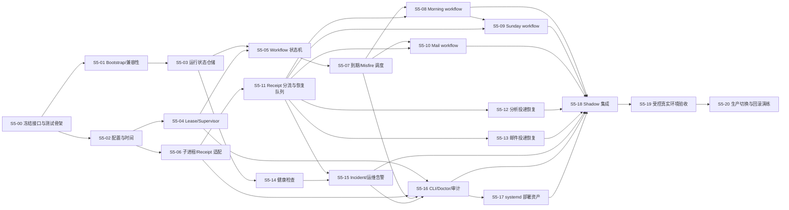

# 第五层：总调度与服务监控层详细开发需求清单

状态：开发中（S5-00～07 已完成；S5-08～20 与 G2～G4 未完成）

清单版本：1

创建日期：2026-07-23

实现授权：本文件只拆分需求，不授权实现、执行同步/分析/邮件、修改数据库、依赖或配置。

## 1. 目标与冻结输入

本清单把第五层 v1 拆分为可以独立开发、独立验证、完成后逐项勾选的单元。第五层是唯一常驻业务服务：Supervisor 负责调度、健康检查、incident 和运维告警；每次业务工作由一次性 workflow executor 调用第一至第四层的公开接口完成。

本层只拥有 `scheduler_*`、`orchestrator_*`、`service_health_checks`、`operational_incidents` 和 `operational_alert_deliveries`。它不得直接写 Garmin、邮件、分析、计划、用户事实或任何其他层 delivery 表。

### 1.1 权威大契约快照

| 契约 | 版本 | SHA-256 |
|---|---:|---|
| [第一层](01-data-foundation.md) | v2.4 | `9bf0a91e61bda47c9dba971c731ca6ec79e064b7f0ea4eb8124a5a216d67e396` |
| [第二层](02-data-collection.md) | v1 | `afdffa6268d64403d170906ee6a42d10f873a75b1615b806d893982aea86db14` |
| [第三层](03-data-analysis.md) | v2 | `4a9b3f1ffb92ba1ad4f56e68380344007e48a43e03a3e0f746399c50da794eb8` |
| [第四层](04-mail-agent.md) | v2 | `47175280f917dee55d2aa5f663f0705da8ec7baf463eae5933ea391c0770be94` |
| [第五层](05-orchestration-monitoring.md) | v1 | `5b1d5abf15689cec2507bd20e36aa83fe49626dd82247a4c0a1b91cc266ce804` |

实施开始前必须重新计算以上哈希。任一哈希变化即停止后续单元，先由总控重新冻结
影响范围；不得根据旧清单猜测新的共享边界。

### 1.2 本层明确不做

- 不实现或迁移第一层 DDL、SQLite schema、目录或 ready 标记。
- 不实现 Garmin API/FIT 解析、第三层模型分析或第四层收件/回复逻辑。
- 不改变任何下层 CLI、request/receipt、Harness、Gmail MCP allowlist 或模型选择。
- 不把 systemd timer 直接指向第二至第四层，避免双重调度。
- 不发送业务日报、周报、计划修订或邮件回复；第五层只发送独立、确定性、self-only 的运维告警。

## 2. 外部前置条件与本层起始快照

以下是外部前置条件，不属于第五层实现单元。未满足时可开发 fake/fixture 适配器和
单元测试，但不得宣称真实环境已验证。

| 编号 | 外部前置条件 | 提供层 | 第五层使用方式 |
|---|---|---|---|
| P5-01 | `foundation init/status/verify`、ready/schema receipt 与第五层运行表 DDL | 第一层 | Supervisor bootstrap、兼容性和运行状态持久化 |
| P5-02 | `SyncRequest/SyncReceipt`、Garmin CLI、repair/audit/status | 第二层 | morning 的同步、补漏、质量门禁 |
| P5-03 | `AnalysisRequest/AnalysisReceipt`、delivery retry/reconcile/status | 第三层 | daily、weekly、revise-plan 与分析投递恢复 |
| P5-04 | `MailRequest/MailReceipt`、deliver-response/reconcile/status | 第四层 | 邮件轮询、计划修订后恢复回复、回复投递恢复 |
| P5-05 | owner-only 配置、服务账号、受限 Gmail MCP 与 systemd 权限 | 部署环境 | 运维告警和常驻服务真实验收 |
| P5-06 | 当前 `trainlab run` 旧入口、旧调度和回滚手册 | 生产迁移 | shadow 对账与唯一调度切换 |

本层自身的开发可使用：合成 SQLite contract fixture、fake 下层 CLI、可控时钟、fake
进程管理器与 fake Gmail transport。所有 fixture 必须只含脱敏状态、计数和 ID，不能
含真实健康数据、邮件正文、凭据或 token。

## 3. 依赖图与开发波次

| 波次 | 可开始单元 | 前置门 |
|---|---|---|
| W0 共享基础 | S5-00 | 权威哈希一致 |
| W1 核心骨架 | S5-01、S5-02 | W0 通过 |
| W2 可并行内部能力 | S5-03、S5-04、S5-06 | W1 通过；各自目录/模块不重叠 |
| W3 编排核心 | S5-05、S5-07、S5-11、S5-14 | W2 通过 |
| W4 业务与运维 workflow | S5-08、S5-09、S5-10、S5-12、S5-13、S5-15、S5-16 | W3 通过；可使用 fake 下层 |
| W5 部署、集成与切换 | S5-17、S5-18、S5-19、S5-20 | W4 通过；真实前置条件按门开放 |

集成门 G1：所有 request/receipt、时间、workflow key 和运行表语义使用同一冻结快照。

集成门 G2：Supervisor、executor、下层适配和重试恢复可在合成 fixture 中端到端运行。

真实环境验收门 G3：P5-01 至 P5-05 满足，且取得明确的 Gmail self-send 授权。

最终完成门 G4：本层所有单元完成、影子对账、受控真实验收、切换与回滚演练均通过。

## 4. 需求单元

### [x] S5-00 / 冻结接口清单与合成测试骨架

- **目的：** 建立第五层唯一的实现起始快照、类型命名、fake 下层接口和测试数据边界，防止后续单元各自猜测跨层协议。
- **依赖与起始快照：** 五份权威 SHA-256；无代码依赖。起始时记录每份契约的版本、哈希、公共 CLI/API、receipt 状态和所有权。
- **负责范围：** 第五层类型清单、fixture 目录、可控时钟、fake Foundation/Garmin/Analysis/Mail/Gmail transport 的最小协议与测试帮助器。
- **禁止触碰范围：** 不实现第一至第四层业务、不复制其 schema、不修改大契约、不访问真实 provider。
- **预期产物：** 版本化的第五层 request/receipt schema 草案、接口 manifest、合成 SQLite fixture、fake receipt 工厂和契约哈希校验测试。
- **验证方法与证据：** 测试逐一比对五层的 CLI mode、receipt 必填字段、所有者和允许状态；哈希失配 fixture 必须阻断启动。
- **完成定义：** 所有后续单元可从同一 fake 接口启动，且测试能在任一权威哈希变化时失败。
- **集成顺序与失败回退：** 首先完成；发现大契约冲突时停止并报告总控，删除/隔离本层草案而不修订共享契约。

#### S5-00 实施证据（2026-07-23）

- 五份冻结大契约 SHA-256 重新计算并与本清单 1.1 的快照完全一致。
- `.venv/bin/python -m pytest -q tests/test_orchestration_s5_00.py`：9 passed；覆盖五层 mode/status/owner/完整 required receipt 集合、哈希漂移、Analysis/Mail `run_key` 的 status-only selector、unknown mode/status、缺字段 receipt、fake receipt factory、可控时钟与受限运维 Gmail fake。
- `.venv/bin/python -m pytest -q`：退出码 0，全量离线套件通过。
- `.venv/bin/python -m compileall -q src/trainlab/orchestration`、JSON 解析及 `git diff --check`：通过。
- 本单元只新增/修改第五层专属 contracts/fakes/schema/fixture/test 与本清单；未调用真实 provider，未修改任何冻结大契约或下层实现。

### [x] S5-01 / Foundation bootstrap 与兼容性门

- **目的：** 实现 Supervisor 启动时唯一允许的 `foundation init` bootstrap，以及后续 `status/verify` 的严格 receipt 验证。
- **依赖与起始快照：** S5-00；P5-01 在真实环境前可用 fake 实现替代。
- **负责范围：** bootstrap 调用编排、ready/schema version 检查、FoundationReceipt 解析、失败分类和运行审计引用。
- **禁止触碰范围：** 不创建目录/表、不调用 `migrate`、不以目录存在替代 receipt、不对 ready 环境做补建。
- **预期产物：** `foundation_adapter`、bootstrap step、兼容性错误类型和 unit tests。
- **验证方法与证据：** 覆盖 initialized、already_initialized、ready、incompatible、lock_busy、failed；证明 ready 时不触发写入性维护。
- **完成定义：** Supervisor 仅在启动 bootstrap 调用一次 init；日常 workflow 只读验证 ready/schema。
- **集成顺序与失败回退：** W1；任何不兼容或失败进入 attention_required/incident，停止领取业务 workflow，等待显式 maintenance。

#### S5-01 实施证据（2026-07-23）

- `FoundationAdapter` 只通过注入的公开 Foundation invoker 调用固定 `init`、`status`、`verify` request；它不导入 `FoundationTool`、不创建目录/表、不打开 SQLite，且没有 `migrate` 方法。
- `.venv/bin/python -m pytest -q tests/test_orchestration_s5_01.py`：15 passed；覆盖 `initialized`、`already_initialized`、`ready`、`incompatible`、`lock_busy`、`failed`、ready/schema 不一致、严格 receipt schema/mode/invocation 验证、唯一 bootstrap 和只读 status/verify。
- `.venv/bin/python -m pytest -q tests/test_orchestration_s5_00.py`：9 passed；`.venv/bin/python -m pytest -q`：退出码 0，全量离线套件通过。
- `.venv/bin/python -m compileall -q src/trainlab/orchestration`、JSON 解析、`git diff --check` 和五份冻结 SHA-256 复核：通过。
- gate 仅输出 `ready`、`deferred` 或 `attention_required` 与脱敏 `FoundationAuditReference`；不兼容/失败不允许启动业务 workflow，需显式 maintenance，S5-01 本身不执行 maintenance。

### [x] S5-02 / 静态配置、时钟与计划投影

- **目的：** 安全加载 owner-only 调度配置，并用 `Asia/Singapore` 和可控时钟计算 due time、逻辑日期与 job 投影。
- **依赖与起始快照：** S5-00；第五层 v1 第 5、6、17 节。
- **负责范围：** 配置 schema、原子 reload、计划 projection、daily 07:00、Sunday、邮件轮询、health-check 间隔和 config hash。
- **禁止触碰范围：** 不接受邮件/CLI 自由 cron、任意时区、任意命令或模型名；不把 schedule 写回配置。
- **预期产物：** `orchestrator` 配置 schema、clock abstraction、`scheduler_jobs` projection service、配置校验测试。
- **验证方法与证据：** 覆盖新加坡日期跨 UTC、周日、时钟跳变、非法配置、原子 reload 失败保留上一有效配置。
- **完成定义：** 所有 workflow 的逻辑日期和 next due 可复算，且无配置能产生直接 shell/Gmail recipient 注入。
- **集成顺序与失败回退：** W1；配置无效时 Supervisor 保持不领取新任务并建立配置 incident，不使用部分新配置。

#### S5-02 实施证据（2026-07-23）

- 新增 owner-only `orchestration_config.schema.json`、不可变配置快照、config SHA-256、内存原子 reload 及数据最小化的 `orchestrator_configuration_invalid` incident evidence；调用者传入的 project root 仅在构造时规范化，以兼容部署根别名；其内从原始 config/safe-child 路径逐段 `lstat`，在任何 `resolve()` 前拒绝既存 symlink，随后再作 resolved containment 与 owner-only 检查。配置叶文件以 `O_NOFOLLOW` 打开，并比对打开前后 device/inode，避免静默跟随替换。本单元不写 `scheduler_jobs` 或任何数据库。
- `SchedulingProjectionService` 仅生成不可变 DTO：每日新加坡 07:00 `morning`，以及同一 Sunday 07:00、显式 `reuse_morning_collection` 且依赖该 morning 的 `weekly`（不是第二个独立同步计划）；另有配置间隔的 mail poll/health check，以及 daily/weekly misfire window；支持注入 `UtcClock`，无系统墙钟依赖。
- `.venv/bin/python -m pytest -q tests/test_orchestration_s5_02.py`：10 passed；覆盖 UTC 跨日、Sunday、重复 07:00、墙钟前/后跳的确定性、owner-only 根/中间目录、文件自身与根内/根外祖先 symlink、`safe_child` 中间 symlink、path escape、禁止命令/recipient/model/cron/secret 字段与失败 reload 保留旧 snapshot。
- `.venv/bin/python -m pytest -q tests/test_orchestration_s5_00.py tests/test_orchestration_s5_01.py`：24 passed；完整 `.venv/bin/python -m pytest -q` 在共享树稳定后退出码 0。
- `.venv/bin/python -m compileall -q src/trainlab/orchestration`、全部第五层 JSON 解析、`git diff --check` 和五份冻结 SHA-256 复核：通过。

### [x] S5-03 / 第五层运行状态仓储与审计模型

- **目的：** 为 workflow、step、job、lease、health check、incident 与运维告警建立第五层唯一写入的 repository 和短事务规则。
- **依赖与起始快照：** S5-01；P5-01 提供 7.9 表和稳定视图，开发期使用 contract fixture。
- **负责范围：** `scheduler_jobs`、`scheduler_leases`、`orchestrator_runs`、`orchestrator_steps`、`service_health_checks`、`operational_incidents`、`operational_alert_deliveries` 的访问层、约束和审计字段。
- **禁止触碰范围：** 不写第二至第四层 run/item/cursor/artifact/delivery 表；不保存完整业务 request/receipt、正文或凭据。
- **预期产物：** repository、事务边界、状态转移 guard、脱敏序列化器和数据库 fixture tests。
- **验证方法与证据：** 验证 workflow key 唯一、step key 唯一、incident 去重、receipt 仅存 hash/受控计数、失败事务无半成品。
- **完成定义：** 任一 workflow 可在重启后仅依靠本层运行记录和下层引用 ID 恢复判断。
- **集成顺序与失败回退：** W2；repository/DDL 不兼容时不启动 Supervisor，使用只读 doctor 报告而不自行迁移。

#### S5-03 实施证据（2026-07-23）

- 新增 `OrchestrationRepository`：只以 `mode=rw` 打开已有 SQLite，并在每个短事务前用 Foundation schema manifest 做只读兼容性校验；任何表缺失、列漂移或 manifest 不一致均 fail closed，未包含 `CREATE`、`ALTER`、迁移或自动修表。
- 所有 DTO 完整暴露七张表的恢复/审计字段：job 配置投影、lease 的 owner PID/acquired/heartbeat/expires、run 逻辑身份与摘要、step 下层引用/时间/重试、incident 生命周期及 alert provider 验证字段。`scheduler_leases` 仍只有只读恢复查询，lease 获取/续期/接管仍留给 S5-04。
- step 结果汇总使用有界、版本化 `step_summary_v1`，按 `step_key` 合并计数、receipt hash 或固定 evidence code，不覆盖此前 step。相同状态调用不写库、不改时间/摘要/receipt；有真实 receipt 必须保存 hash，failed/skipped 无 receipt 仅可使用固定受控 evidence code。
- 运维序列化器只接收 code、SHA-256、UTC、整数计数与显式枚举；拒绝正文、邮箱、健康值串、长 base64/编码文本、token 和凭据。所有 SQL 均参数化，未提供第二至第四层表写入路径。
- incident 以 `incident_key` 去重并保留 `first_seen`；open/acknowledged 不降级，resolved/suppressed 再出现时在同一事务原子 reopen、清 `resolved_at`、增加 occurrence 且只保留或提升 severity。alert 的全局幂等键若关联另一 incident 则 fail closed。最近 run/open incident 查询有显式时间与 ID tie-break 排序。
- `.venv/bin/python -m pytest -q tests/test_orchestration_s5_00.py tests/test_orchestration_s5_01.py tests/test_orchestration_s5_02.py tests/test_orchestration_s5_03.py`：48 passed；覆盖 schema 阻断、完整 recovery DTO、摘要合并、同状态 data_version 不变、无 receipt evidence、incident reopen、alert 关联冲突、稳定排序、payload lookalike 拒绝、rollback、跨层表不变及只读查询。
- 完整 `.venv/bin/python -m pytest -q`：在第四层共享树稳定后退出码 0；`.venv/bin/python -m compileall -q src/trainlab/orchestration`、全部第五层 JSON 解析、`git diff --check` 和五份冻结 SHA-256 复核：通过。
- 第二轮返修：摘要升级为深校验的 `step_summary_v2` append-only attempt/transition 历史，支持 `running → deferred(receipt) → running → deferred(new receipt) → running → succeeded`，并记录 retry/evidence/count/hash；同状态仅完全同证据 no-op，否则 conflict。deferred 强制未来 retry 或固定 no-retry evidence，terminal 清理 retry，时间和 attempt 均单调受守卫。
- 第二轮返修：incident 重复记录验证 category/关联 identity，`last_seen` 不倒退且 `None` 不擦除既有证据；closed 再出现原子 reopen。事务 begin 失败会关闭连接；摘要出现未知键、超限或非受控嵌套值即 fail closed。聚焦与完整离线 pytest、编译、JSON、diff、冻结哈希均已复跑通过。
- 身份门补强：每次连接以 owner-only、非 symlink DB fd 记录 inode 身份；connect、`BEGIN IMMEDIATE` 和关闭前均复核，并要求 `PRAGMA database_list` 仅有 `main` 且 realpath 等于配置数据库。连接重定向至另一份完整 Foundation DB、路径替换和 schema 验证异常均零业务写、无 fd 泄漏。

### [x] S5-04 / 单实例 Lease 与 Supervisor 生命周期

- **目的：** 让 Supervisor 成为唯一常驻业务进程，并能安全获得、续期、失效与接管 lease。
- **依赖与起始快照：** S5-02、S5-03。
- **负责范围：** owner-only 锁文件、数据库 lease、instance ID、heartbeat、优雅停止、接管审计与停领新 workflow。
- **禁止触碰范围：** 不假定本地锁即是真实 lease，不删除未知锁，不重启下层 daemon（下层不存在 daemon）。
- **预期产物：** Supervisor lifecycle service、lease manager、signal handler、health heartbeat 和 unit/integration tests。
- **验证方法与证据：** 两实例竞争、数据库不可用、heartbeat 超时、旧 PID 存在/不存在、TERM 时停止领取任务和 executor 回收。
- **完成定义：** 任意时刻最多一个有效 owner；接管必须同时证明 lease 过期和旧进程不存在。
- **集成顺序与失败回退：** W2；lease 获取失败返回/保持 passive，不运行 workflow；数据库异常时安全停止新任务。

#### S5-04 实施证据（2026-07-24）

- `LeaseManager` 使用 S5-03 Foundation manifest/路径身份门；SQLite lease 是唯一权威，本地 marker 仅为 owner-only 诊断证据且从不按名称删除。
- claim token 精确绑定 record/owner/PID/acquired/heartbeat/expiry；旧 generation 不能续租或释放新 generation。接管要求严格过期、旧 PID 明确不存在，并在同一 CAS 事务写入 SHA-256 predecessor-claim 审计。
- marker 仅接受当前 UID、0600、普通、最大 4 KiB 的未知遗留文件；所有 write/fsync/stat/short-write 失败受控失败并尝试 exact-token 补偿。lease 行时间、身份与时序畸形 fail closed。
- `.venv/bin/python -m pytest -q tests/test_orchestration_s5_00.py tests/test_orchestration_s5_01.py tests/test_orchestration_s5_02.py tests/test_orchestration_s5_03.py tests/test_orchestration_s5_04.py`：通过；覆盖竞争、接管、PID/时钟、fencing、marker swap、短写、counterfeit/schema/path redirect、FD 异常与 Supervisor TERM/INT。
- `.venv/bin/python -m compileall -q src/trainlab/orchestration`、第五层 JSON 解析、`git diff --check` 与五份冻结 SHA-256：通过；未实现 S5-05 或任何下层业务。

### [x] S5-05 / Workflow 状态机、幂等键与恢复模型

#### S5-05A 状态持久化映射契约（进行中，不代表 S5-05 完成）

- `domain_state_v1` 是唯一可逆投影：完整 domain workflow/step state 保存于受控 JSON；Foundation 兼容列只保存 `queued/running→started`、`attention_required→partial`、`unchanged→succeeded`、`partial/lock_busy/auth_required/rejected→failed` 等粗粒度值。
- 读取必须同时验证 JSON version、未知键、domain state、全部 step key 与每个列投影；任一侧被篡改即 fail closed，绝不从 `partial`/`failed` 猜测更细 domain state。
- 固定 domain transition table 禁止 terminal revive；实际 event 的 exact replay/no-write 与持久 aggregate 集成、恢复 planner 均留给后续 S5-05 单元。

- **目的：** 将 `queued/running/succeeded/partial/deferred/attention_required/failed/cancelled` 和 step 状态实现为严格、可恢复的状态机。
- **依赖与起始快照：** S5-03、S5-04；第五层 v1 第 6、7、14、15 节。
- **负责范围：** workflow key、parent/dependency、deadline、状态允许转移、started step 复核和 restart recovery。
- **禁止触碰范围：** 不通过重建 invocation ID 绕过幂等，不直接把未知 running 改 failed，不重跑已验证的外部副作用。
- **预期产物：** workflow aggregate、state transition table、recovery planner、workflow/step persistence tests。
- **验证方法与证据：** 覆盖相同 morning/weekly/mail key 重入、任意 step 中断、deadline、parent workflow、非法转移拒绝。
- **完成定义：** 同一业务逻辑日期最多一个有效 workflow；恢复决策可复现并输出受控 next action。
- **集成顺序与失败回退：** W3；状态不确定时转 reconcile/attention_required，绝不自动创建并行替代 run。

#### S5-05 完成证据（2026-07-24）

- S5-05A 已提供不可变 workflow/step 定义、严格 domain transition、exact replay
  无写入和 fail-closed 持久 aggregate；同一 `workflow_key` 重入只复用原 aggregate。
- S5-05B 新增纯 `recovery_planner`：只读取持久 aggregate 与显式 parent 状态/UTC
  时钟，输出受控 `RecoveryDecision`，不执行子进程、网络或数据库写入。未知 running
  step 总是先选择原 invocation 的 status/reconcile；analysis 与 mail 的精确 delivery
  恢复分别选择对应 reconcile。已验证成功/terminal step 不重跑，deferred/lock_busy
  仅在持久 `next_retry_at_utc` 到期后恢复；deadline、parent、依赖和畸形状态保守转
  attention_required。最后 step 已提交但 workflow terminal 未落盘时输出确定性
  `complete_workflow`；workflow deferred 的到期恢复先输出 `resume_workflow`，以满足
  状态机的 deferred→running 前置条件；未知 running 对账优先于 deadline/parent gate。
  planner 还在任何外部 action 前验证 A2 可达的组合：queued 只能全 pending；running
  最多一个且必须位于成功前缀/待处理后缀之间；deferred 必须有唯一合法
  deferred/lock_busy frontier。不可能组合只输出 `attention_required/malformed_state`。
- `.venv/bin/python -m pytest -q tests/test_orchestration_s5_00.py tests/test_orchestration_s5_01.py tests/test_orchestration_s5_02.py tests/test_orchestration_s5_03.py tests/test_orchestration_s5_04.py tests/test_orchestration_s5_05a.py tests/test_orchestration_s5_05a1b.py tests/test_orchestration_s5_05a2.py tests/test_orchestration_s5_05b.py`：通过（最终专项 S5-05A+B：469 passed；完整 S5-00..05 回归：全部通过）。
- `.venv/bin/python -m compileall -q src/trainlab/orchestration`、`git diff --check`
  与五份冻结大契约 SHA-256：通过；S5-06 保持未勾选，未调用真实 provider，未暂存/提交。

### [x] S5-06 / 固定 argv 子进程、Receipt 验证与进程组回收

- **目的：** 安全执行下层 CLI，并只接受唯一、版本兼容、与请求匹配的结构化 receipt。
- **依赖与起始快照：** S5-00、S5-02；P5-02 至 P5-04 的 fake CLI 协议。
- **负责范围：** 静态 command map、argv builder、最小环境、工作目录、stdout/stderr 限额、JSON parser、退出码映射、timeout 和 TERM/KILL 进程组清理。
- **禁止触碰范围：** 不使用 shell、不接受任意 command/env/path、不解析自然语言 stdout、不泄露 stderr 原文到 incident。
- **预期产物：** subprocess runner、receipt validator、受控错误分类、fake process suite。
- **验证方法与证据：** 覆盖成功、非 JSON、多 JSON、超限 stdout、退出码不一致、超时、子孙进程残留、schema/ID/date 不匹配和 secret env 缺失。
- **完成定义：** 每次下层调用都可关联 request hash、invocation ID、receipt hash，且任意失败能安全回收进程组。
- **集成顺序与失败回退：** W2；Receipt 不可信时 step failed/attention_required，不依据退出码单独继续。

#### S5-06 完成证据（2026-07-24）

- 实现冻结 argv、逐 mode 参数白名单、最小环境、独立进程组、双流有界读取、严格
  UTF-8/JSON/schema/身份/日期/退出码校验；只返回 receipt、摘要哈希和受控错误，
  不返回下层 stdout、stderr、凭据或业务正文。
- timeout、stdout/stderr 超限和 reader/pipe 异常均先回收并确认整个进程组与读取
  线程；清理无法确认时稳定优先返回 `untrusted/process_group_unreaped`，不会误报为
  普通 timeout/output-limit。只有清理成功后才保留
  `timeout_unknown/process_timeout_unknown`，供后续恢复单元按非幂等副作用未知状态
  执行 reconcile，而不盲目重试。
- `.venv/bin/python -m pytest -q tests/test_orchestration_s5_06.py`：通过
  （197 tests）；覆盖全部冻结 layer/mode、request/receipt 绑定、严格 JSON、schema
  漂移、输出限制、timeout、TERM/KILL、子孙进程、继承 pipe、reader 异常、清理失败
  优先级和命名读取线程无残留。
- `.venv/bin/python -m pytest -q tests/test_orchestration_s5_00.py tests/test_orchestration_s5_01.py tests/test_orchestration_s5_02.py tests/test_orchestration_s5_03.py tests/test_orchestration_s5_04.py tests/test_orchestration_s5_05a.py tests/test_orchestration_s5_05a1b.py tests/test_orchestration_s5_05a2.py tests/test_orchestration_s5_05b.py tests/test_orchestration_s5_06.py`：
  通过（885 tests）。
- `.venv/bin/python -m compileall -q src/trainlab/orchestration`、`py_compile`、
  `git diff --check` 与五份冻结大契约 SHA-256：通过；未调用真实下层/provider，
  未开始 S5-07，未暂存或提交。

### [x] S5-07 / 到期调度、Misfire 与恢复队列

- **目的：** 根据静态计划、deferred next retry 和未完成 workflow 选择下一项一次性 executor 工作。
- **依赖与起始快照：** S5-02、S5-04、S5-05、S5-06。
- **负责范围：** due queue、daily/weekly/mail/health priority、misfire window、停机后 catch-up、deferred wake-up 和 deadline 排序。
- **禁止触碰范围：** 不回放每一次错过的 mail 间隔，不因重启执行 full sync/regenerate/migrate，不覆盖下层更晚的 `next_retry_at_utc`。
- **预期产物：** scheduler loop、due evaluator、misfire policy、可控时钟测试。
- **验证方法与证据：** 覆盖每日 07:00、周日 07:00、重复时钟、停机 5 分钟/13 小时/超窗口、deferred、多个 due job 和单实例竞争。
- **完成定义：** scheduler 对同一 due 只创建一个 workflow，mail 停机恢复只触发一次 catch-up。
- **集成顺序与失败回退：** W3；时间/配置无法确定时不领取任务，建立 scheduler incident。

#### S5-07 完成证据（2026-07-24）

- 总控验收通过：S5-07 focused 测试 `26/26` 通过，S5-00..07 全量回归通过。
- 总控 hidden probes 通过：invalid heartbeat、mixed invalid、cross-subject 和 handoff
  场景均按预期 fail closed 或保持受控绑定。
- S5-08 仍为 `[ ]`，尚未启动；本次仅收口 S5-07 验收文档。

### [ ] S5-08 / Morning workflow：增量同步、质量门与有限 repair

- **当前状态：** 未启动。
- **目的：** 实现每天 07:00 的 `morning` 编排：第二层 incremental、receipt/质量检查、可预算 repair、第三层 daily。
- **依赖与起始快照：** S5-05 至 S5-07、S5-11；P5-02、P5-03；第二层和第三层
  fake receipt。
- **负责范围：** 显式传递昨天/今天日期、同步 step、coverage/gap 门、`repair_data/rerun_collection` 分流、daily step 和其 receipt 记录。
- **禁止触碰范围：** 不直接写 cursor/gap，不直接计算质量结论，不发送日报，不把 partial 当 complete。
- **预期产物：** morning workflow definition、quality gate adapter、repair budget handler、fixture tests。
- **验证方法与证据：** 覆盖 collection succeeded/partial/deferred/auth_required、ready/ready_with_warnings/blocked、repair 上限、daily partial delivery 与幂等重入。
- **完成定义：** 在数据允许时只调用一次 daily，日期正确；数据 blocked 时不调用 Codex 且生成可恢复原因。
- **集成顺序与失败回退：** W4；下层失败保留原 workflow 和 step，按 receipt retry/reconcile，不新建第二份日报。

### [ ] S5-09 / Sunday workflow：一次同步复用、daily 与 weekly

- **目的：** 实现周日 07:00 在一次 collection 快照上依次执行 daily 和 weekly，避免重复 Garmin 抓取。
- **依赖与起始快照：** S5-08；P5-02、P5-03。
- **负责范围：** Sunday logical date、共享 collection step、daily/weekly 独立 downstream step、各自质量结果和序列化执行。
- **禁止触碰范围：** 不因 daily 失败自动断言 weekly 失败；不额外同步；不替第三层发送周报或计划。
- **预期产物：** weekly workflow definition、shared snapshot reference、Sunday fixture tests。
- **验证方法与证据：** 覆盖周日只一次 incremental、daily 成功/weekly 失败、daily 失败/weekly 可继续、collection blocked 两者都跳过、重启后无重复周计划。
- **完成定义：** weekly 的 `as_of` 等于周日逻辑日期，daily/weekly 下层 invocation 和 delivery 都可独立追踪。
- **集成顺序与失败回退：** W4；任一分析 step 的 partial 仅恢复其 own delivery/step，不回滚另一个 accepted artifact。

### [ ] S5-10 / Mail workflow 与计划修订依赖链

- **目的：** 定期调用第四层 `mail run`，并编排 `invoke_analysis → revise-plan → resume process` 的跨层闭环。
- **依赖与起始快照：** S5-05 至 S5-07、S5-11；P5-03、P5-04。
- **负责范围：** mail workflow、max-items/deadline 传递、pending dependency 保存、reason event/plan/artifact/delivery ID 验证、resume invocation。
- **禁止触碰范围：** 不读 inbox，不生成/发送回复，不创建 user fact，不把 plan 内容交给第四层重发。
- **预期产物：** mail workflow definition、dependency resolver、第五层 consumer-side
  resume tests；完整跨层闭环由总控方案 `X-04` 唯一拥有。
- **验证方法与证据：** 覆盖无消息、partial backlog、普通回复、await_analysis、reason event 不可信、第三层 plan revision 成功/partial/rejected、第四层只在原 thread 回复。
- **完成定义：** 一次计划修改只触发一个 reason event、一个第三层 revise-plan 和一个必要的第四层回复恢复；不产生重复计划邮件。
- **集成顺序与失败回退：** W4；依赖不满足时 mail item 保持 awaiting_analysis/deferred，不能假装计划已修改或重新处理用户原文。

### [ ] S5-11 / Receipt 分流、重试预算与跨调用恢复

- **目的：** 把第二至第四层的 `succeeded/unchanged/partial/deferred/lock_busy/auth_required/rejected/failed` 统一映射为确定的 workflow 行为。
- **依赖与起始快照：** S5-05、S5-06；三类下层 receipt fake。
- **负责范围：** receipt schema/identity/date 校验、next action dispatcher、retry budget、退避加抖动、attention_required 和 incident trigger。
- **禁止触碰范围：** 不解析任意错误文本推断重试，不自动改变 Harness，不对 rejected 无界重试。
- **预期产物：** outcome classifier、retry policy、恢复队列、状态矩阵测试。
- **验证方法与证据：** 每种状态、错误分类、超过预算、下层更晚 next retry、lock busy 持续冲突、schema mismatch 和 identity mismatch。
- **完成定义：** 所有下层状态均有单一可测试处理路径；同一失败不会以新 invocation 绕过幂等。
- **集成顺序与失败回退：** W3；无法分类的 receipt 一律 attention_required 并保存脱敏证据。

### [ ] S5-12 / 第三层分析投递恢复

- **目的：** 对已 accepted 但 `partial + retry_delivery` 的第三层分析结果，只恢复精确 delivery。
- **依赖与起始快照：** S5-11；P5-03。
- **负责范围：** `retry-delivery`、`reconcile-delivery` 调度、delivery ID 校验、未知发送结果和 workflow receipt 更新。
- **禁止触碰范围：** 不重新调用 daily/weekly/revise-plan Codex，不修改 artifact/plan，不让第四层代发。
- **预期产物：** analysis delivery recovery handler、fake Gmail/Analysis receipt tests。
- **验证方法与证据：** 覆盖 pending、already_sent、delivery_unknown、retry 成功、重复 retry、缺失 delivery ID 和第三层 rejected。
- **完成定义：** 分析邮件恢复不创建新 artifact 或第二封同幂等键邮件。
- **集成顺序与失败回退：** W4；未知状态先 reconcile，仍无法确认时 deferred/incident，不盲目 send。

### [ ] S5-13 / 第四层回复投递恢复

- **目的：** 对第四层已经 accepted 的邮件回复恢复 `deliver-response/reconcile`，不重新调用 Mail Agent。
- **依赖与起始快照：** S5-11；P5-04。
- **负责范围：** mail response/delivery ID 校验、回复 delivery retry、unknown reconcile、workflow 更新。
- **禁止触碰范围：** 不读取/渲染邮件正文，不修改 reply artifact/user facts，不使用第三层 delivery 表。
- **预期产物：** mail delivery recovery handler、fixture tests。
- **验证方法与证据：** 覆盖明确发送前失败、send unknown、already sent、label-only retry、重复恢复和 thread ID 不匹配。
- **完成定义：** 回复恢复只能引用已 accepted 的精确 response revision，绝不重复生成 AI 回复。
- **集成顺序与失败回退：** W4；无法验证 provider 结果时保留 delivery_unknown 并建立 incident。

### [ ] S5-14 / 服务、数据与下层新鲜度健康检查

- **目的：** 实现第一至第五层状态、数据库/磁盘、cursor/gap、artifact/delivery、mail backlog、lease/heartbeat 和日志的只读健康检查。
- **依赖与起始快照：** S5-03、S5-04、S5-06；P5-01 至 P5-04 可分阶段接入。
- **负责范围：** check catalog、阈值版本、受控 metrics、`service_health_checks` 写入、检查调度和只读 doctor 数据。
- **禁止触碰范围：** 不复制完整业务 payload，不自动修复数据，不运行 full sync 或 migration。
- **预期产物：** health-check services、threshold config、retention/downsampling policy、tests。
- **验证方法与证据：** 覆盖 ready/schema、WAL/integrity、磁盘/inode、Garmin cursor/gap、analysis delivery、mail cursor/backlog、lease、日志轮转和缺失下层状态。
- **完成定义：** 每项检查只有状态/计数/时间进入监控表，并能稳定触发或关闭对应 incident。
- **集成顺序与失败回退：** W3；检查异常本身不能阻塞已在运行的 executor，除非检测到数据库/身份/权限等明确安全阻断。

### [ ] S5-15 / Incident 生命周期与独立运维 Gmail 告警

- **目的：** 对可操作故障建立去重 incident，并以确定性、self-only 模板发送及恢复运维告警。
- **依赖与起始快照：** S5-03、S5-11、S5-14；P5-05 在真实发送前可用 fake Gmail transport。
- **负责范围：** incident key、severity/state、acknowledge/suppress/resolve、告警 idempotency、运维模板、受限 Gmail MCP adapter 和 reconcile。
- **禁止触碰范围：** 不调用 Codex，不发送业务内容，不写 `analysis_delivery_*`/`mail_delivery_*`，不读 inbox/thread，不更改 recipient。
- **预期产物：** incident manager、alert renderer、operational alert delivery service、fixture tests。
- **验证方法与证据：** 覆盖相同故障去重、连续计数、恢复关闭、suppression、self identity mismatch、send unknown、Gmail 不可用和正文脱敏扫描。
- **完成定义：** 同一 open incident 最多一封相同告警；告警失败仍完整保留本地 incident，恢复不会发送重复业务邮件。
- **集成顺序与失败回退：** W4；Gmail 故障时只记录/更新 incident，等待 reconcile 或未来第二渠道，不递归产生告警风暴。

### [ ] S5-16 / Supervisor CLI、Doctor、日志与人工操作审计

- **目的：** 提供受限的 `supervisor run/doctor` 与 `orchestrate run/retry/reconcile/status` 入口，并实现脱敏日志与人工操作审计。
- **依赖与起始快照：** S5-04 至 S5-07、S5-14、S5-15。
- **负责范围：** 参数校验、JSON receipt、只读 doctor、status、operator retry/ack/suppress/resume/forced takeover 审计、日志轮转。
- **禁止触碰范围：** 不暴露 `--command`、`--sql`、`--recipient`、`--harness` 或任意文件路径；不输出下层业务正文。
- **预期产物：** CLI parser、doctor report schema、logging/audit adapter、CLI tests。
- **验证方法与证据：** 覆盖非法参数、权限不足、stdout 仅含 receipt、日志不含正文/token/prompt、operator 操作可追溯、status 不调用 provider。
- **完成定义：** 所有人工恢复仍经过同一 workflow 状态机，且无 CLI 能越权改下层业务表。
- **集成顺序与失败回退：** W3；CLI 错误只返回脱敏错误并不启动子进程。

### [ ] S5-17 / systemd、Watchdog、停止、升级与回滚部署资产

- **目的：** 将 Supervisor 作为 Linux 唯一常驻业务服务部署，并建立安全启动、停止、重启、升级和回滚资产。
- **依赖与起始快照：** S5-04、S5-16；P5-05、P5-06。
- **负责范围：** systemd unit、服务账号/目录权限、Restart/backoff、watchdog/notify、资源限制、停止流程、部署/回滚 runbook。
- **禁止触碰范围：** 不创建 systemd timer 调用下层，不修改生产系统或启用服务；本单元只交付模板和验证步骤。
- **预期产物：** 单元文件模板、环境文件样例、部署/停止/升级/回滚 runbook、静态校验测试。
- **验证方法与证据：** 静态检查 unit 无双调度、服务账号权限最小、TERM 时停止领取任务、executor 超时回收、升级前备份/lease 检查。
- **完成定义：** 部署资产明确要求 Supervisor 唯一调度，且任意失败都有不启用/回滚路径。
- **集成顺序与失败回退：** W3；真实 systemd 安装留到 G3/G4，不通过静态审查不得进入真实主机。

### [ ] S5-18 / Shadow 编排集成与旧入口对账

- **目的：** 在不产生真实外部副作用的条件下，让第五层读取冻结状态、生成 workflow 计划并与人工/旧入口结果对账。
- **依赖与起始快照：** S5-08 至 S5-17；P5-06。
- **负责范围：** shadow mode、隔离数据库/fixture、workflow/date/key/receipt/incident 对账报告和差异分类。
- **禁止触碰范围：** 不调用真实 Garmin/Gmail/Codex，不让 shadow 写生产业务表，不关闭旧调度。
- **预期产物：** shadow runner、对账报告格式、差异基线和回归 tests。
- **验证方法与证据：** 连续模拟 daily、Sunday、mail、deferred/restart；验证只有预期 workflow 被计划、没有真实 send/同步。
- **完成定义：** 对账可解释全部差异，且证明新旧调度不会在同一生产对象上并发写入。
- **集成顺序与失败回退：** W5；发现未解释差异则停止切换，保留旧入口并修复对应单元。

### [ ] S5-19 / 受控真实环境验收

- **目的：** 在有限日期窗、已认证 self-only 账号和明确授权下验证真实 provider、Gmail 告警、systemd 和恢复行为。
- **依赖与起始快照：** S5-18；G3；P5-01 至 P5-05 已实现并通过各自 smoke test。
- **负责范围：** 受控验收计划、最小 workflow、真实 receipt/日志证据、故障注入记录和清理确认。
- **禁止触碰范围：** 不执行 full sync、不发送非 self 邮件、不修改历史数据、不在未授权时真实发信。
- **预期产物：** 受控验收 runbook、证据清单、结果记录和已知限制。
- **验证方法与证据：** 一个 daily、一个 Sunday、一个 TrainLab 邮件回复、一个 plan revision、一个 collection deferred、analysis/mail delivery unknown、Supervisor 重启和一个运维告警。
- **完成定义：** 所有真实副作用均有精确 run/delivery ID，且无重复同步、artifact、计划或邮件。
- **集成顺序与失败回退：** W5；任何不确定发送先 reconcile；失败后停用新调度并回到 shadow/旧入口，保留证据。

### [ ] S5-20 / 生产切换、唯一调度与回滚演练

- **目的：** 完成从现有 `trainlab run`/旧调度到第五层唯一调度的可逆切换。
- **依赖与起始快照：** S5-19；G4 前的最终运行基线；总控批准。
- **负责范围：** 切换 checklist、数据库/状态备份、旧调度关闭验证、AGENTS/Harness/配置/systemd/runbook 同步变更、回滚演练。
- **禁止触碰范围：** 不在没有备份和回滚验证时切换；不让新旧调度同时启用；不把 migration 伪装成 Supervisor 启动动作。
- **预期产物：** 切换 runbook、go/no-go checklist、回滚 runbook、验收证据模板。
- **验证方法与证据：** 验证旧调度已停、新 Supervisor 是唯一 lease owner、daily/weekly/mail 均按预期、回滚恢复旧入口且无重复副作用。
- **完成定义：** 生产切换由明确批准完成；任意回滚可在不丢失运行/incident 历史的条件下执行。
- **集成顺序与失败回退：** 最后执行；go/no-go 任一项失败立即保持/恢复旧入口，不清除第五层审计证据。

## 5. 大契约覆盖矩阵

| 第五层 v1 条款 | 覆盖单元 | 验收证据 |
|---|---|---|
| 1 目标与唯一常驻服务 | S5-04、S5-17、S5-20 | lease、systemd、唯一调度演练 |
| 2 Supervisor + executor 架构 | S5-04、S5-05、S5-06 | 生命周期/进程组测试 |
| 3 非目标与越权边界 | S5-00、S5-03、S5-06、S5-16 | 静态 API/权限测试 |
| 4 核心决策与单表所有权 | S5-00、S5-03、S5-05、S5-15 | 所有权审计与 schema fixture |
| 5 daily/Sunday/mail 固定调度 | S5-02、S5-07、S5-08、S5-09、S5-10 | 可控时钟 workflow tests |
| 6 misfire 与重启 | S5-05、S5-07、S5-11 | 重启/补跑 fixture |
| 7 workflow 状态与依赖门 | S5-05、S5-08、S5-09、S5-10 | 状态机与 gate tests |
| 8 CLI | S5-16 | 参数/receipt/无越权测试 |
| 9 Python API/Receipt | S5-00、S5-05、S5-06 | schema 与 hash 验证 |
| 10 下层 receipt 分流 | S5-06、S5-11 | 状态矩阵测试 |
| 10.1 分析 delivery 恢复 | S5-12 | retry/reconcile 无重生成 |
| 10.2 邮件 reply 恢复 | S5-13 | deliver-response/reconcile 无重生成 |
| 11 重试与预算 | S5-11 | budget/backoff/incident tests |
| 12 服务与数据健康检查 | S5-14 | check catalog 与阈值 fixture |
| 13 incident 与运维告警 | S5-15 | 去重/self-only/unknown reconcile |
| 14 第五层运行数据 | S5-03 | repository 约束与重启恢复 |
| 15 lease、锁与并发 | S5-04、S5-05 | 双实例/接管/冲突测试 |
| 16 子进程管理 | S5-06 | timeout/kill/receipt 欺骗测试 |
| 17 配置契约 | S5-02、S5-16 | schema/reload/注入测试 |
| 18 日志、审计与保留 | S5-03、S5-14、S5-16 | 脱敏/retention/audit tests |
| 19 systemd 部署 | S5-17 | unit 静态审查和受控验证 |
| 20 故障与恢复 | S5-05、S5-06、S5-11 至 S5-15 | 故障注入矩阵 |
| 21 当前生产迁移 | S5-18、S5-20 | shadow 对账和切换证据 |
| 22 测试与验收 | S5-00、S5-08 至 S5-19 | 单元/集成/真实环境记录 |
| 23 完成定义 | S5-20 | G4 审计清单 |
| 24 对其他层固定接口 | S5-00、S5-01、S5-06、S5-10 至 S5-13 | 接口兼容与越权测试 |

## 6. 集成、真实环境与最终完成门

### G1：内部实现集成门

S5-00 至 S5-07 全部完成；所有第五层运行状态可用合成 fixture 持久化；下层 receipt
验证、lease、时间与进程组清理测试通过。

### G2：工作流集成门

S5-08 至 S5-16 完成。daily、Sunday、mail、delivery 恢复、健康检查、incident 和
CLI 在 fake 下层环境端到端通过；没有真实网络、Gmail 或 Codex 副作用。

### G3：真实环境验收门

P5-01 至 P5-05 已满足，具有独立备份、受控账号、明确 self-only 发信授权和回滚
窗口。仅允许执行 S5-19 的最小验收矩阵。

### G4：最终完成门

S5-00 至 S5-20 全部保持 `[x]` 前不得宣称完成。本层实现完成还必须同时满足：

1. 总控重新校验五份大契约哈希仍为本清单快照或已批准新清单。
2. 所有覆盖矩阵条款都有可复现测试或真实验收证据。
3. 没有第五层越权写入、双重调度、重复邮件或残留子进程。
4. shadow 对账、生产切换和回滚演练由总控验收通过。

## 7. 实施记录规则

- 每个单元实际完成后才可由实施者把其标题从 `[ ]` 改为 `[x]`，并在本节或对应 PR/运行记录附上证据链接。
- 一个单元失败、被替换或因契约变化作废时不得勾选；记录失败原因、影响单元和回退状态。
- 本清单不授权并行写同一文件或同一数据库 schema。实施阶段应按波次分支/worktree 隔离，并由总控集成。
- 任一跨层接口、所有权、时间语义或安全边界变化，必须先更新大契约，再更新本清单和覆盖矩阵。
