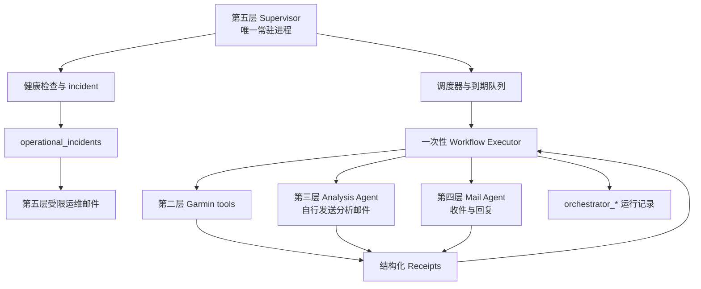

# 第五层：总调度与服务监控层开发契约

状态：已冻结

契约版本：1.1

冻结日期：2026-07-26

实现状态：尚未开始

依赖契约：

- [01-data-foundation.md](01-data-foundation.md) v2.4
- [02-data-collection.md](02-data-collection.md) v1
- [03-data-analysis.md](03-data-analysis.md) v2.1
- [04-mail-agent.md](04-mail-agent.md) v2.1

### Gmail 环境绑定修订（2026-07-26）

第五层 Gmail MCP 的唯一名称为 `gmail`，实现固定为
`@artymclabin/gmail-mcp`，默认使用当前 Codex 执行环境的注册和认证状态，不绑定
部署机器路径或复制 token。缺失、禁用或实现不匹配时只保存本地 incident，并提示
执行 `npx @artymclabin/gmail-mcp auth` 与
`codex mcp add gmail -- npx @artymclabin/gmail-mcp`；不得自动安装或换用其他
Gmail transport。下文旧自建工具名仅为迁移基线。

## 1. 目标

第五层是 TrainLab 唯一允许长期运行的业务服务，负责两类工作：

1. 总调度：按照新加坡时区判断哪些工作到期，依次调用第二、第三和第四层的一次性
   tools，并根据它们的结构化 receipt 继续、重试、延期或停止。
2. 总运维：监控初始化状态、数据库、磁盘、凭据可用性、任务新鲜度、失败积压、
   日志和自身心跳，形成可追溯 incident，并在必要时向已认证账号本人发送运维邮件。

第二至第四层仍然是“调用时存在、完成后退出”的工具。第五层不能因为它们平时没有
进程就判断服务故障，也不能把调度循环重新塞进这些层。

第五层只负责“何时调用、按什么顺序调用、失败后怎么办”。业务数据如何同步、
分析、生成邮件或处理回复，仍由对应层负责。

## 2. 内部架构

第五层包含两个职责不同的组件，但仍属于同一个层：

### 2.1 Supervisor

总服务监控，是长期运行的主进程：

- 维护单实例 lease 和心跳。
- 加载并验证静态调度配置。
- 检查到期任务、未完成 workflow、到期 retry 和健康检查。
- 启动隔离的一次性 workflow executor。
- 监控子进程超时、退出码、receipt、日志和资源使用。
- 维护 incident、恢复状态和运维告警。

### 2.2 Workflow executor

调度执行器，是由 Supervisor 启动的一次性子进程：

- 一次只执行一个有稳定身份的 workflow。
- 按冻结依赖调用第二、第三或第四层 CLI/API。
- 保存每一步请求摘要、receipt、状态和时间。
- 遇到延期或中断时安全退出，由 Supervisor 在到期后恢复。
- 不包含永久循环，不在执行完成后留驻。



Supervisor 与 executor 可以位于同一 Python 包，但必须保持生命周期隔离。一个
workflow 中的 Codex、Garmin 或 Gmail 子进程不能进入 Supervisor 主进程长期存活。

## 3. 非目标

第五层不负责：

- 绕过第一层接口自行创建目录/数据库，或静默执行 schema migration；Supervisor
  启动时必须调用一次第一层 `foundation init` 作为幂等 bootstrap。
- 直接调用 Garmin endpoint、解析 FIT 或写 Garmin cursor/gap。
- 直接读取原始健康 payload 或代替第三层生成总结、建议和计划。
- 修改 analysis artifact、training plan、user fact、mail response 或 delivery。
- 扫描 Gmail inbox、解释用户邮件或发送业务回复。
- 代替第三层发送日报、周报和计划修订。
- 使用第四层的回复接口伪装成主动运维邮件。
- 接受网络请求后执行任意命令、脚本、SQL、日期范围或收件人。
- 提供通用远程 shell、Web 管理后台或任意插件执行能力。
- 诊断医疗状况或根据监控指标改变训练计划。

第五层可以通过各层稳定的 repair、retry、reconcile 和 status 接口修复问题，但
不得绕过这些接口直接修改下层状态。

## 4. 已冻结的核心决策

1. 第五层是唯一常驻业务服务；第一层完成 init 后退出，第二至第四层均按次运行。
2. 调度时区固定为 `Asia/Singapore`，数据库时间仍保存 UTC。
3. 每个 workflow、step 和下层 invocation 都有稳定幂等 ID；进程重启不能产生
   第二份日报、计划、回复或邮件。
4. 第五层只根据结构化 request、receipt 和稳定状态视图工作，不解析 stdout 中的
   自然语言，也不读取业务邮件正文判断成功。
5. 第五层不能直接写下层业务表；重试必须用原 invocation/delivery ID 调用原所有者。
6. 每天和每周工作先通过第二层更新数据，再调用第三层；数据质量不满足时不强行
   生成看似完整的总结或计划。
7. 第三层负责主动发送自己的日报、周报和计划修订；第四层不重复投递。
8. 第四层负责收件、会话处理和回复；第五层只编排邮件触发的正式计划修订。
9. 第五层运维邮件使用独立、确定性的模板和 `operational_alert_deliveries`，
   不占用第三层或第四层投递表，也不调用 Codex 生成告警内容。
10. 同一 subject 同一时间最多运行一个会写业务数据的 workflow；只读健康检查可以
    并行，但不能绕过 SQLite 和各层自己的写入锁。
11. `partial`、`deferred`、`lock_busy`、`auth_required`、`rejected` 和 `failed`
    必须区别处理，不能统一做无限重试。
12. Supervisor 自身由操作系统服务管理器负责拉起和进程级 watchdog；Supervisor
    不能可靠地“监控并重启自己”。
13. 配置不固定 Codex 模型名，不保存 Garmin/Gmail token、密码或 OAuth secret。
14. 所有子进程使用静态 argv 模板、最小环境和独立进程组；不得拼接 shell 命令。
15. 日志、receipt 和告警不包含完整健康 payload、邮件正文、训练正文或凭据。

### 4.1 Supervisor 启动 bootstrap

Supervisor 获得 lease、加载调度任务前固定执行：

1. 调用 `trainlab foundation init`。
2. `initialized` 或 `already_initialized` 且 schema compatible 才继续。
3. `incompatible` 时停止调度并要求显式 migrate。
4. `lock_busy` 进行有限短退避；持续冲突建立 incident。
5. `failed` 时不启动第二至第四层 workflow。

该调用不是周期任务，也不能用于修复 ready 后出现的目录丢失、权限变化或数据库
损坏；这些情况必须由 verify/incident 和显式维护流程处理。

## 5. 固定调度

### 5.1 每日早晨 workflow

新加坡时间每天 07:00 触发一次 `morning` workflow：

1. 调用第二层 `sync incremental --through 昨天`。
2. 检查逐资源 cursor、未解决 gap、实际日期范围和 receipt。
3. 对明确可自动修复且在预算内的问题调用第二层 repair。
4. 数据达到 `ready` 或 `ready_with_warnings` 后调用第三层 daily。
5. 第三层完成落库并自行发送日报邮件。
6. 第五层记录最终 workflow receipt；不再次调用第四层发送日报。

日报总结日期是昨天，训练建议日期是今天。日期由第五层显式传给第三层，不能依赖
子进程所在机器的隐式本地日期。

### 5.2 星期日 workflow

新加坡时间每个星期日 07:00 使用同一次早晨数据更新执行：

1. 只运行一次第二层 incremental，不为 daily 和 weekly 重复抓取。
2. 在相同数据质量快照上先执行 daily，再执行 weekly。
3. weekly 复盘过去七个已结束日期，并生成从当日开始的未来七天计划。
4. 第三层分别保存并自行发送日报和周报/计划。

daily 分析失败不自动证明 weekly 必须失败；第五层应根据 weekly 自己的质量门禁
决定是否继续。第二层数据更新整体未达到最低条件时，两项分析都不执行。

### 5.3 邮件 workflow

第四层没有自己的轮询循环，由第五层按配置间隔调用：

```text
trainlab mail run --max-items ... --deadline-seconds ...
```

初始建议间隔为 5 分钟，但这是可调整的运维配置，不是第四层业务契约。一次调用
达到上限后返回 partial，第五层按 receipt 安排继续，不在同一 executor 内无限循环。

若第四层返回 `next_action=invoke_analysis`：

1. 保存精确 reason event、原 plan 和触发 message 的依赖。
2. 第五层调用第三层 `revise-plan`。
3. 第三层保存并自行发送新版计划。
4. 第五层把精确新 plan/artifact/analysis delivery ID 交回第四层恢复原 message。
5. 第四层只在原 thread 中发送必要的交互回复，不重复附送完整计划。

### 5.4 不默认定时的操作

以下操作只由明确的人工请求、恢复策略或 incident 触发：

- Garmin full sync。
- Garmin snapshot。
- 大范围历史 audit/repair。
- analysis regenerate。
- mail response regenerate。
- schema migration、备份恢复或数据重建。

不得因为 Supervisor 重启就自动执行 full sync、regenerate 或 migration。

## 6. Misfire 和重启规则

Supervisor 停机后恢复时：

- daily/weekly：按逻辑日期检查唯一 workflow key；缺失且仍在允许补跑窗口内时补跑
  一次，超出窗口则建立 incident 等待人工决定。
- mail：立即调用一次 `mail run`，依赖第四层重叠 cursor 吸收停机期间邮件；不按
  错过的每个 5 分钟间隔逐次回放。
- health-check：立即执行一次，只保留当前结果，不补造停机期间的虚假检查记录。
- deferred/retry：读取持久化 `next_retry_at_utc`，到期后恢复原 workflow/step。
- started 但无完成 receipt：先对账下层运行表和 delivery，再决定恢复；不得直接
  创建新 invocation。

推荐 workflow key：

```text
morning:<subject_id>:<local_date>
weekly:<subject_id>:<as_of_local_date>
mail-poll:<subject_id>:<window_or_invocation_id>
health-check:<host_id>:<scheduled_at_utc>
manual:<workflow_kind>:<operator_invocation_id>
```

## 7. Workflow 与步骤依赖

### 7.1 状态

Workflow 状态：

- `queued`
- `running`
- `succeeded`
- `partial`
- `deferred`
- `attention_required`
- `failed`
- `cancelled`

Step 状态：

- `pending`
- `running`
- `succeeded`
- `unchanged`
- `partial`
- `deferred`
- `lock_busy`
- `auth_required`
- `rejected`
- `failed`
- `skipped`

状态只能按允许的状态机转移。Supervisor 重启后不能把未知的 running step 直接
改成 failed；必须先读取下层 status 或 reconcile。

### 7.2 依赖门

每个下游 step 启动前必须验证：

- 第一层 ready/schema version。
- 前置 step 已满足当前 workflow 的完成条件。
- 下层 tool 契约版本兼容。
- 当前时间未超过 workflow deadline。
- 没有同 subject 冲突 workflow。
- 对应凭据和能力最近一次健康状态未被明确标为不可用。

`ready_with_warnings` 可以继续，但 warning 必须进入第三层上下文或最终 workflow
receipt。`blocked` 不继续调用 Codex。

## 8. 公共 CLI

目标 CLI：

```text
trainlab supervisor run
trainlab supervisor doctor

trainlab orchestrate run morning [--date DATE] [--invocation-id ID]
trainlab orchestrate run weekly [--as-of DATE] [--invocation-id ID]
trainlab orchestrate run mail [--invocation-id ID]
trainlab orchestrate run health-check [--invocation-id ID]
trainlab orchestrate retry --workflow-run-id ID
trainlab orchestrate reconcile [--workflow-run-id ID]
trainlab orchestrate status [--workflow-run-id ID] [--json]
```

规则：

- `supervisor run` 是唯一长期运行入口。
- `doctor` 是只读/受控探测，不启动调度循环，不修改业务数据。
- `orchestrate run` 是一次性执行入口，可供 Supervisor 或人工受控调用。
- `retry` 恢复原 workflow，不创建新的业务逻辑日期或下层 invocation。
- `reconcile` 读取下层 status/delivery 证据，不重新生成业务内容。
- 不提供任意 `--command`、`--sql`、`--recipient`、`--harness` 或 shell 参数。
- stdout 只输出结构化 receipt，不输出子层业务正文。

## 9. Python API 与 Receipt

统一入口：

```python
OrchestrationTool.execute(request: WorkflowRequest) -> WorkflowReceipt
```

`WorkflowRequest` 固定包含：

- `workflow_kind`
- `subject_id`
- `logical_local_date`
- `invocation_id`
- `trigger_kind`: `scheduled | recovery | manual | dependency`
- `parent_workflow_run_id`
- `dependency_ids`
- `deadline_at_utc`
- `requested_at_utc`

调用方不能通过 request 传入任意命令、环境变量、Gmail recipient、Garmin 日期范围、
SQL、prompt 或 Harness 路径。

`WorkflowReceipt` 固定包含：

- `schema_version`
- `workflow_run_id`
- `workflow_key`
- `workflow_kind`
- `status`
- `trigger_kind`
- 计划时间、实际开始/完成时间和逻辑日期
- 每个 step 的稳定 ID、layer、mode、状态、下层 run/invocation ID
- 下层 receipt 哈希和允许公开的计数
- `next_action`
- `next_retry_at_utc`
- `incident_ids`
- `warnings` 和脱敏错误摘要

Receipt 不包含健康记录、邮件正文、AI artifact 正文、HTML、FIT 内容或凭据。

## 10. 下层 Receipt 处理

第五层必须按下层语义处理：

| 下层状态 | 第五层行为 |
|---|---|
| `succeeded` / `unchanged` | 完成 step，继续满足依赖的后续步骤 |
| `partial` | 保存进度；按 `next_action` 恢复缺失阶段，不重做已完成阶段 |
| `deferred` | 保存 `next_retry_at_utc`，到期恢复原 step |
| `lock_busy` | 短退避后有限重试；持续冲突建立 incident |
| `auth_required` | 停止依赖该 provider 的新工作，建立高优先级 incident |
| `rejected` | 不自动改变 Harness 或重复诱导模型；等待人工或显式 regenerate |
| `failed` | 按错误分类决定有限重试或 attention_required |

第五层还必须检查 receipt schema version、invocation ID、逻辑日期和下层数据库
run ID 是否与请求一致。字段不一致视为契约错误，不能按成功处理。

### 10.1 分析投递恢复

第三层返回 `partial + retry_delivery` 时：

1. 保存 artifact/plan 已经 accepted 的事实。
2. 使用第三层返回的精确 `delivery_id` 调用 `retry-delivery`。
3. 发送结果不确定时调用 `reconcile-delivery`。
4. 不重新运行 daily/weekly/revise-plan Codex。
5. 不调用第四层代发。

### 10.2 邮件回复恢复

第四层 accepted 回复发送失败时：

1. 使用精确 `mail_response_artifact_id` 和 `mail_delivery_id`。
2. 调用 `deliver-response` 或 `reconcile`。
3. 不重新调用 Mail Agent，除非用户显式要求 regenerate。

## 11. 重试与预算

重试分为三层：

1. 下层工具内部短重试：由第二至第四层各自契约负责。
2. 跨调用延期：第五层根据 `next_retry_at_utc` 恢复。
3. 运维介入：超过 workflow retry budget 后建立 incident。

默认原则：

- 指数退避加抖动。
- `lock_busy` 使用短退避，不累计为 provider 网络失败。
- auth、schema mismatch、identity mismatch、rejected 不做无意义自动重试。
- 相同错误连续出现达到阈值后抑制重复告警，只更新同一 incident。
- 恢复成功后关闭 incident，并可发送一次恢复通知。
- 不允许“失败就重新生成新的 invocation ID”来绕过幂等状态。

具体次数和时间可配置，但不得覆盖下层 receipt 提供的更晚
`next_retry_at_utc`。

## 12. 服务与数据健康检查

### 12.1 第一层

- ready 标记存在且 schema version 兼容。
- `data.db` 可读写、WAL 正常、foreign keys 开启。
- 定期受控执行 quick/integrity check；完整检查不得阻塞业务高峰。
- 数据目录、raw、state、tmp、backup 和日志权限符合要求。
- 磁盘剩余空间、inode 和数据库/WAL 增长。

### 12.2 第二层

- 最近一次 incremental 成功时间。
- 各健康资源 completed cursor 新鲜度。
- unresolved gap、failed/deferred item 数量和最早日期。
- Garmin auth/capability 状态。
- 活动 inventory、FIT 缺失和 repair backlog。

### 12.3 第三层

- 最近 daily/weekly 成功逻辑日期。
- 应有 artifact/plan 是否存在且 accepted/current 唯一。
- `analysis_delivery_*` 是否 pending、unknown 或超过恢复时限。
- Codex 超时、Schema reject 和质量门禁阻断次数。

### 12.4 第四层

- 最近完整 poll 时间和 cursor 新鲜度。
- awaiting_analysis、ready_to_send、delivery_unknown 和失败 item。
- Gmail identity/auth/capability。
- 同一 inbound message 是否存在重复 response/delivery 冲突。

### 12.5 第五层自身

- Supervisor lease、heartbeat 和事件循环延迟。
- 到期 job 是否按容差启动。
- executor 子进程数量、最长运行时间和僵尸进程。
- incident/alert backlog。
- 日志写入和轮转状态。

健康检查只读取必要的状态和计数，不把完整业务 payload复制到监控表。

## 13. Incident 与运维告警

Incident 至少包含：

- `incident_key`
- `category`
- `severity`: `info | warning | error | critical`
- `state`: `open | acknowledged | resolved | suppressed`
- 首次/最近发生时间
- 连续发生和恢复计数
- 关联 workflow/step/layer/run
- 脱敏摘要
- `next_action`

告警去重键由 category、subject、资源和逻辑日期组成。同一问题持续存在时更新原
incident，不按每次健康检查重复发邮件。

第五层运维邮件规则：

- 只发送给已认证账号本人。
- 使用确定性中英文受控模板，不调用 Codex。
- 主题包含 `[TrainLab][运维]`、severity 和 incident key。
- 正文只包含时间、组件、错误代码、影响、已采取动作和建议动作。
- 不包含健康指标、活动详情、用户邮件正文、训练计划正文或凭据。
- 发送前按 alert idempotency key 查询，未知结果先 reconcile。
- 使用独立 `operational_alert_deliveries`，不写 `analysis_delivery_*` 或
  `mail_delivery_*`。

第五层通过当前环境的 `gmail` MCP 确定性发送运维告警，只允许实际包中完成
authenticated-self、按 alert idempotency key 精确搜索、自投递和应用 TrainLab
标签所需的固定工具；不读取 inbox/thread，不把 Gmail 工具交给 Codex，也不允许
改变 recipient。

当 Gmail 本身故障时，不能依赖 Gmail 告警证明 Gmail 故障已送达；必须同时保留
本地 incident，并允许未来接入第二告警渠道。

## 14. 第五层运行数据

第一层 initializer 必须创建以下第五层专属表，运行时仅第五层写入：

### `scheduler_jobs`

- 保存配置中已验证 job 的运行时投影、启用状态、上次/下次到期时间和 misfire
  policy。
- 配置文件是计划定义来源，数据库是运行状态；修改数据库不能偷偷改变计划。

### `scheduler_leases`

- 保存 Supervisor 单实例 lease、owner instance、heartbeat 和过期时间。
- 接管前必须确认旧 owner 已过期且对应进程不存在。

### `orchestrator_runs`

- 一次 workflow 一行，包含 workflow key、逻辑日期、trigger、状态、deadline、
  开始/完成时间和脱敏结果。
- `workflow_key` 唯一。

### `orchestrator_steps`

- 一次下层调用或确定性检查一行。
- 记录 step 顺序、layer、mode、request hash、invocation ID、下层 run ID、
  receipt hash、状态、尝试次数和 next retry。
- 不保存完整业务 request/receipt payload。

### `service_health_checks`

- 保存检查类型、目标、状态、数值摘要、阈值版本和时间。
- 高频检查按保留策略聚合或清理，incident 和关键失败证据不得一起删除。

### `operational_incidents`

- 保存去重后的问题生命周期、影响、关联对象和恢复证据。

### `operational_alert_deliveries`

- 保存运维告警的幂等键、incident、状态、provider IDs 和验证时间。
- 不引用 analysis artifact 或 mail response。

第五层不得写第二至第四层的 run/item/cursor/artifact/delivery 表，只保存引用 ID、
receipt hash 和编排状态。

## 15. 锁、租约与并发

- Supervisor 使用数据库 lease 加 owner-only 锁文件保证单实例。
- lease 定期续期；数据库不可用时停止启动新 workflow，不以本地内存假装持有 lease。
- 同一 `workflow_key` 只能有一个有效 run。
- 同一 subject 的 collection、analysis、mail 写入 workflow 默认串行。
- 只读 health check 可有限并行，并设置连接、时间和资源上限。
- workflow executor 启动下层前仍尊重下层自己的单写锁；第五层锁不能替代下层锁。
- 进程中断后先 reconcile 旧 running step，不直接清锁重跑。
- 手工强制接管必须有显式命令、审计记录和进程/lease 双重验证。

## 16. 子进程管理

所有下层调用必须：

- 使用固定可执行文件和 argv 数组，不经过 shell。
- 使用受控工作目录、最小环境和明确 locale/timezone。
- 单独进程组启动，超时先 TERM，宽限后 KILL，并回收所有后代。
- stdout/stderr 设置大小上限；stdout 必须解析为唯一 receipt JSON。
- 校验退出码与 receipt 状态的一致性。
- 不继承不需要的文件描述符、网络监听或秘密环境变量。
- 完成后确认无遗留 Codex、Gmail MCP、Garmin 或 worker 子进程。

每个 mode 的 timeout 由静态配置定义。超时不代表业务副作用没有发生；涉及 Gmail
发送时必须进入相应 reconcile，而不是直接重跑。

## 17. 配置契约

目标配置示例：

```yaml
orchestrator:
  timezone: Asia/Singapore
  morning_time: "07:00"
  weekly_day: sunday
  mail_poll_interval_seconds: 300
  health_check_interval_seconds: 60
  workflow_deadline_seconds: 3600
  max_parallel_read_checks: 4
  lease_ttl_seconds: 90
  heartbeat_interval_seconds: 30
  daily_misfire_window_hours: 12
  weekly_misfire_window_hours: 24
  state_lock_path: state/locks/supervisor.lock
  temp_root: state/tmp/orchestrator
  log_root: logs
  operational_alerts_enabled: true
```

规则：

- 调度配置只能来自 owner-only 静态文件，不能来自邮件、模型输出或 CLI 自由文本。
- 不固定模型名。
- 不保存 credential/token/密码内容。
- 下层命令、mode 和允许参数在代码中静态映射。
- 配置变更先完整校验，再原子替换活动配置；失败继续使用最后有效版本并告警。
- schedule 变更不追溯重写历史 workflow。

## 18. 日志、审计与保留

- 每个日志事件包含 UTC 时间、instance、workflow、step、layer、mode、状态和受控
  error code。
- 不记录健康 payload、邮件正文、AI 输出正文、HTML、FIT、token 或完整 prompt。
- 日志按大小/日期轮转，owner-only，达到保留期后安全清理。
- workflow、incident 和 delivery 历史属于审计数据，不能与普通日志一起删除。
- `service_health_checks` 可以按策略降采样；关键失败和恢复证据保留在 incident。
- 每次人工 retry、acknowledge、suppress、resume 和 forced takeover 必须有审计记录。

## 19. 系统服务部署

Linux 生产基线使用 systemd 或等价服务管理器：

- 开机后启动 Supervisor。
- `Restart=on-failure`，设置退避，避免快速重启风暴。
- 使用 watchdog/notify 或外部存活探测确认主循环仍推进。
- 使用专用服务账号、受限目录权限、合理文件描述符和进程数上限。
- 停止时先停止领取新 workflow，再等待有界时间或安全终止 executor。
- 部署升级先停止 Supervisor、确认无写入 executor、备份状态，再切换版本。

systemd timer 不直接调用第二至第四层，避免与 Supervisor 形成双重调度。若未来选择
完全使用外部 scheduler，则必须关闭 Supervisor 调度功能并保持唯一调度所有者。

## 20. 故障与恢复

必须覆盖：

- Supervisor 崩溃、主机重启和 lease 过期。
- executor 在下层调用前、调用中、receipt 后、数据库提交前后中断。
- SQLite busy、WAL 异常、磁盘满和权限变化。
- Garmin/Gmail auth_required。
- 网络、5xx、429、超时和 provider 返回未知结果。
- Codex 超时、非 JSON、Schema rejected 和进程残留。
- daily/weekly misfire。
- mail poll 长时间未完成和 backlog 增长。
- 运维邮件发送未知或 Gmail 自身不可用。
- 系统时间跳变、时区配置错误和重复 07:00 触发。

恢复必须从持久化 workflow/step 和下层 run/delivery 证据开始，不能从“日志最后一行”
猜测状态。

## 21. 与当前生产实现的迁移

当前生产 `trainlab run` 同时包含采集、分析、Gmail 和运行控制。目标迁移顺序：

1. 第一层 v2.4 initializer/migration 和稳定视图完成。
2. 第二层完成 Garmin 同步、repair、audit 和 receipt。
3. 第三层完成分析落库、主动 Gmail 投递和 delivery 恢复。
4. 第四层完成入站邮件、回复和 reply delivery。
5. 第五层先以 shadow 模式读取状态并生成 workflow 计划，不执行真实下层调用。
6. 对照人工执行结果、逻辑日期、幂等 ID、邮件和 incident。
7. 切换到第五层唯一调度，关闭旧调度入口。
8. 验证 daily、Sunday weekly、mail、重启恢复和告警。
9. 保留受控回滚路径；回滚时不能让新旧调度同时启用。

切换必须同步更新项目根 `AGENTS.md`、生产 Harness、systemd 配置、运行手册和旧
watchdog。现有生产入口在切换完成前继续有效。

## 22. 测试与验收

### 22.1 调度

- 每日 07:00 只触发一个 morning workflow。
- 星期日复用一次 collection，随后按顺序运行 daily 和 weekly。
- DST 不影响新加坡时区；系统 UTC/本地时区不同仍得到正确逻辑日期。
- 重启 misfire 补跑一次，不重复生成。
- mail 间隔丢失后只运行一次 catch-up。

### 22.2 编排

- collection ready/ready_with_warnings/blocked 三种门禁。
- daily 与 weekly 独立结果但共享数据快照。
- mail `invoke_analysis → revise-plan → resume reply`。
- 第三层发送自己的产物，第四层不重复发送。
- 下层 receipt schema/ID/date 不一致被拒绝。

### 22.3 重试和恢复

- partial/deferred/lock_busy/auth_required/rejected/failed 分流。
- 同一 invocation 恢复，不创建重复 run。
- analysis delivery 失败只 retry/reconcile delivery。
- mail reply delivery 失败不重新调用 AI。
- Supervisor 在任意 step 中断后从持久化证据恢复。

### 22.4 监控

- ready/schema、SQLite、磁盘、cursor、gap、artifact、delivery、mail cursor、
  backlog、lease、heartbeat 和日志检查。
- 相同故障只创建一个 incident。
- 恢复后 incident 正确关闭。
- 高频 health check retention 不删除 incident 证据。

### 22.5 告警

- 运维邮件 self-only、确定性模板、TrainLab 标签和幂等。
- 不包含健康、邮件、训练正文或凭据。
- Gmail 不可用时本地 incident 仍完整。
- send unknown 通过 reconcile 恢复，不重复发送。

### 22.6 安全和进程

- 任意 CLI/request 无法注入命令、SQL、recipient、Harness 或环境变量。
- 子进程超时后整个进程组被回收。
- stdout 超限、非 JSON 和 receipt 欺骗被拒绝。
- Supervisor 单实例、lease 接管和陈旧锁验证。
- 工具退出后无 Codex/Gmail MCP/Garmin 僵尸进程。

### 22.7 受控端到端验收

- 连续运行至少一个完整每日周期。
- 覆盖一个星期日 daily + weekly 周期。
- 发送一封 TrainLab 测试邮件并完成第四层回复。
- 通过邮件触发一次受控 plan revision，确认第三层发新版计划、第四层只回原 thread。
- 人工制造一次 collection deferred、一次 analysis delivery unknown 和一次 mail
  reply delivery unknown，并验证恢复。
- 重启 Supervisor，确认无重复同步、artifact、计划或邮件。

## 23. 完成定义

第五层只有同时满足以下条件才从“已冻结”进入“已验证”：

1. Supervisor 是唯一常驻业务进程，第二至第四层仍为一次性 tools。
2. 每日 07:00 和星期日 workflow 的日期、顺序与幂等正确。
3. mail 按配置调用，停机恢复不逐次回放空轮询。
4. 所有 workflow/step 状态持久化，重启可以恢复。
5. 只根据结构化 receipt 和稳定视图决策。
6. 不直接修改任何下层业务表。
7. 第三层主动邮件、第四层回复邮件和第五层运维邮件所有权互不重叠。
8. 下层所有状态和 next action 有确定处理规则。
9. analysis/mail delivery 恢复不会重新生成 AI 内容或重复发送。
10. 监控覆盖初始化、数据库、磁盘、采集、分析、邮件、调度和自身心跳。
11. incident 去重、恢复和告警幂等通过。
12. Gmail 故障时仍有本地可审计 incident。
13. 子进程隔离、超时和清理通过。
14. 配置、日志、receipt 和告警不泄露敏感 payload 或凭据。
15. systemd/watchdog、升级、停止和回滚流程完成验收。
16. 新旧调度不会同时运行。
17. 每日、星期日、邮件、计划修订、故障恢复和主机重启端到端验收通过。

## 24. 对其他层的固定接口

- 第一层提供 ready/schema、第五层运行表和稳定只读状态；第五层除 Supervisor
  启动 bootstrap 外，不调用 init 处理日常故障。
- 第二层只通过 `SyncRequest/SyncReceipt`、repair、audit 和 status 与第五层交互。
- 第三层只通过 `AnalysisRequest/AnalysisReceipt`、delivery retry/reconcile 和
  status 与第五层交互；第三层自行发送 accepted 分析产物。
- 第四层只通过 `MailRequest/MailReceipt`、deliver-response、reconcile 和 status
  与第五层交互；第四层只处理收件和回复。
- 第五层生成 invocation/workflow ID、决定调用时间与依赖、管理跨调用 retry 和
  incident，但不修改下层 cursor、gap、artifact、plan、fact、response 或 delivery。
- 各层内部 SQL、MCP payload、prompt、Harness 路径和 provider token 都不是跨层 API。
